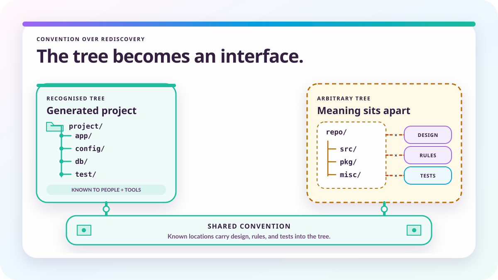

# AI coding has not had its Rails moment

*2026-08-10 by Thomas Mangin*

Once Claude knew how to maintain the design documents and follow their links to the code, better documentation led to better implementations. The missing convention is the structure which makes that possible.

Claude already knew how to write Go when I began building Ze, a network operating system. The difficulty was getting it to write the code this project needed, according to its architecture and the decisions already made. A familiar programming pattern could produce a plausible implementation while undoing something the project was deliberately trying to preserve.

Much of the effort therefore went into teaching the AI where to write documentation and designs, then how to find them from the code and find the code from them. As those documents improved, the quality of the generated code improved too. The explanations were becoming part of what the next implementation was built from.

That required more than putting some Markdown in a `docs/` directory. The agent had to know when to consult it, where a new decision belonged and how to keep the explanation connected to the implementation. Building that arrangement became a way of programming how the AI would approach the project.

*This article was co-authored with Claude and revised with OpenAI Codex. The argument and the conclusions are mine. Claude helped organise the material and draft the original text.*

## Giving the next session something to learn from

A correction made in a conversation helps with the change in progress, but the next session needs a way to recover it. Without that, an agent can arrive at the same alternative which was rejected earlier, and there is another conversation to have before development can continue.

Plugin registration is a useful example. A central switch can be a reasonable way to dispatch a known set of commands. Ze's plugins, including third-party extensions, are meant to remain separate from the core, so adding a branch there for every new plugin would defeat the design. The model needs the reason for that choice as well as an example of the registration code.

Writing the reason down gives the next session a chance to use it, provided the session knows where to look. In Ze, the task-oriented [`ai/INDEX.md`](https://github.com/ze-software/ze/blob/main/ai/INDEX.md) directs an agent towards the relevant guidance. Work on the modular core leads to the [registration pattern](https://github.com/ze-software/ze/blob/main/ai/patterns/registration.md), where the explanation and an approved way of doing it can be found together.

The same organisation has to guide what the agent writes. A new design needs a known home, and a change to an existing decision needs to update its explanation instead of leaving a contradictory account elsewhere. Teaching those habits prevents each session from inventing another place to put the information which later sessions will need.

Once the documents have a place, links make them useful from whichever end a task begins. Source files carry `// Design:` references to their design documents, while documents cite the source through `<!-- source: ... -->` anchors. The generated [code-to-documents](https://github.com/ze-software/ze/blob/main/ai/CODE-TO-DOCS.md) and [design-to-code](https://github.com/ze-software/ze/blob/main/ai/DOCS-TO-CODE.md) indexes provide the corresponding lookups.

An agent investigating a function can therefore reach the reasoning behind it. An agent starting with a design can find the implementation it governs. When either changes, there is also a route to the other half which needs attention, so the next session can recover the decision without needing the conversation in which it was made.

## The documentation began to affect the code

These links would achieve little if the model were left to ignore them. `CLAUDE.md` is the entry point to the rules which teach it how to work with the repository, including how to find the relevant design before changing the code and how to maintain that design afterwards. The files and the [instructions for using them](../the-repository-is-the-ai-harness/) have to be developed together.

Better explanations of the project's choices gave the model better guidance for its next implementation. A correction which once needed to be repeated in conversation could instead improve the document the following session was directed to read. As the documentation became more useful, the generated code followed the intended design more closely.

The design documents give the model a reason to choose a project-specific approach even when a different pattern would be more familiar from training. Its knowledge of programming is still useful, but the project supplies the decisions about how that knowledge should be applied. A new request can build on that guidance without repeating the whole architecture in its prompt.

I have always enjoyed metaprogramming and macros, so this turned out to be a satisfying way to work. Part of programming Ze had become describing how another program should approach its implementation. The `CLAUDE.md` system is a meta-system in that sense: its rules govern how the agent finds the information it needs and how its changes contribute to what the next agent will find.

## This is where Rails comes in

Most projects do not come with this arrangement already in place. They may have code and documentation, but the rules for creating the documentation and navigating between it and the implementation still need to be supplied. A `CLAUDE.md` or `AGENTS.md` gives the agent an entrance; somebody has to organise what lies behind it.

That is a familiar kind of problem. At Exa in the early 2000s, we carried a common layout between projects: configuration in `etc/`, working data in `data/`, reusable code in `lib/` and the rest in `src/`. Changing `$ETC` and `$DATA` pointed a project at the installed locations, while the repository itself acted as the installed root during development.

The layout meant the configuration needed to try a program was already beside its code. The [first ExaBGP commit, from September 2009](https://github.com/Exa-Networks/exabgp/commit/5490f7baf5981279e2360d88c735570bc9f72532), contains `daemon`, `etc`, `lib` and `test` directories, and its commit message records a test announcing a route to a Cisco 7204. A convention familiar to us removed some of the setup and explanation each project would otherwise require.

Rails made that benefit available across a much larger community through [Convention over Configuration](https://guides.rubyonrails.org/getting_started.html#rails-philosophy). Running `rails new` creates recognised places for application code and configuration, along with database migrations, libraries and tests. The framework uses the arrangement too, so a developer entering another Rails application already knows something about how it works before reading its code.

Younger programmers who have never used Rails will recognise the same benefit in React projects. React leaves more of the surrounding structure to its ecosystem, but familiar component conventions still reduce the amount a newcomer has to learn. Once that familiarity exists, every project no longer needs to explain its organisation from the beginning.

An equivalent convention for AI development would extend that familiarity to the design and to the way the agent is expected to use it. A new repository would have a structure for recording decisions and finding their implementations, with instructions for keeping those relationships useful. The project would supply its own architecture within that arrangement, much as a Rails application supplies its own behaviour within the framework's conventions.

## A structure other projects could start with

There are already related attempts to make project knowledge usable this way. Cloudflare's [engineering standards system](https://blog.cloudflare.com/engineering-standards-enforcement/) gives standards stable identifiers which agents can use during reviews, addressing guidance previously spread between documents, repositories and conversations. Its setting is a large organisation, but the need to recover an earlier decision is much the same.

Andrej Karpathy's [LLM Wiki gist](https://gist.github.com/karpathy/442a6bf555914893e9891c11519de94f) provides a recognisable arrangement for a knowledge base, with raw sources separate from cross-linked Markdown pages, an index and instructions explaining the conventions. Much of that was familiar from Ze's ordinary files and links. Describing the arrangement together gives others something to copy instead of requiring them to discover each part independently.

For a software project, the convention would also need to cover the relationship between a design and its implementation. A session starting from either would know how to reach the other and where to record what it changes.

A shared starting structure could save another project from having to invent all of this before benefiting from it. Its author would still decide how the software should be built; the convention would give those decisions a place and teach the agent how to work with them. That is the part which ought to become ordinary.

For Ze, the machinery is now in place and the update for Opus 5 is finished. I am going back to writing the router, with its design documents now helping to determine what the AI writes next.

*Last updated: 11 September 2026. The history of this article is available in the [project's Git repository](https://github.com/ze-software/ze/commits/main/website/blog/posts/ai-coding-has-not-had-its-rails-moment.md).*
