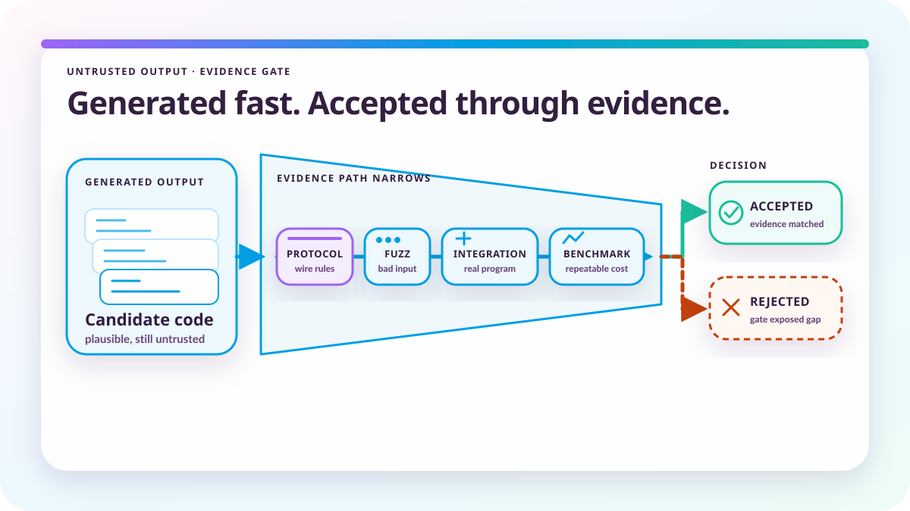

# AI slop is the wrong test

*2026-08-03 by Thomas Mangin*

I am using AI to build a router, and I remain responsible for what gets released. I also expect our tools to improve, as they have before.

Ze is an AI-written network operating system, so I have a fairly direct interest in the argument about "AI slop". I decide the architecture and the tradeoffs, including what the code must never break, and Claude turns that into implementation. Rejecting what it gets wrong takes rather more of my time than I had hoped, but quite often the code is better than I could have written myself. Claude is more meticulous, and writes far more tests per feature than I ever did.

The same convenience extends to these articles. I am lazy, my time is limited, and help putting my thoughts into words leaves more of it for decisions and corrections. What goes out under my name remains my responsibility, whether it is an article or a router.

There is plenty of slop around, including code merged because it compiled or because a demo worked once. AI makes producing it much cheaper, but that tells us little about whether a particular program is useful or well made. Dismissing the useful results along with the failures seems a strange choice for an industry which has spent so long improving its tools.

*This article was drafted and revised with OpenAI Codex. The ideas, experience and conclusions are mine.*

## The compiler was not always good enough

In July 1983, Ed Post's [Real Programmers Don't Use Pascal](https://www.pbm.com/~lindahl/real.programmers.html) made fun of programmers for whom FORTRAN and assembly were evidence of competence. It is still amusing, although the assembly programmer sometimes had a perfectly good reason to object. Knowing the processor and choosing its instructions carefully could produce a faster inner loop than the compiler managed.

Michael Abrash's [Graphics Programming Black Book](https://www.jagregory.com/abrash-black-book/) explains how much could be gained from that knowledge, and the released [Quake source](https://github.com/id-Software/Quake/tree/master/WinQuake) has hand-written x86 assembly alongside its C rendering code. These programmers understood what the machine was doing and used that understanding to make something possible. Their objections had substance.

But compilers improved, and the programs we wanted to write grew. Saving instructions in one loop had to be weighed against maintaining the rest of the program and moving it to another machine. At some point, insisting on writing everything in assembly meant spending time on something the compiler could do well enough, while the rest of the project waited. Being right about a compiler's failings did not make that a good choice forever.

[FFmpeg's x86 codec code](https://github.com/FFmpeg/FFmpeg/tree/master/libavcodec/x86) still contains extensive assembly implementations. There are places where the gain justifies the effort, and recognising them is part of the job. I would not write a control plane in assembly, however much I might admire someone else's inner loop.

A model can misunderstand the request or invent an API, which is quite different from a compiler translating a program under language rules. The failures need different checks, but today's limitations still tell us little about where either tool will end up. They also do not cancel out the things it can already do well.

## Human-written software has hardly been a guarantee

The history of better tools is also a history of finding ways to waste what they give us. We have spent decades producing programs which are slow, wasteful and difficult to understand, with a human responsible for every line. I have little patience for "Clean Code" used as a substitute for taste, or for a high-level language used as permission to ignore what the program compiles to. We managed all of this without a language model.

The implied quality of software before AI arrived annoys me because human typing was never much of a quality control process. Generating code faster with the same weak checks will give us more bad software, and projects which do that deserve the criticism which follows. Improving those checks, and giving the generator enough information to do a better job, seems a more useful response than defending the old process.

## Useful results need something behind them

The case for improving the checks is hardly theoretical. Veracode's [2025 GenAI Code Security Report](https://www.veracode.com/blog/genai-code-security-report/) found that 45 per cent of generated samples failed its security tests across Java, Python, C# and JavaScript. Those figures describe its evaluation, rather than vulnerabilities in every AI-written project, but they give us ample reason to look beyond whether generated code appears reasonable.

Even the benefit of using it needs measurement. In [METR's early-2025 study](https://metr.org/blog/2025-07-10-early-2025-ai-experienced-os-dev-study/), 16 experienced open-source developers took 19 per cent longer on tasks in repositories they knew when AI tools were allowed. They believed they had been faster, so being pleased with the tool was apparently not a very good measurement.

METR's [February 2026 update](https://metr.org/blog/2026-02-24-uplift-update/) says developers are likely to benefit more from newer tools, but the follow-up data gives only very weak evidence for the size of that improvement. Developers' reluctance to work without AI introduced selection effects, and concurrent agents made time spent harder to measure. The tools are changing, and I am interested in the next measurements rather than treating the first ones as the final answer.

For Ze, the immediate judgement concerns the implementation in front of us. Claude can explore it and revise it against the design, or ignore a constraint it has just been given. A BGP encoder still has to produce the bytes the protocol requires and respect the surrounding code's ownership rules, however convincing the accompanying explanation may be.

Calling a Go function and checking its result covers something different from starting Ze and speaking to it as a peer, so both are needed. The [quality model](https://ze-software.net/quality/) sets out the evidence Ze requires: a parser failure should leave a regression test or a fuzz corpus entry, Linux behaviour needs an exercise on Linux, and a memory optimisation needs a repeatable benchmark with a stated allocation contract. Parts of Ze still have to meet those requirements, and even a test which does meet them cannot discover a case nobody thought to exercise.

The extra tests Claude writes are therefore welcome, but they need scrutiny of their own. A model can "fix" a failure by changing the expected result to agree with bad code, or by removing the assertion which caught it. The suite then passes with the bug still present, which is why [The proof is the expensive part](../the-proof-is-the-expensive-part/) spends so much time on tying tests to requirements and establishing what they demonstrate.

## I still have to understand the bug

Judging those tests requires some understanding of the failure they are meant to catch. I know BGP from operating it and implementing it, including being called late at night to fix my own code. When Claude proposes a shortcut in route selection or a change to a peer's state, that experience gives me something to compare it with besides Claude's explanation. Relying on the same model to recognise its own mistake would be rather unwise.

Before Ze, I had not implemented IS-IS or OSPF, but the protocol debugging experience is still useful. Information has to reach neighbouring routers and enter the topology database before the route calculation can use it. When something behaves strangely, I need to reduce it to a packet or a state transition I can explain, much as I would with BGP.

My maths is very rusty, but I understand Dijkstra's algorithm and enough set theory to reason about reachability and shortest paths. Knowledge of packets and sockets also helps me recognise when the kernel might be involved. Wireshark still helps me decode TCP; the tool does not relieve me of noticing when what it shows contradicts what I expected.

With Claude trying an implementation, I can concentrate on the design and recognise when we need to return to the RFC. I must still be able to debug the problem and build a reproduction of the rule it broke. If I cannot do that without the model, I cannot safely ask it to write the code.

Reading the diff only takes that judgement so far. A change can look reasonable and fail across a peer connection or when the router reaches capacity, and reading the same lines more carefully will not make that interaction appear on the screen. Review has to establish which test would expose the failure, as well as whether the model made a design decision it was never authorised to make. This takes time even when the implementation took very little.

## There is plenty worth building

The time spent on that review does not make the tool pointless. There is no shortage of software we would like to have, or existing software that needs attention, and we do not have enough good programmers to write and maintain it all. A tool which lets an experienced engineer attempt more is worth having. Ze has given me good reasons to keep using AI, and better models will help alongside the tools and practices we are still learning to build around them.

I expect considerable progress, and learning how to use these tools now is a better use of my time than waiting for everyone to agree they are useful. That leaves me responsible for the result. Claude cannot answer for an outage, a route leak or a security hole, and users should never have to excuse one because of how Ze was written.

I expected Ze to be finished by now. It is not ready, and the issues we keep finding have taken longer to fix than I expected. The repository is open, with the tests and design notes available for scrutiny, but I would rather delay Ze than release it with problems I already know about.

*Last updated: 11 September 2026. The history of this article is available in the [project's Git repository](https://github.com/ze-software/ze/commits/main/website/blog/posts/ai-slop-is-the-wrong-test.md).*
