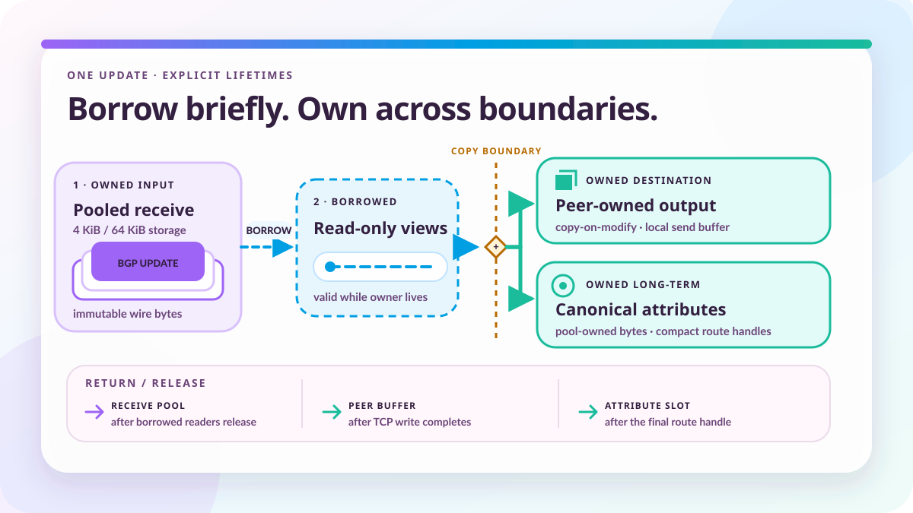

# How Ze reuses memory for BGP UPDATEs

*2026-08-04 by Thomas Mangin*

An UPDATE has already arrived as bytes. Turning it into objects, then back into bytes, gives the program plenty to do before it has done anything useful with the route.



When I wrote [ExaBGP](https://github.com/Exa-Networks/exabgp), the idea was much like the Common Gateway Interface used by web servers. CGI let an ordinary program produce a webpage without having to become an HTTP server, and ExaBGP let an ordinary program announce routes without having to become a BGP speaker. ExaBGP dealt with the protocol and passed useful data to the application.

Producing that useful data was a substantial part of the work. Transcoding BGP into text or JSON is expensive, and although I paid attention to performance from the start, large announcements and full-table decoding made Python's object costs hard to avoid. Creating a few objects for an attribute looks harmless until it happens for all the routes carrying that attribute.

Go gave Ze more room, but translating the same operations into Go would still leave it doing the same unnecessary copying. An UPDATE has already arrived as bytes, and forwarding it may require no more than inspecting its next hop. Building a complete collection of objects, only to turn them back into bytes, would preserve much of the cost I wanted to remove.

I kept the received bytes as a representation Ze could use directly. Readers could then avoid decoding and copying data they did not need, provided they finished before the storage was reused. Deciding when each reader had to finish became as important as deciding how to represent the route.

*This article was co-authored with Claude and revised with OpenAI Codex. The architecture and design decisions are mine. Claude helped with implementation, tests and measurements, and with organising and drafting the original text.*

## The bytes are already there

The [session read loop](https://github.com/ze-software/ze/blob/main/internal/component/bgp/reactor/session_read.go) gets reusable storage, reads the BGP header, checks the message length and fills the rest of the buffer. Standard messages fit within 4,096 octets. A speaker advertising the [BGP Extended Message Capability](https://www.rfc-editor.org/rfc/rfc8654.html) must be able to receive up to 65,535 octets, except for OPEN and KEEPALIVE, so Ze uses 4 KiB and 64 KiB receive storage.

Once receive-side validation has finished, the UPDATE is available as an immutable wire representation. Its readers can take views of attributes and prefixes, and iterate over the values they need, without first building a fully decoded route. The [buffer-first architecture](https://github.com/ze-software/ze/blob/main/docs/architecture/buffer-architecture.md) keeps that choice available to each caller.

A caller interested in the next hop therefore need not manufacture community objects along the way. The communities can stay in the packet until something has a use for them, and several readers can inspect the same bytes. That saving depends on all of them agreeing about how long the packet remains available.

```text
receive pool -> validated UPDATE in cache-owned storage
                   |
                   +-> borrowed views for current processing
                   +-> canonical attribute storage for the RIB
                   +-> borrowed unchanged bodies for eligible sends
                   +-> peer-owned output for rebuilt bodies

cache eviction -> receive storage returned
send completion -> rebuilt output storage returned
route release  -> canonical attribute references released
```

A Go slice makes the view cheap: it refers to the existing buffer without copying the payload, and the garbage collector keeps the backing array alive. Keeping an array alive says nothing about which UPDATE is in it, though. If its owner returns the buffer to a pool and the next read overwrites it, the old slice will quite happily show the new packet.

Go has no invalid memory access to complain about in that case. The memory and the reference are both still there, but the reader now sees someone else's route, so the release rules have to come from the program.

In Ze, the [recent UPDATE cache takes ownership before event delivery](https://github.com/ze-software/ze/blob/main/internal/component/bgp/reactor/reactor_notify.go). Normally it releases the storage after consumers have acknowledged the UPDATE and counted retentions have ended. A structured-event consumer can borrow the bytes during its delivery call; if it needs them afterwards, it can take an owned [WireUpdate snapshot](https://github.com/ze-software/ze/blob/main/internal/component/bgp/wireu/wire_update.go) before returning. Saving a slice does not extend the cache's lifetime protocol.

Counted retention also has a limit. Once a later entry has been fully acknowledged, the [cache's safety valve](https://github.com/ze-software/ze/blob/main/internal/component/bgp/reactor/recent_cache.go) can evict an older activated entry which is still held after its retention threshold. Pressure-aware reclamation can shorten that threshold under read-pool pressure, so a slow consumer needs storage whose lifetime it controls.

## Some copies are worth keeping

Copying for every consumer would spare callers some of this bookkeeping, at the cost of charging every reader for independent storage. Most readers only need the bytes while they are processing the event. I prefer to let them borrow and require an ownership change where a consumer needs more time.

Forwarding extends that arrangement to the send worker. If no policy edit, encoding conversion, path-identifier rewrite or message split is needed, [the body builder](https://github.com/ze-software/ze/blob/main/internal/component/bgp/reactor/forward_body.go) can give it a view of the original body, with the cache supplying its lifetime. Matching encoding contexts is one condition among these; it does not settle whether the destination can receive the message unchanged.

When policy changes a body, later destinations may still need the original, so the result goes into separate storage. Ze records the edits, calculates the exact size and [writes the result into the destination peer's output buffer](https://github.com/ze-software/ze/blob/main/internal/component/bgp/reactor/forward_build.go). Unchanged sections go straight from the input to that buffer alongside the new values. Copying the whole thing into temporary storage first would add another copy without helping either owner.

Each established destination has [64 output buffers](https://github.com/ze-software/ze/blob/main/internal/component/bgp/reactor/forward_pool.go), cut from one backing array at its negotiated message size. A rebuilt send owns its buffer until its worker has finished with it. If another peer needs exactly the same result, Ze copies those bytes into that peer's buffer rather than rebuilding them, and the sends can finish independently. I kept that last copy deliberately; [One BGP UPDATE, many peers](../one-bgp-update-many-peers/) explains the comparison which led to the choice.

A congested destination needs a longer-lived arrangement, as does a destination whose initial route announcements have to leave before the forwarded UPDATE. Items entering the overflow queue [take an owned copy](https://github.com/ze-software/ze/blob/main/internal/component/bgp/reactor/forward_body.go), even when the normal channel path could borrow the original body. Otherwise a queue which outlasted the cache's safety valve could eventually transmit whatever a later receive had put in the buffer.

The copy uses overflow-pool storage when suitable space is available and a fresh allocation when it is not. I kept the allocation fallback because the queued item still needs its own bytes when the pool is full. Sending the wrong route would be an absurd price to pay for keeping a counter at zero.

## A pool can also waste memory

Those queued copies solve a lifetime problem, but they also leave the daemon holding more memory while a destination is behind. Receive storage, peer output and overflow have separate pools because their users return buffers at different points. Each pool can then have capacity and exhaustion rules suited to the traffic it serves.

A pool is useful while traffic repeatedly needs the same storage. Keeping everything the daemon has ever needed would be expensive, so Ze budgets how much capacity to retain. The allocation fallbacks still apply when that capacity is unavailable; a pool budget is therefore not a fixed ceiling for the daemon's total memory use.

The budget has to allow for the difference between an initial table and an ordinary burst of UPDATEs. Ze estimates demand from locally configured prefix maximums, summed across address families, which are the operator's limits rather than a memory allowance negotiated with the other speaker. Until all the initial table's [End-of-RIB markers](https://www.rfc-editor.org/rfc/rfc4724.html) have arrived, the [calculation](https://github.com/ze-software/ze/blob/main/internal/component/bgp/reactor/forward_pool_weight.go) uses the full prefix allowance, then drops to a burst allowance which becomes a smaller fraction for larger peers. The shared overflow budget also reserves for restart demand, because that large table may arrive again and have to leave through several destinations.

Reserving memory gives a slow peer time to catch up, but it cannot make a persistently slower destination keep pace with its sources. The [forward congestion design](https://github.com/ze-software/ze/blob/main/docs/architecture/forward-congestion-pool.md) therefore includes pressure controls and eventual session teardown. Without that, the queue would merely keep growing.

Temporary storage which is cheap to recreate needs less machinery. Go's [`sync.Pool`](https://pkg.go.dev/sync#Pool) may discard a cached item, so its users have to work just as correctly with a fresh allocation. Ze's [Bidirectional Forwarding Detection packet pool](https://github.com/ze-software/ze/blob/main/internal/component/bfd/packet/pool.go) can use it because a fixed-capacity buffer suits the packet and can go back after encoding and use, without any route depending on its continued existence.

## Keeping a route after the packet has gone

A route in the RIB may need to survive long after receive processing and its sends have finished. Keeping the whole incoming packet for that lifetime would retain the other bytes in the packet as well, while copying every route's complete attribute set would leave repeated AS paths and communities occupying repeated storage.

Ze's RIB plugin therefore [interns common attributes individually](https://github.com/ze-software/ze/blob/main/internal/component/bgp/plugins/rib/storage/attrparse.go). Two routes which differ only in their Multi-Exit Discriminator can share their AS path and communities, so one changed value does not force everything else to be duplicated with it. Attributes outside the individually handled set are kept together in an interned remainder.

On the first occurrence, the [attribute pool](https://github.com/ze-software/ze/blob/main/internal/component/bgp/attrpool/pool.go) copies the value and returns a 32-bit handle. Finding an equal live value later increments its reference count and returns a handle to the existing storage. The bytes can be borrowed while the handle remains live, and releasing the last reference makes the slot available for reclamation. The first copy has separated route storage from receive storage, while subsequent routes can share what is already there.

Long-lived sharing needs a way to recover space as routes disappear. Released values leave holes, so compaction moves live entries in batches while access continues through live handles. Busy pools are partitioned by content hash, and attribute types with few distinct values use fewer partitions. The [pool architecture](https://github.com/ze-software/ze/blob/main/docs/architecture/pool-architecture.md) describes how the handles keep access valid through those moves.

A mistake in any of these release rules can leave plausible-looking data in place until the next reuse, which gives the bug plenty of time to hide. With the `debug` build tag, [receive-buffer release](https://github.com/ze-software/ze/blob/main/internal/component/bgp/reactor/session.go) overwrites returned bytes with `DE AD BE EF`. Attribute release also poisons the freed region, and debug builds refuse to reuse its slot number, so a stale handle continues to fail as a dead slot.

These checks expose some otherwise silent mistakes, but a released view remains invalid whether poison is visible or not. Receive-buffer reuse can overwrite the pattern, and attribute release poisons only the released handle's buffer, which may leave another copy after compaction unpoisoned. Refusing to reuse slot numbers also consumes capacity during a long debug run. The [lifetime contracts](https://github.com/ze-software/ze/blob/main/docs/architecture/memory/lifetime-contracts.md) describe the release rules and the limits of these debug checks.

## Text has a lifetime too

The same choice between a borrowed view and independent storage returns when Ze produces text for an application, the job ExaBGP began with. An encoder which creates a temporary byte sequence for its caller to copy would reintroduce the redundant storage avoided in forwarding. Ze's buffer-first encoders instead take caller-owned storage, and the UPDATE builder sizes its result before writing retained and replacement sections there.

Text formatting adds another cost before the copy. Go's general formatter supports dynamic formats, widths, precision and custom types, while many repeated operations in Ze already know the layout and the types. Returning a new string then gives the result independent storage even when the caller will consume it immediately.

The [Zig formatting case study](https://ziglang.org/documentation/master/#Case-Study-print-in-Zig) shows how compile-time knowledge of the format and argument types can produce specialised writes. Go needs a different approach. Ze's [`textbuf.Buffer`](https://github.com/ze-software/ze/blob/main/internal/core/textbuf/textbuf.go) has typed append operations for values such as integers and addresses, a 128-byte inline array, and the escape-analysis technique also used by [`strings.Builder`](https://go.dev/src/strings/builder.go).

A local buffer initialised with `Reset` can build a result within that capacity without acquiring heap-backed result storage. A caller which only needs the text before reset or release can use `Slice`, which freezes the buffer and returns a borrowed string view. A caller which needs the text to survive reuse can use `String`: it returns owned text and empties the buffer, copying inline data or transferring heap-backed storage.

The names give the caller a choice which a string-returning formatter would have made in advance. Immediate use can borrow, retained output can own, and the buffer can be reused once the relevant lifetime has ended. The [text buffer design](https://github.com/ze-software/ze/blob/main/docs/architecture/textbuf-string-building.md) and [tests](https://github.com/ze-software/ze/blob/main/internal/core/textbuf/textbuf_test.go) cover the exact rules.

## Go still has a garbage collector

Rust developers will recognise these ownership concerns, although Go has no borrow checker to enforce Ze's release rules. The [Rust ownership guide](https://doc.rust-lang.org/book/ch04-01-what-is-ownership.html) and [Go garbage collector guide](https://go.dev/doc/gc-guide) explain their respective memory models. Ze still relies on Go to manage the backing storage; the release rules govern when the program may reuse it.

I do not consider manual memory management a performance result by itself. A program which clones data to regain sole ownership, or carries several decoded versions of the same information, still pays for those choices. A garbage-collected program can create very little new garbage on a repeated path if its storage is already available and its readers can share a representation.

Xavier Leroy discusses memory management and performance in his [interview about OCaml and systems programming](https://www.youtube.com/watch?v=9Cswiqrq6So). Uncertain ownership can encourage defensive copying, and reclaiming memory manually does not make those copies free. In Ze, deciding who needed independent storage came before deciding which allocations could be removed.

There are allocation assertions for repeated operations once their working storage is available. For UPDATE rebuilding, the [tests](https://github.com/ze-software/ze/blob/main/internal/component/bgp/reactor/forward_build_merge_test.go) cover peer-specific attribute changes with a free output buffer. The community-removal case also checks that the requested values disappear and the others keep their order, which is rather more useful than a zero-allocation encoder producing the wrong communities. The wider [forwarding path](https://github.com/ze-software/ze/tree/main/internal/component/bgp/reactor) still allocates around the rebuild, as do session creation, maps, external serialisation and cold pool growth.

The original measurements published with this article used Go 1.26.5 on an Apple M4 Max running macOS on arm64, with allocation reporting and medians of five runs. These are retained historical microbenchmarks of the named operations, rather than a new measurement of the current tree.

| Operation | Median time | Heap bytes | Heap allocations |
|---|---:|---:|---:|
| BFD pooled encode and parse round trip | 31.7 ns | 0 | 0 |
| Intern an existing attribute value | 145 ns | 0 | 0 |
| Read a live attribute handle | 6.65 ns | 0 | 0 |

The [BFD benchmark](https://github.com/ze-software/ze/blob/main/internal/component/bfd/packet/bench_test.go) acquires a packet buffer, writes and parses one unauthenticated control packet, then releases it. The [attribute-pool benchmarks](https://github.com/ze-software/ze/blob/main/internal/component/bgp/attrpool/benchmark_test.go) use the existing value `benchmark-data` for interning and handle lookup. Those zeroes cover the named operations with storage available. They leave out a new route's complete attributes, TCP throughput and route convergence, and another compiler can move the timings.

*Last updated: 11 September 2026. The history of this article is available in the [project's Git repository](https://github.com/ze-software/ze/commits/main/website/blog/posts/how-ze-manages-memory.md).*
