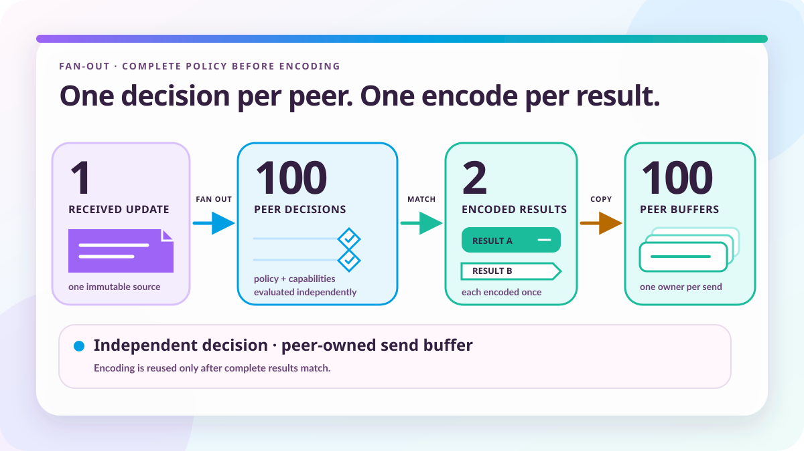

# One BGP UPDATE, many peers

*2026-08-04 by Thomas Mangin*

A hundred peers may need only two different UPDATE bodies. Each still has its own routing decision to make, and sharing a rebuilt buffer would tie its lifetime to the slowest send.



I wrote [ExaBGP](https://github.com/Exa-Networks/exabgp) to let an ordinary process speak BGP. It could announce a service or anycast prefix, inject a blackhole or FlowSpec rule, and turn received messages into text or JSON for another program. The configuration or the program using its API decided what to announce, and ExaBGP looked after the sessions.

An external program could decide to take a route from one peer and forward it to others, but ExaBGP supplied no internal routing path to make that decision for it. I had deliberately left that responsibility with the application. A useful tool does not have to be a complete router.

Ze began with a migration path for those users, with a compiled, multithreaded engine which could keep their configuration and process integrations. Adding a native RIB and policy, including route-server and route-reflection behaviour, brought those routing decisions inside the program. It also gave Ze work which ExaBGP had left to its users.

An UPDATE arriving from one peer might now leave through a hundred others, each with its own policy and encoding requirements. Those hundred decisions might produce only two different bodies, yet a straightforward implementation would build both answers repeatedly. I wanted to reuse the result once peers had independently reached the same decision, while leaving each send free to finish with its own output buffer.

*This article was co-authored with Claude and revised with OpenAI Codex. The architecture and design decisions are mine. Claude implemented the result comparison, generated AS path test cases and ran the competing benchmarks, as well as helping organise and draft the original text.*

## The comparison was in the wrong place

For a route server, considering the UPDATE for each destination is the fan-out. A destination's policy can suppress the route, replace its next hop or edit its communities and AS path. Protocol rules and negotiated capabilities affect the result too, so membership of a peer group supplies only part of what Ze needs to know before sending.

Deciding and then building once for every destination gives the right answer. In the hundred-peer example, though, a hundred builds produce only two distinct results. This is an illustration of the repeated operation, rather than a measurement from a deployment, and the repetition occurs even with a single UPDATE.

Ze's first implementation also revisited attributes within each build and produced temporary values which then had to be copied into output. Queued and immediate announcements had separate attribute writers. A reuse check compared materialised wire objects, so by the time it could recognise a match, the build it ought to have saved had already happened. The [fan-out architecture record](https://github.com/ze-software/ze/blob/main/docs/architecture/bgp/fanout-dedup.md) describes that earlier arrangement.

Moving the comparison ahead of the build would remove that particular repetition, provided the decision was complete. Moving it ahead of policy would be a different change: peers which appeared equivalent could still need different bytes by the time Ze sent to them.

## Decide first, then build

The received UPDATE is available as an immutable wire representation. Ze can inspect its path attributes and prefixes without copying the complete route into decoded objects, and the [forwarding path](https://github.com/ze-software/ze/blob/main/internal/component/bgp/reactor/reactor_api_forward.go) records the changes required for each destination by protocol rules and export policy.

The recorded changes may replace or remove attributes, edit the AS path, or alter which prefixes are announced and withdrawn, and policy can suppress the route altogether. Once encoding starts, a required change must either reach the output or suppress that destination's send. Falling back to the unchanged source after a build failure would undo the decision just made for that peer.

```text
immutable source UPDATE requiring announcement edits
    -> complete protocol and policy edits for this peer
    -> compare the source identity and the complete edits
    -> reuse a matching rebuild, or encode a new body
    -> keep the rebuilt bytes in this peer's own buffer
    -> finish destination-specific framing and queue its send
```

The reusable operation builds the content after the fixed BGP header. Splitting and some encoding-context work still happen afterwards for each destination, so two successful reusable rebuilds can replace a hundred rebuilds without combining the hundred sends.

This is usually called delayed materialisation. In Ze it puts a precise requirement on the comparison: it has to describe everything the rebuild will read, including any operation whose output is generated only when needed.

## An empty list can mean two different things

Ze serialises the completed edits into a stable byte representation, called a [digest](https://github.com/ze-software/ze/blob/main/internal/component/bgp/filterapi/fingerprint.go). Values carry their lengths and operations keep the order used by the rebuild, so a comparison can distinguish one instruction from the next.

Presence has meaning alongside content. A `nil` prefix replacement leaves the advertised prefixes alone, whereas a non-`nil` empty replacement removes them. Both have zero length, but reusing one result for the other would reverse the destination's decision. The digest therefore records whether a replacement is present as well as its bytes.

The AS path generator presents a different version of the same problem. Ze reuses its object between peers, so the address can remain unchanged while the path it describes changes. The digest includes the bytes the generator would produce; comparing its address would establish only that the same working storage was being used again.

Those descriptions still need the route they apply to. The [reuse table](https://github.com/ze-software/ze/blob/main/internal/component/bgp/reactor/forward_dedup.go) requires the same immutable source UPDATE object because equal edits over different routes can produce different results, and export policy can supply a replacement source for one destination. Separate objects containing equal source bytes currently rebuild separately. That forgoes some possible reuse, but keeps the comparison tied to the input on which the edits were decided.

Looking for a match by comparing every digest with all its predecessors would add expense as the destination count grew. Ze instead uses a 64-bit fingerprint to find candidates, then requires both the same source identity and byte-for-byte equality of the full digest. When the source and fingerprint match but the digest differs, the table records a collision and continues looking. The fingerprint alone can never authorise reuse.

Because full equality decides, the hash can remain cheap. The first version used FNV-1a, with a multiply for each byte dependent on the previous result, and a [48-byte digest was recorded at around 35 ns](https://github.com/ze-software/ze/blob/main/internal/component/bgp/filterapi/fingerprint.go). Every destination paid that cost, including the ones which found nothing to reuse. The current mixing function processes eight bytes per round.

The table lasts for one forwarding call. The first destination with a new result causes a rebuild, and later ones with the same source and digest can copy it. Retained descriptions are bounded to at most 128 classes and 64 KiB of digests, with no individual digest larger than 2 KiB, because network-influenced values should not make the comparison consume unlimited memory.

An edit set which exceeds the digest limit therefore bypasses reuse. If the table cannot record another class, Ze counts the refusal and keeps the peer's independently built result, while entries already recorded remain available to later peers. Exhausting space changes how much rebuilding is saved without changing what a destination receives.

## New results still need an encoder

These comparisons save a build when a matching result already exists. The first destination, or a later one which needs different bytes, still pays for encoding, so removing temporary copies from that path remained worthwhile.

The [body builder](https://github.com/ze-software/ze/blob/main/internal/component/bgp/reactor/forward_build.go) indexes the source attributes and plans which regions to retain, replace or remove. It walks the plan to calculate the exact output length, acquires storage, then walks it again to write. If policy leaves the communities alone, their bytes go straight from the source into the destination buffer. Retained runs within an edited community list can also be copied directly, without first assembling a temporary version of the whole list.

Sizing before writing replaces a guess about spare capacity and gives the builder a point at which to refuse an unsupported body size. A disagreement between the calculated length and the write is also a build failure. Both follow the same rule as an unapplied modification: the destination's send is suppressed.

The [configured and queued announcement writer](https://github.com/ze-software/ze/blob/main/internal/component/bgp/reactor/announce_build.go) now uses the same attribute-emission machinery. With separate writers, changing the way an announcement was scheduled could also select a different implementation of where its attributes belonged. Maintaining both was an unnecessary opportunity for them to disagree.

Where no change is required, the builder may have nothing to encode at all. With matching non-zero encoding contexts and no path-identifier rewrite or split required, [the forwarding body builder can borrow the original body](https://github.com/ze-software/ze/blob/main/internal/component/bgp/reactor/forward_body.go). An earlier version of this article called that future work, which was wrong. The source stays immutable and the receive cache supplies its lifetime, so unchanged forwarding already avoids the copy which would create rebuilt output.

## The copy was cheap enough to keep

Rebuilt output raises a further choice. Sharing one buffer among all equivalent destinations would remove the final per-peer copy, but the buffer would have to remain live until every send using it had finished, including the slowest. Each peer already had output storage it could release independently. I was reluctant to replace that arrangement without a measurement showing what the additional ownership bookkeeping would buy.

Claude ran the comparison. In the [original published measurements](https://github.com/ze-software/ze/blob/93faff0744e0801c2d22cf17060bc5496b66863c/website/blog/posts/one-bgp-update-many-peers.md), rebuilding took 426.85 ns and copying the result took 2.07 ns, about half of one per cent of the rebuild time. For that case, retaining the copy gave up very little of the saving.

It was a small case. [BenchmarkFanoutRebuildOnly](https://github.com/ze-software/ze/blob/main/internal/component/bgp/reactor/forward_dedup_bench_test.go) uses a [fixture](https://github.com/ze-software/ze/blob/main/internal/component/bgp/reactor/forward_dedup_test.go) announcing `10.0.0.0/24` and `10.0.1.0/24`, with ORIGIN, a three-AS path, NEXT_HOP, MED, LOCAL_PREF and eight communities. The body is 89 bytes excluding the BGP header, and replacing the next hop with `10.99.0.1` leaves its size unchanged. There is no MP_REACH or attribute 40 in the fixture for the other recorded edits to change.

The historical rebuild arm has no peer output pool and includes its owned-result allocation fallback. The copy arm uses already allocated slices, so its timing excludes buffer acquisition as well as policy and TCP. It was enough to inform this ownership decision, although the ratio cannot predict savings for arbitrary UPDATEs.

I kept the per-peer copy. Ze copies a reused rebuild into each later destination's own output buffer, and the loop collects pending sends until all comparisons have finished. Only then does it dispatch them, so no worker can return a buffer while the table still needs it as a copy source. Once dispatched, the rebuilt sends finish independently.

That independence applies to rebuilt output; a body borrowed from the receive cache still has the cache's lifetime. Items entering overflow take owned copies, including unchanged bodies which the normal channel path could borrow, because the queue can outlive the cache's retention safety valve. [How Ze manages memory](../how-ze-manages-memory/) follows the ownership change and its pool allocation fallbacks. Overflow can also hold an item while a destination's initial route announcements leave first, so the need for a copy does not depend solely on congestion.

## Configured routes have different inputs

Configured and API announcements are closer to ExaBGP's usual workload. Ze already has the route to announce, with no received UPDATE body to edit, so the comparison has to begin from the inputs to its builder.

The configured path groups established destinations using [the same per-peer facts passed to the batch builder](https://github.com/ze-software/ze/blob/main/internal/component/bgp/reactor/reactor_api_batch.go). These include the resolved next hop and session role, along with encoding and message-grouping settings. Within a batch, equal facts permit a shared build when grouping is enabled.

I kept the builder's inputs and the grouping key in one description. Maintaining a second list just for comparison would require every new per-peer input to be added in both places, and an omitted field could group peers which need different bytes. Here the same value reaches both uses, while the received-UPDATE path compares its source identity and completed edits. The two paths reuse builds at the point where their respective inputs are known.

## What the forwarding benchmark measured

The [fan-out benchmark](https://github.com/ze-software/ze/blob/main/internal/component/bgp/reactor/forward_dedup_bench_test.go) uses the same route fixture, with per-peer next-hop policy generating the requested number of distinct results. It runs the forwarding path with edit-set reuse enabled and disabled in one harness, after an untimed warm-up. Forwarding and pool dispatch are included, while a live TCP connection and the network receive loop are not.

The harness also counts rebuilds, so the timing can be checked against the operation the change is meant to remove. With reuse disabled it rebuilds once per destination; with reuse enabled the intended count is once per distinct result.

The original article reported these Apple M4 Max results from six runs per case in alternating order, with median times per destination. These remain historical measurements of that harness. The [architecture record](https://github.com/ze-software/ze/blob/main/docs/architecture/bgp/fanout-dedup.md) contains an earlier set with different timings and percentages, and is not the raw record for this table.

| Destinations | Distinct results | Reuse disabled | Reuse enabled | Change |
|---:|---:|---:|---:|---:|
| 2 | 1 | 1,228 ns | 1,090 ns | -11.2% |
| 2 | 2 | 1,233 ns | 1,286 ns | +4.3% |
| 10 | 2 | 1,234 ns | 989 ns | -19.8% |
| 100 | 2 | 1,100 ns | 729 ns | -33.7% |
| 100 | 100 | 1,102 ns | 1,115 ns | +1.2% |

When every destination needs different bytes, recording and comparing the results adds work and saves no builds. That cost was 1.2 to 4.3 per cent in these runs. When a hundred destinations needed two results, the saved builds reduced time per destination by 33.7 per cent. These figures do not establish TCP throughput, route convergence or complete-router performance.

Allocations across the wider harness stayed the same because stages surrounding the rebuild still allocate. The separate [warm rebuild checks](https://github.com/ze-software/ze/blob/main/internal/component/bgp/reactor/forward_build_merge_test.go) cover the encoder with output storage available. Saving repeated builds did not remove those surrounding allocations.

## Where I stopped

The encoder still walks its plan twice, once for size and once to write. Some lengths are known when edits are recorded and could be carried forward, but for now sizing and writing use the same emission walk. Another arrangement would need to save enough to justify maintaining both answers.

Changing the original source buffer would require a much broader ownership change. Every later reader and policy decision would have to be finished with its bytes, there would have to be room for the modification, and ownership would have to pass to the sends. I left that buffer immutable, so a later destination can still make its decision from the route as it arrived.

*Last updated: 11 September 2026. The history of this article is available in the [project's Git repository](https://github.com/ze-software/ze/commits/main/website/blog/posts/one-bgp-update-many-peers.md).*
