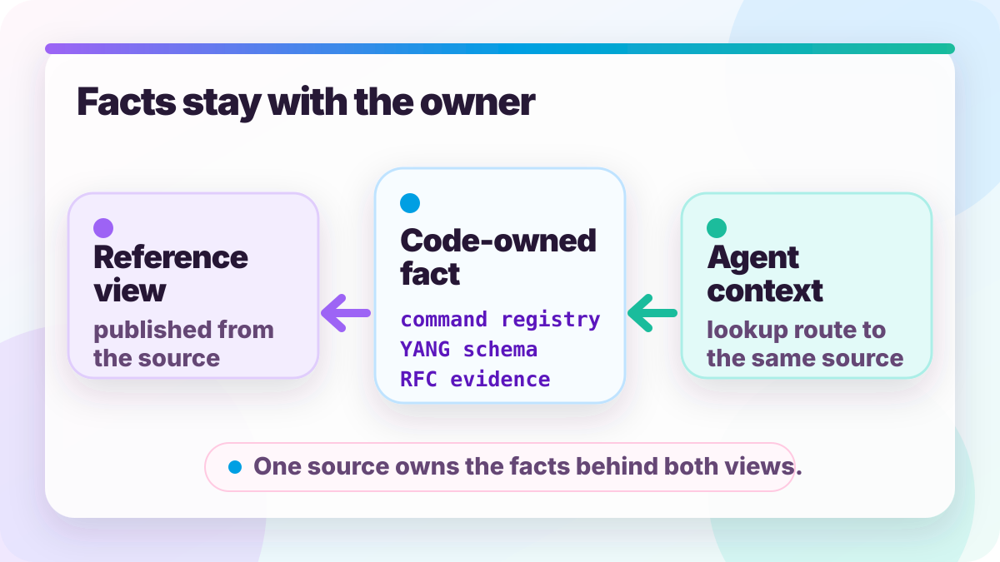

# Reference stays attached to code

*2026-08-22 by Thomas Mangin*

Ze does not copy facts into prose. It publishes checked views from the sources that own them.



## Key points

- Facts stay with the owner
- Pages publish checked views
- Agents follow the same routes

A large project has to explain itself. The website cannot become a second database.

Operators need current facts: commands, configuration leaves, plugin names, dependency reasons, RFC status and gaps. If the site lags behind the code, the project moves risk to the operator.

Developers and agents need a different view of the same material. They need the rule, source owner, evidence and prior decision while they edit. If that context comes from the same repository facts each time, the next session starts from the same map instead of inventing a new one.

Those two readers make the same demand: do not copy a fact away from the place that owns it.

The trick we used in Ze is simple. Keep each fact where the system already enforces it. Generate the reference page from that place. Check the links back to evidence.

*This article was drafted with OpenAI Codex. The design, decisions and conclusions are mine.*

## The useful split

<p class="blog-section-reveal">The website stays current when prose explains decisions and generators publish the inventory.</p>

Humans own the context, judgement and tradeoffs. The system owns the lists, counts and relationships.

That split keeps reference pages from becoming a second database. Each fact stays with its owner in the repository, and the website reads those owners to publish a view.

The table is useful because the same pattern repeats across enough of the project.

| Public reference | Source that owns the fact | Scale covered | Why generation helps |
|---|---|---:|---|
| CLI reference | Live command registry | 409 commands<br>across 48 groups | The page cannot miss a command the binary exposes. |
| Configuration reference | YANG schema from<br>`ze yang tree` | 36 top-level sections<br>27 from plugins | The page follows the schema when a plugin adds a leaf. |
| Plugin catalogue | Plugin registry and metadata | 90 runtime plugins<br>6 fixtures | Names, purposes, config roots and source paths come from registration. |
| Dependencies | `go.mod`<br>plus written reasons | 48<br>direct dependencies | Versions come from Go, while the reason stays human-written. |
| RFC status | RFC requirement ledger | 4,818 requirements<br>across 179 summaries | Public support claims stay tied to tests, gaps and annotations. |

The page can still be readable. It can group commands, add search, explain why a dependency exists, or warn that an RFC is partial. The fact itself still comes from the place that changes when the product changes.

Some pages are not regenerated every time the data changes. For those, the HTML carries `data-ze-stat` markers. JavaScript fetches `data/site-facts.json` and updates those values in the browser. The page stays static, while the visible count still comes from the latest generated data.


## Links turn reference into a route

<p class="blog-section-reveal">A reference becomes operational when every public claim has a maintained route back to its owner.</p>

A public claim is useful only when a reader can follow it back to the source and evidence behind it.

Ze uses links in both directions. Source files carry headers such as `// Design:` near the top. They point to the rule or design document that explains the file. Documents point back with `<!-- source: ... -->` anchors.

Two generated indexes invert those links:

```text
code file       -> documents that cite it
design document -> source files that name it
```

That is not small either.

| Link type | Current scale | What the link answers |
|---|---:|---|
| `// Design:` headers | 3125 | Which design or rule governs this file? |
| `// Related:` headers | 2076 | Which nearby file owns the related detail? |
| `// RFC:` headers | 773 | Which standards text is relevant here? |
| `<!-- source: ... -->` anchors | 6228 | Which source path supports this document claim? |
| Generated code-doc indexes | 2 files, about 600 KB together | Which side mentions the other side? |

A link is not proof. It is a route to proof. The useful property is that a stale route fails before a reader follows it.

This helps a developer with limited time. They can start from a public claim, follow the requirement or source link, and get to the code path. They do not have to search the whole tree.

The same path has to be part of the AI role. Ze's instructions tell the agent which header or generated index to read before it studies a subsystem. Without that rule, the tag is just text. The model can miss it, so the reference does not shape the work.

That is where the consistency comes from. The tag exists in the file, the generated index makes it searchable, and the role tells the agent when to use it.

## RFCs show the whole system

<p class="blog-section-reveal">Standards support is a chain from normative text to a public row, with omissions made visible along the way.</p>

An RFC support claim is credible only when the standard, Ze's interpretation, the evidence and the public page share one requirement id.

The RFC remains the authority. Ze keeps a local copy under `rfc/full/`, then records its implementation requirements in `rfc/short/`. Each requirement gets a stable id. For example, `RFC7606-7.1-1` identifies one rule from RFC 7606 section 7.1.

Writing the summary creates an obvious risk: the author can omit a normative sentence. Every listed requirement can have a test while the omitted sentence remains invisible.

The extraction record under `rfc/extraction/` checks the summary against the RFC text. A generated skeleton lists the normative locations found in the RFC. A reviewer must map each location to a requirement id or exclude it with a reason from the allowed list. The record therefore answers a separate question from the tests: did the summary account for the normative text?

Tests name the same requirement ids:

```go
// RFC requirement: RFC7606-7.1-1 negative - ORIGIN length 2 selects treat-as-withdraw.
```

The id connects the RFC sentence to its evidence:

```text
RFC sentence
  -> extraction review
  -> requirement id
  -> test or declared gap
  -> per-RFC ledger
  -> public support row
```

`./le rfc index-update` performs the joins. It combines the summary, extraction result, test tags and gap annotations. It writes one ledger per RFC under `rfc/requirements/` and the global index at `ai/RFC-REQUIREMENTS.md`.

| Layer | File or page | Job | Failure it catches |
|---|---|---|---|
| External text | `rfc/full/<stem>.txt` | Keep the RFC text local and stable. | A claim based on memory. |
| Local summary | `rfc/short/<stem>.md` | Give each obligation a stable id. | A test or gap with no named requirement. |
| Extraction review | `rfc/extraction/<stem>.json` | Account for each normative location. | A summary that missed a normative sentence. |
| Test tag | `RFC requirement:` comment | Tie evidence to one requirement id. | A passing test with no public claim. |
| Per-RFC ledger | `rfc/requirements/<stem>.md` | Join requirements, tests, gaps and evidence type. | Evidence hidden in the tree. |
| Global ledger | `ai/RFC-REQUIREMENTS.md` | Show coverage across all summaries. | Backlog hidden across many files. |
| Public page | `reference/rfcs/` | Publish support and gaps. | Private gaps missing from the public claim. |

The public RFC page is the final view of this chain. A supported row must point to current source, tests or documentation. A `{gap}` annotation in `rfc/short/` must appear as a public gap, and each enrolled RFC must have a public row.

This gives every public support claim a traceable route back to the standard. The requirement points to evidence, the evidence points to code, and a code change can update the claim that users see.

## Why this serves Ze

<p class="blog-section-reveal">One repository map can guide operators reading the website and agents changing the code.</p>

The same checked facts serve two readers: users who operate Ze and agents that change it.

The public site gives users the current support view and does not turn reference pages into separate ledgers.

The same structure gives agents a route through the repository. A change can start from the page, reach the requirement, reach the source, and then return to the page if the public claim changed.

That is the part I care about most. The website is useful for users, and the same links make AI work less forgetful. A later session can find the decision the earlier session used.

I hope the article is useful for other projects for that reason. The exact generators are Ze-specific. The shape is more general: public reference and working context can come from the same checked facts.

## The cost is worth naming

<p class="blog-section-reveal">Generated reference trades manual drift for machinery that must itself be tested and maintained.</p>

Generated reference replaces stale prose with generators, checks and links that all require maintenance.

Builds take longer, false positives can block correct work, and useful source links become debt when files move.

The system can also be believed too much. A generated page can be generated from the wrong source. A test tag can name the right requirement and assert the wrong behaviour. An extraction sign-off can record a walk over RFC text and still miss the meaning of a paragraph.

The fix is honesty. Each generated file has to say what it knows. The RFC ledger separates unit evidence from functional evidence, verification evidence from nightly evidence, mapped requirements from annotations, and extraction sign-offs from perfect understanding.

A page that publishes its uncertainty is safer than a page that says "supported" and stops.

## The shape I want

<p class="blog-section-reveal">The website MUST describe the repository that exists now, and stay synchronised with the published code, using facts its owners can still enforce.</p>

The target is a website where each fact stays with the owner that can keep it current.

A human writes the explanation, the judgement and the tradeoff. The program provides the lists, relationships and counts. The gate checks the links between them.

The result has to serve both readers. The public page tells users what the system supports now. The same links give an agent the context it needs to make the next decision consistent with the last one.

I do not want a website that remembers what Ze did last month. I want a website that is rebuilt from what Ze is now.
