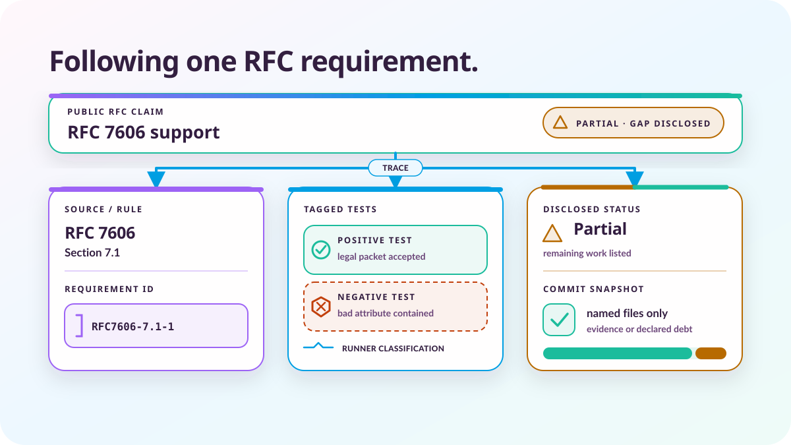

# The proof is the expensive part

*2026-08-06 by Thomas Mangin*

A requirement ID can connect the standard to a test and a public claim. Deciding whether those things mean the same thing remains the expensive part.

Ze is a network operating system being written with AI assistance. A routing daemon can parse the usual BGP UPDATEs and pass the examples its author thought to test, then mishandle a malformed attribute from a peer. A convincing diff gives me very little assurance about that case.

I use Claude to write code and tests, and its speed is useful until it produces both from the same mistaken reading of a requirement. In [AI slop is the wrong test](../ai-slop-is-the-wrong-test/) I called the proof the expensive part. Much of that expense comes from checking the relationship between things which look reasonable on their own.

Which RFC rule does a feature claim to implement? Which test would fail if it did something else? Does that test run, and can a user follow the public support claim back to what it observes?

*This article was drafted and revised with OpenAI Codex. The ideas, experience and conclusions are mine.*

## One malformed attribute

[RFC 7606 section 7.1](https://www.rfc-editor.org/rfc/rfc7606.html#section-7.1) gives a small enough example to follow. BGP's ORIGIN attribute is malformed if its length is not one octet or it has an undefined value. An UPDATE carrying that attribute SHALL be handled using treat-as-withdraw.

That last phrase has an operational meaning. Under [section 2](https://www.rfc-editor.org/rfc/rfc7606.html#section-2), all the routes in the affected UPDATE are treated as withdrawn and removed from the routes held for that peer. Ignoring the packet would leave an older route installed. Resetting the session would affect other routes as well.

Ze's [RFC 7606 checklist](https://github.com/ze-software/ze/blob/main/rfc/short/rfc7606.md) gives the ORIGIN rule the ID `RFC7606-7.1-1`. The ID names the document, section and obligation within that section. The same ID can then appear beside a test or a recorded gap without relying on someone remembering which paragraph a test name was meant to cover.

In [`rfc7606_test.go`](https://github.com/ze-software/ze/blob/main/internal/component/bgp/message/rfc7606_test.go), `TestRFC7606MalformedOriginLength` constructs an ORIGIN attribute two octets long, calls `ValidateUpdateRFC7606`, and requires the returned action to be exactly `RFC7606ActionTreatAsWithdraw`. Its comment carries the tag `RFC requirement: RFC7606-7.1-1 negative`.

The [validator](https://github.com/ze-software/ze/blob/main/internal/component/bgp/message/rfc7606.go) checks the length and the value in `validateOriginAttr`. Other tests in the same file supply the defined values, IGP, EGP and INCOMPLETE, and require acceptance. A router that accepts everything can pass many positive tests, while one that rejects everything can pass many negative tests. Requiring the exact error action also stops a session reset from passing as an acceptable way to contain the bad packet.

These tests inspect the validator's decision. They cannot tell us whether the running daemon acts on it.

## Following the test into the daemon

The same requirement is tagged in [`test/plugin/rfc7606-withdraw.ci`](https://github.com/ze-software/ze/blob/main/test/plugin/rfc7606-withdraw.ci). That scenario starts Ze and a test peer, sends an UPDATE with the malformed ORIGIN, and expects a later valid announcement over the same connection. It exercises the session-survival part of the behaviour through the running program.

Its own comments explain what it cannot establish: it never reads the routing table. Receiving a later UPDATE says nothing about whether the earlier malformed one removed a previously installed route. The scenario therefore does not claim `RFC7606-2-1`, the separate requirement that the routes be treated as withdrawn. That obligation has its own tests.

This is the sort of distinction I need a reviewer to make. The scenario's filename sounds broad enough to cover withdrawal, and its tag is attached to the relevant RFC. Someone still has to read the assertions and notice where their reach ends. Adding another tag would make the report look better without proving any more behaviour.

The generated [requirement table](https://github.com/ze-software/ze/blob/main/rfc/requirements/rfc7606.md) puts these tests on the same row. The Go tests are labelled `unit/verify`, and the scenario is `functional/verify`. Those labels describe the kind of test and the verification machinery responsible for it. They are not receipts from a successful run: functional verification selects suites according to the change, so a green verification result alone does not establish that this particular scenario ran.

The [carrier code](https://github.com/ze-software/ze/blob/main/internal/le/rfc/carriers.go) derives the functional classification from the verifier's suite list and refuses tags in recognised test formats which have no automatic runner. This catches a test placed outside a live suite. It cannot replace the run result or decide whether the test asserts enough.

## What reaches the public page

The [public RFC 7606 ledger](../../quality/rfc-compliance/rfc7606/) publishes the requirement text with those test references. It also separates tags from recorded discrimination evidence: an observed failure after deliberately breaking the claimed behaviour. Where that record is absent, the tagged unit is labelled `unproven`.

At this revision, RFC 7606 has tagged tests but no stored discrimination file. Its extraction sign-off is absent too. Following this requirement through the repository therefore ends with evidence to inspect and missing records to disclose, rather than a claim that every step has been completed.

The connection to the public page is generated. [`RequirementRows`](https://github.com/ze-software/ze/blob/main/internal/le/rfc/render.go) assembles the checklist and test tags, and the [site producer](https://github.com/ze-software/ze/blob/main/internal/le/site/rfcledger.go) consumes those same rows alongside the stored audits and proof records. A separate, hand-maintained public table would give us another place to forget a correction.

The overall support status is still a declaration in the summary's metadata, and RFC 7606 is declared `Partial`. One passing ORIGIN test cannot establish support for the rest of the document. The summary records a deliberate gap in section 5.1, and that admission is published alongside the support claim.

A missing corner of an RFC may be harmless in one deployment and unacceptable in another. I want an operator to be able to find the missing part before relying on it. The ledger is a statement by the project about its implementation and evidence; it is no IETF certificate.

## The checklist also needs review

The ORIGIN rule is unusually easy to extract. RFCs also put obligations in tables and state machines, or in ordinary prose without a capitalised `MUST`. Some requirements apply to a role Ze does not play, and others depend on a different document. An AI can produce an orderly checklist while getting any of those decisions wrong.

Ze records extraction reviews under `rfc/extraction/`. The [sign-off checker](https://github.com/ze-software/ze/blob/main/internal/le/rfc/signoff.go) compares the source inventory with that record in both directions. A detected source passage needs a classification, and a gated checklist requirement needs a source mapping or a declaration that it came from prose the inventory did not capture. The reviewer supplies the reasons for exclusions.

That exposes an unmatched passage or an unsupported checklist entry. It does not discover an obligation missed by both the extractor and the reviewer. A `manual-walk` sign-off records a review which the gate cannot reproduce mechanically, and a reason for excluding a passage can still be wrong.

Giving requirements stable names is also part of [Cloudflare's engineering standards system](https://blog.cloudflare.com/engineering-standards-enforcement/). Their standards are internal rather than IETF documents, but the need to refer back to the same statement survives that difference. I discuss shared repository conventions in [AI coding has not had its Rails moment](../ai-coding-has-not-had-its-rails-moment/); the cost here is deciding what each named statement obliges Ze to do.

## Evidence belongs to a particular change

The original version of this article described a commit gate which refused a normal commit unless the whole working tree matched a successful verification run. That is no longer the policy. The [current commit path](https://github.com/ze-software/ze/blob/main/docs/contributing/committing.md) permits local commits with failed or missing verification and records the resulting debt. An authorised push is refused while verification debt remains open. Structural failures attributed to the commit still require a recorded reason before it can proceed.

There is a separate problem when several agents share a checkout: the files checked and the files committed may differ. The generated commit script now uses a private index and the contents captured when the commit was prepared. Another session's staged file cannot join that commit, and a later edit to one of its named files stays in the working tree.

Neither mechanism improves a test's meaning. They preserve which change the evidence or the outstanding debt belongs to, so a local commit is not mistaken for a verified result. The command details belong in the committing guide, where they can change without turning this article into a second manual.

## Where I pay for it

For the ORIGIN example, the code which selects an action is short. The review has to connect section 7.1 to section 2, distinguish the validator's result from the daemon's behaviour, and refuse to count session survival as proof that a route disappeared. A generated table can retain those decisions, but it cannot make them on my behalf with enough reliability for me to stop questioning them.

I also have to decide whether an exception is legitimate and whether a disclosed gap is acceptable in the design. Those decisions interrupt implementation. A test which was attached to the wrong obligation needs another review even if its code has not changed, and an extraction review can end by adding requirements the implementation does not yet meet.

AI helps with the repetitive parts, including drafting cases and following a precise failure back to its source. It also produces more plausible material for review. I still need to judge whether the test would catch the defect we care about, and an empty gap list cannot tell me what we both failed to notice.

*Last updated: 8 September 2026. The history of this article is available in the [project's Git repository](https://github.com/ze-software/ze/commits/main/website/blog/posts/the-proof-is-the-expensive-part.md).*
