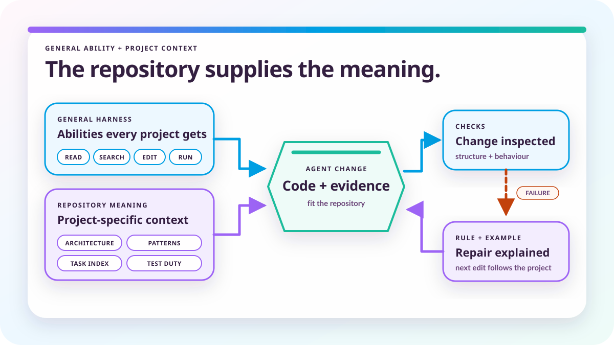

# The repository is half the AI harness

*2026-08-09 by Thomas Mangin*

The harness gives an agent tools. The repository provides project-specific meaning and checks that reject work which does not belong.



Ze is a network operating system spread over 760 Go packages. A model can open any one of them in under a second and still have no idea which package a change belongs in, which rule it is about to break, or which test would catch it if it gets that wrong. Nothing in the repository tells it.

The harness supplies the general abilities: read a file, search the tree, edit code, run a program, keep track of a task and report a failure. The project has to supply the meaning. A developer who misreads a convention usually notices, and a reviewer notices for them when they do not. An agent produces something plausible and moves on.

So an AI-ready repository has to teach the agent how the project works and catch it when it gets that wrong. This article describes how Ze is trying to do both. Why I think every serious project ends up building something similar is a separate argument, in [AI coding has not had its Rails moment](../ai-coding-has-not-had-its-rails-moment/).

I ended [AI slop is the wrong test](../ai-slop-is-the-wrong-test/) by saying that generated code has to be constrained, reviewed, tested and measured. [The proof is the expensive part](../the-proof-is-the-expensive-part/) explains how Ze ties an RFC claim to requirements, tests, known gaps and commit evidence. This article covers what comes before all of that: helping the agent find the right information before it writes the wrong code.

*This article was co-authored with Claude. The architecture, design decisions and conclusions come from my work on Ze. Claude helped organise the material and draft the text.*

## What the repository has to carry

<p class="blog-section-reveal">Repository links turn scattered design knowledge into context an agent can discover and verify.</p>

Ze carries that meaning in several layers.

`ai/INDEX.md` is a task-oriented entrance. It answers questions such as where to start when adding a plugin, changing configuration, implementing an RFC or adding a command, so the agent does not have to search hundreds of packages to find the first document.

`ai/PACKAGE-MAP.md` gives one short description for each of those 760 packages, and that saves a great deal of blind exploration.

Production Go files carry a `// Design:` line near their top, so opening the implementation reveals the document explaining why it exists. Closely connected files also point to each other with `// Detail:`, `// Overview:` and `// Related:` comments. There are 4,400+ of the first kind and 4,000+ of the second.

The documents point back into the source through `<!-- source: ... -->` markers. Small programs generate the two reverse indexes, `ai/CODE-TO-DOCS.md` and `ai/DOCS-TO-CODE.md`:

```text
code file       -> documents which explain it
design document -> source files which implement it
```

Those names are boring, which is useful. An agent can guess them without learning a product name for a simple idea.

All of these links are checked. A renamed file, a deleted design or a stale generated index makes verification fail. A hand-written index which quietly becomes fiction is worse than no index at all.

Source files are kept around one concern. Ze uses 1,000 lines as the point at which a production file must be examined for a second concern, which protects the agent's context: changing one thing should not mean paying for several unrelated things on every later step. A coherent file is allowed to stay coherent even when it is large, because mechanical splitting usually makes navigation worse.

Humans benefit from all of this too. We have longer-lived memory than an AI session, though we still forget, change teams and misunderstand old decisions. Structure reduces the amount everybody has to remember.

## A rule needs teeth

<p class="blog-section-reveal">A written rule becomes useful when checks reject violations and explain the correction.</p>

Consider command dispatch. A switch is simple and efficient when every possible command is known:

```go
switch name {
case "show":
    runShow()
case "configure":
    runConfigure()
}
```

Ze allows features supplied by plugins, including third-party plugins, so the complete set of commands is open. A central switch would force the core to know every extension and would destroy that separation.

Ze uses a registry instead. A registry is just a table which modules add themselves to:

```go
Register("show", runShow)
Register("configure", runConfigure)
```

The main program looks up the name in the table, and a third party can register another command without touching the core.

A requirement like that needs more than a sentence in an architecture document. The repository provides a chain. `ai/patterns/registration.md` explains why registration is required and what the accepted shape looks like. Nearly four hundred `register.go` files show the normal implementation. `./le repository generate` scans for those files and writes the list of modules loaded at startup, so nobody maintains it by hand. An edit hook rejects hard-coded command lists and registration hidden inside `init()`. A separate check catches dependencies crossing a plugin boundary. Tests prove that registration and discovery actually work.

Whatever the hook prints becomes the agent's next prompt, so it has to point somewhere useful:

```text
✘ BLOCKED: Implicit behavior in init()
  Registration belongs in register.go (or register_*.go), not init().
  Move Register/Subscribe/AddHandler/Hook calls to register.go.
  Global assignments belong in var blocks, not init().
  See ai/patterns/registration.md
```

That is the general shape I want from an AI-ready project. An important rule needs an explanation, a visible example, a mechanical check where one is possible, and a behavioural test.

The check should also run as early as it can. The `init()` mistake above is caught while the file is being written, before anything is compiled, so the agent repairs one file. Caught by a test run half an hour later, the same mistake has a morning's work sitting on top of it, all of it written on the assumption that the first file was acceptable.

Some evidence cannot be had that cheaply. A protocol error may need another routing daemon running beside Ze, so it naturally comes later and costs more. Ze's verification command currently runs twenty-five stages in roughly that order. Cheap structure, documentation and generated-file checks come first, then unit, race, allocation, functional and ExaBGP compatibility tests. Release evidence extends further into fuzzing, interoperability, Linux virtual machines, deployment tests, chaos and performance.

Those twenty-five stages are scar tissue. Almost every one exists because something plausible once passed through a weaker process.

## Testing has two directions

<p class="blog-section-reveal">Test depth must cover system reach and the conditions most likely to expose failure.</p>

Unit testing is one form of testing. It answers a small question, and it can give a dangerously reassuring answer when the real requirement is larger.

The functional direction asks how far through the system a behaviour has been proved. At the shallowest level a small piece of code returns the expected result. Deeper, the connected parts work together as a subsystem. Deeper still, a user achieves the result through the real program. At the far end, the program works with software written by somebody else.

A door is the easy analogy. At function level the handle turns and operates its latch. At subsystem level the handle is fitted to a door, and the door still opens and closes. At application level the door has to secure the building, because a door which works perfectly is still useless if it has been fitted next to a large hole in the wall. At interoperability level the door has to work with a frame and a lock supplied by somebody else.

For Ze, a parser can return the right values in a Go test while the complete daemon sends the wrong message on the wire. Ze can also agree with its own test peer while FRR, BIRD or another implementation rejects the result. Each level catches a class of mistake the level below cannot see.

The other direction asks what happens under unusual, hostile or expensive conditions. Fuzzing looks for the inputs the developer did not think to write, and race detection for the failures caused by operations happening at the same time. Mutation testing looks for the tests which stay green after the code has been deliberately broken. Allocation checks watch for unexpected memory use in work which runs frequently, and benchmarks for important work becoming unacceptably slow.

I group benchmarks with the safety checks rather than with performance work because uncontrolled CPU and memory use becomes an operational failure, and occasionally a denial-of-service weakness.

The two directions cross each other. A parser can be tested for correct output and then fuzzed with malformed input. A subsystem can be checked for its normal result and then run under the race detector.

All of that is ordinary engineering judgement, and judgement is the part an agent is worst at. It has to place a change on both axes before writing a line, and everything about its situation pushes the choice downwards. A unit test is faster to write, faster to run and far easier to turn green. So Ze takes the choice away from it, and testing goes through the same chain as the registration rule above.

## Which test a change owes

<p class="blog-section-reveal">Repository rules should assign each change the test depth its risk requires.</p>

`ai/rules/testing.md` is one of the rule files the task index routes to, and it is marked blocking, which puts it in front of the agent before the implementation exists rather than during review. Most of it is a lookup. The kind of change decides the test the change owes and the directory that test lives in.

| Change | Test it owes | Where |
| --- | --- | --- |
| BGP wire behaviour | a `.ci` scenario matching the bytes | `test/encode/`, `test/decode/` |
| A new configuration option | a scenario proving the parse succeeds or fails | `test/parse/` |
| A CLI subcommand | a scenario running the real command | `test/ui/` |
| A web endpoint | a scenario with HTTP expectations | `test/web/` |
| A configuration reload | a scenario driven by SIGHUP | `test/reload/` |
| Plugin behaviour | a scenario exercising the plugin API | `test/plugin/` |

The rule continues in the same way for interoperability, editor behaviour, fleet management and cross-component work. Unit tests on their own are accepted for genuinely internal logic, and the rule lists those cases so the exception cannot be invented on the spot. Everything else owes both kinds. Around 1,800+ `.ci` scenarios and 160+ editor `.et` scenarios are what that produces, next to the Go unit tests.

The test comes first and has to fail before the implementation is written. Each one carries `VALIDATES:` and `PREVENTS:` comments, so a later reader learns what the test proves and which regression it was written against.

The writing happens in an incubator. `test/draft/` is gitignored and skipped by every repository-wide gate, so a half-finished scenario cannot turn somebody else's verification run red while its author is still iterating on it. A draft ends in one of two moves, promotion into the live suite or deletion, and stopping anywhere else is refused. A scenario sitting in the incubator tells the next session nothing about whether it is abandoned scaffolding or work in progress.

## A test can gate nothing and still be green

<p class="blog-section-reveal">A green test is evidence only when the intended defect can make it fail.</p>

A test which exists can still guard nothing. A scenario passes happily when the result it observes arrives through some path other than the one under test. Three of Ze's redistribution tests stayed green with the late-join replay they existed to prove disabled: the route reached the peer another way, and nothing had ever asked them to prove otherwise.

So a new behavioural test is broken on purpose before it is trusted. Disable the function the test exists to prove, rebuild the real program, confirm the scenario fails, restore the function and confirm it passes again. Claude 5 started doing that on its own, and nobody had asked for it.

It catches tests which observe an unchanged path, along with tests which assert something that was already true before the feature existed, and it is now written into the rule as mandatory for any test meant to guard a specific behaviour. Automation does not reach that far: gomu rewrites production Go code and checks whether the unit tests notice, and nothing in the pipeline runs the `.ci` and `.et` scenarios under mutation.

Two detectors run as stage ten of the verification command. One finds a test with no reachable failure call, which cannot go red whatever the code does. The other finds a test file whose build tag no target ever supplies, so it never compiles into anything. Neither shows up in a count of tests, which is how the published totals grew for years with both hiding inside them. The counts are committed as floors which may only go down, so a regression cannot be laundered into the baseline by regenerating it.

The class nothing catches is a test which rebuilds the logic it names inside itself and asserts against its own copy. It is green against the correct implementation and the broken one alike, and its name reads as coverage of the real thing.

Three of those sat in the BGP reactor tests until a few days before this article, each maintaining its own map of which address families a peer had been sent an End-of-RIB for, a structure which existed in no production code. A session read them and was one step away from reporting a conformance violation which does not exist.

A detector was tried and rejected. Every table-driven test builds local fixtures, so it fired on hundreds of correct tests, and a check that noisy gets switched off. What replaced it is a habit an agent can apply while reading: name the function under test, then confirm the test body calls it.

Test volume alone creates false confidence. Ze's test-health page records volume, and it also reports the tests which assert nothing, the enrolled RFCs with no proven requirement, the mutation kill rate package by package, and how much of the suite expects a specific error rather than any error at all. The useful question is whether a plausible defect would make the evidence fail.

## Protect the proof from its author

<p class="blog-section-reveal">Evidence stays credible when weakening it requires visible and independent approval.</p>

An AI which sees a failing test will sometimes change the test to match its implementation. The result is green, internally consistent and wrong. Humans do this too, usually more slowly and with better excuses.

A single edit does the damage, and every later stage then agrees with it, which is why this check sits at the earliest point there is. An edit hook reads every write to a test file and refuses the recognisable moves: adding a skip, dropping assertions, downgrading a fatal assertion to a warning, deleting table rows, removing expectations from a scenario. When a relaxation is genuine, the reason goes on the line and the edit proceeds:

```text
# test-relax: <why this test/assertion no longer applies>
```

Around 60 lines in the tree carry a genuine one, and reading them is how I find out what has been given up. There are 755 markers across 468 files, so most of them are receipts left by a hook which fires on edits that relax nothing, and separating the two took an audit I should not have needed. The agent writing the relaxation also writes its reason, so what I am reading is its own account of why the test no longer applies. On the tests that matter most, that is not good enough.

A test tagged with an RFC requirement is the evidence behind a public compliance claim, and there the hook refuses outright:

```text
✘ BLOCKED: RFC-tagged test - ask the user before changing it
  grmarker_test.go enforces RFC obligations:
    - RFC4724-4.1-4 positive
  These are the proof behind a public compliance claim
  (docs/features/rfc-status.md), counted by `./le rfc check`.
  Editing the test to match the code inverts that: the obligation stops
  being proven while still being advertised.
  Fix the CODE. If you believe the test is genuinely wrong, STOP and show
  the user the RFC text next to the test.
  `// test-relax:` does NOT authorize this: it is your own justification,
  not the user's approval.
```

Approval leaves its own record on the changed test, dated and greppable, so a decision I made in one conversation is still visible to the session that arrives a month later.

I described the ledger behind those tags in [The proof is the expensive part](../the-proof-is-the-expensive-part/), so I will not repeat it here beyond the principle it rests on: the authoring process has to make every attempt to weaken the evidence visible, whether the author is a model or a person.

## What this costs

<p class="blog-section-reveal">Repository context and deeper checks trade maintainer time for stronger automated evidence.</p>

I would rather not pretend this machinery is free.

The generated indexes are large. `ai/CODE-TO-DOCS.md` and `ai/DOCS-TO-CODE.md` are around a quarter of a megabyte each, and the RFC requirement ledger is over a megabyte. Nobody reads those files, but they are regenerated, checked and committed, and they make diffs noisier.

The six thousand cross-reference comments have to stay true. Every renamed file, every moved design document and every merged package is a small maintenance debt. The checks stop them rotting silently, which means they turn into failures somebody has to clear.

A full verification run is slow enough that I do not run it after every edit, so most of the day I run the cheap stages and rely on the full run before a commit is accepted. That is a real gap and I know it. Breaking every new behavioural test on purpose adds a rebuild and a second run on top of that, minutes at a time, and it is the one item on this list I have never regretted paying for.

The hooks fire on code which is correct. A pattern which is right ninety-five times out of a hundred still blocks the other five, and arguing with a hook is more annoying than arguing with a person. When a rule turns out to be wrong, it has already been copied into hundreds of files by an agent which was doing exactly what it was told.

I still think the trade is worth it, because the alternative is reading every diff myself. None of that is automated, and it spends my time instead of machine time. It is a trade though, and a smaller project should pick the parts which pay for themselves rather than copying all of it.

## A project can build this incrementally

<p class="blog-section-reveal">Projects can add repository context gradually through conventions that prevent repeated mistakes.</p>

Ze's machinery is large because Ze is large and because we have been learning while building it. Another project can start with the useful core, roughly in this order.

1. **Make the project folder runnable.** Keep configuration, fixtures and working data in predictable places, and reduce the differences between development, testing and installation.
2. **Write a short architecture map.** Explain the major directories, what belongs in each one and which dependencies are allowed.
3. **Create one task-oriented index.** Route the common jobs to the relevant design, rule and example.
4. **Link source to design and back again.** Put the link where an agent opening the source will see it, generate the reverse index so no large table is maintained by hand, and fail the build when either side goes stale.
5. **Record the approved patterns.** Show how the project implements registration, configuration, commands, storage and the other repeated concerns.
6. **Turn repeated mistakes into checks.** Start with the cheap ones, for patterns which can be recognised reliably.
7. **Test for depth and under pressure.** Cover function, subsystem, application and third-party software where the feature needs it, then add fuzzing, race detection, mutation checks, memory limits and benchmarks according to the risk. Write down which kind of change owes which kind of test, so an agent looks the answer up instead of deciding how much proof it feels like producing.
8. **Provide one verification command.** Run the cheap failures before the expensive evidence, and continue far enough to report every useful failure rather than stopping at the first.
9. **Make every failure useful.** Name the problem, the affected file, the expected pattern and the document which explains the correction.

The point of writing any of it down is retention. A prompt correction lasts for one conversation. A documented pattern, linked from the code and backed by a check, survives the next agent, the next human and the next year.

Ze has not found the solution, and we are still working on it. This describes summer 2026, and model releases arrive almost every month. Each one moves the boundary: a more capable model may make some of this machinery unnecessary, or it may use a richer structure correctly and justify adding more. If you are reading this later, check which of these problems have already been solved before copying anything.

Claude has developed its own vocabulary while helping me build all of it. For every RFC `MUST`, Ze tests the valid case and the failure case. I called those positive and negative tests. Claude calls them the two polarities. Claude also calls important decisions load-bearing, so often that it has become an online joke. If this continues, I expect the larger ones to become load-banging. I normally cut the phrase from prose. This time the joke has earned its place.
