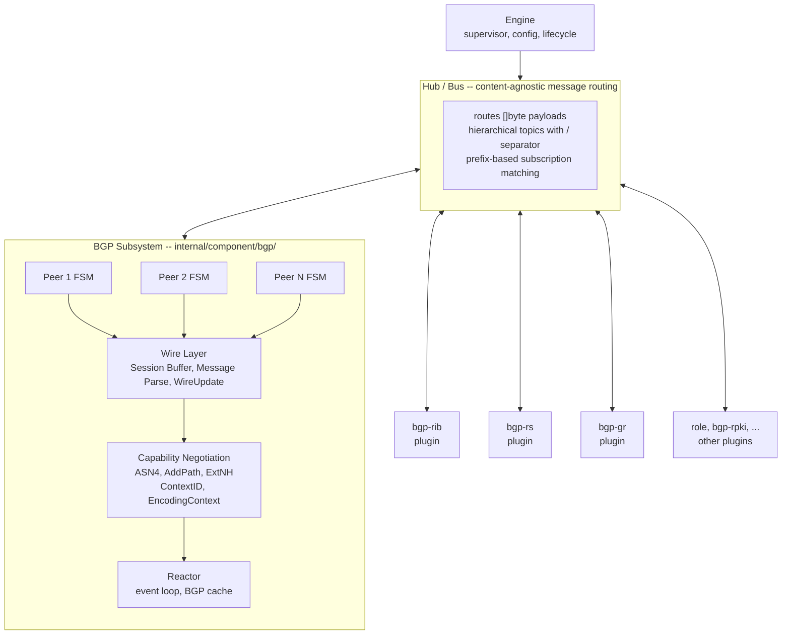
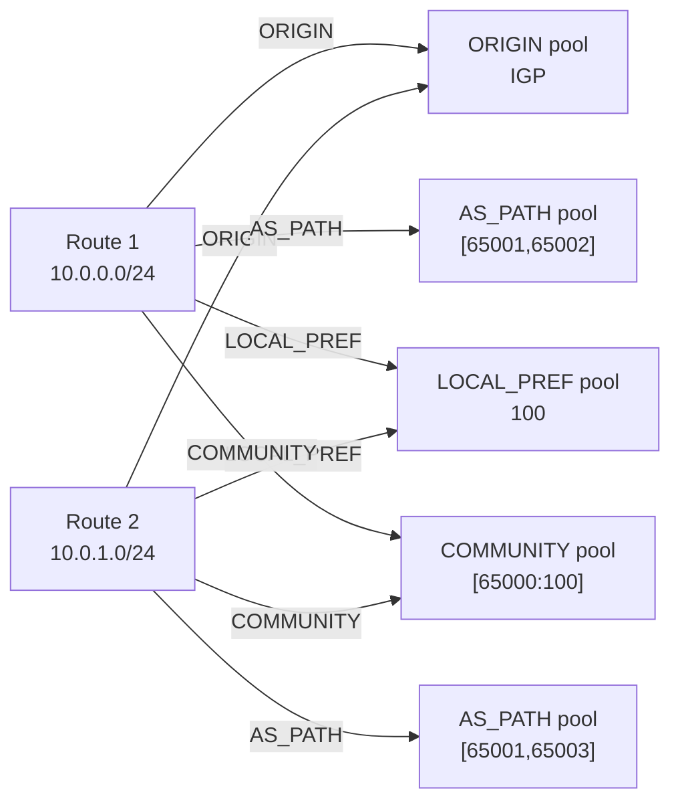
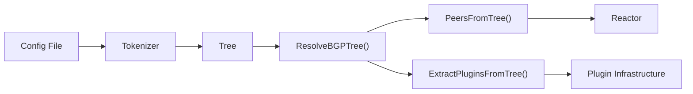

# Ze -- Design Document

A plugin-first, wire-first BGP daemon in Go, built for programmability and performance.

**Architect:** Thomas Mangin
**Code:** Primarily authored by Claude (Anthropic), directed by the architect
**Predecessor:** ExaBGP
**Status:** Pre-release, active development

---

## Goals

**Component architecture.** Ze is a generic engine with a hub/bus at its center.
Subsystems (BGP, and in the future interface control, firewall, and others) and plugins
(RIB, route reflection, graceful restart, policy) are all components that connect to
the hub. BGP was the first subsystem -- built to match ExaBGP's capabilities -- but the
architecture does not assume it is the only one. The goal is to lower the barrier to
network development: anyone can write a plugin in any language -- Go, Python, Rust, or
anything that reads lines and writes lines -- without understanding the engine internals.
Everyone can extend Ze by writing a plugin, not by forking a monolith. Internal
components communicate via `net.Pipe()` with DirectBridge; external ones connect back
over TLS. CLI access to the running daemon uses SSH.

**Wire-first performance.** BGP messages are byte buffers, not parsed structs. Parsing happens
lazily through offset-based iterators. Attributes are deduplicated in per-type memory pools
with refcounted handles. When source and destination peers share the same encoding context
(ContextID), UPDATE messages are forwarded as raw wire bytes with zero parsing. Ze does the
hard thing properly -- zero-copy, pool dedup, buffer-first encoding -- and never trades
correctness for speed of implementation.

**Broad protocol coverage.** 21 address families (IPv4/IPv6 unicast, multicast, VPN,
FlowSpec, FlowSpec VPN, EVPN, VPLS, BGP-LS, MPLS, MUP, MVPN, RTC), 13 capabilities
(Multiprotocol Extensions, ASN4, ADD-PATH, Extended Message, Extended Next Hop,
Graceful Restart, Long-Lived Graceful Restart, Route Refresh, Enhanced Route Refresh,
BGP Role, Hostname, Software Version, Link-Local Next Hop), and 15 path attribute
types. RFC 8203 Administrative Shutdown Communication for graceful teardown with
human-readable messages. All encode, decode, and round-trip through the same wire
representation.

**ExaBGP migration path.** `ze config migrate` converts ExaBGP configuration files to
ze-native format. `ze exabgp plugin` runs existing ExaBGP processes with Ze as the BGP
engine. The migration is external tooling only -- the engine itself has zero ExaBGP
format awareness.

**Observable by default.** Structured logging via slog, JSON events for every BGP state
transition and route change, and a chaos testing framework with a web dashboard for
fault injection.

## Non-Goals

**FIB manipulation (deferred).** Ze does not currently install routes into the kernel
forwarding table. FIB integration is planned but not the current focus. For now, Ze is
a protocol speaker and route injector, like ExaBGP.

**Full routing suite (deferred).** OSPF, IS-IS, LDP, and MPLS control plane are not
currently in scope. The focus is on getting BGP right first.

**Backwards compatibility with itself.** Ze has never been released. No users, no compat
code, no shims, no fallbacks. If something needs to change, it changes.

## Target Use Cases

**Programmable route injection.** Announce and withdraw prefixes from scripts, controllers,
or orchestration systems. JSON events out, text commands in.

**Route server (IX-style).** Many peers, client-to-client route reflection (RFC 7947),
per-peer policy via plugins.

**BGP monitoring and analysis.** Decode and inspect BGP sessions. Adj-RIB-In with raw hex
replay. Event subscription and streaming.

**ExaBGP replacement.** Drop-in migration for ExaBGP deployments with better performance,
broader protocol support, and a plugin ecosystem.

---

## Key Principles

| Principle | Rule |
|-----------|------|
| Buffer-first | All wire encoding writes into pooled, bounded buffers via `WriteTo(buf, off) int`. No `append()`, no `make([]byte)` in encoding helpers, no `Pack()` returning a slice. |
| Lazy over eager | Pass raw byte slices, not parsed structs. Use offset-based iterators (`Next()` yields one element), not collected slices. Never wrap raw data in a struct with accessor methods when existing wire type methods work. |
| Pool-based dedup | Per-attribute-type pools (ORIGIN, AS_PATH, LOCAL_PREF, ...) with refcounted handles. Per-family NLRI pools. ORIGIN has 3 possible values; LOCAL_PREF has a handful; dedup saves memory at scale. |
| One representation | Wire bytes are the source of truth. Everything else (iterators, JSON, text) is a view. WireUpdate is a byte buffer with lazy accessor methods, not a parsed struct. |
| Engine is stateless for routes | The engine forwards wire bytes and caches them for zero-copy forwarding. Plugins own RIB storage, policy, and route selection. |
| No premature abstraction | Three concrete implementations before abstracting. Boring code that obviously works over clever code that might. |
| YANG-modeled everything | All RPCs and config schemas are YANG-defined. CLI dispatch, plugin registration, schema discovery, and config parsing all flow from YANG modules. |

---

## Architecture



**Engine** is the supervisor: it manages lifecycle, configuration, and coordinates
startup/shutdown. It does not know about BGP specifics.

**Hub / Bus** is the central message router. It is content-agnostic -- it routes
`[]byte` payloads on hierarchical topics (e.g., `bgp/update`, `bgp/events/peer-up`)
with prefix-based subscription matching. All components connect to the hub: subsystems,
plugins, config provider. Like RabbitMQ or Kafka -- the bus never inspects payload
content.

**BGP Subsystem** is a component that connects to the hub. It owns the protocol: TCP
connections, FSM state machines, wire parsing, capability negotiation, and the reactor
event loop. It produces structured events and consumes commands. It never imports
plugin code. BGP is the first (and currently only) subsystem, but the architecture
does not assume it is the last.

**Plugins** are components that also connect to the hub. They implement RIB storage
(`bgp-rib`), route server reflection (`bgp-rs`), graceful restart (`bgp-gr`), BGP
role enforcement (`bgp-role`), and per-family NLRI decode/encode (`bgp-nlri-evpn`,
`bgp-nlri-flowspec`, etc.). Plugins can run in-process (goroutine + DirectBridge) or
as external processes (TLS connect-back).

For detailed architecture, see `docs/architecture/core-design.md`.

---

## Wire-First Design

### WireUpdate

The central data type. A BGP UPDATE message represented as a byte buffer with lazy
accessor methods:

```
WireUpdate
  payload     []byte           -- UPDATE body (after BGP header)
  sourceCtxID ContextID        -- encoding context for zero-copy decisions
  messageID   uint64           -- unique ID for cache-based forwarding
  sourceID    SourceID         -- which peer sent this
```

Accessor methods (`Withdrawn()`, `Attrs()`, `NLRI()`, `MPReach()`, `MPUnreach()`)
return slices into the payload without copying. Iterator methods (`AttrIterator()`,
`NLRIIterator()`) walk the wire bytes at offsets, yielding one element at a time.

No intermediate struct is ever built to iterate once.

### Buffer-First Encoding

All wire writing follows the `WriteTo(buf, off) int` pattern. Buffers come from pools
sized to RFC maximums:

| Pool | Size | Purpose |
|------|------|---------|
| `readBufPool4K` | 4,096 | Standard message reads |
| `readBufPool64K` | 65,535 | Extended message reads |
| `buildBufPool` | 4,096 | UPDATE building |
| Per-plugin `nlriBufPool` | 4,096 | NLRI encoding |

The skip-and-backfill pattern handles variable-length sections: write fixed bytes, skip
the length field, write payload forward, backfill the length at the saved position.
This avoids the `Len()`-then-`WriteTo()` double traversal in the hot path.

### Zero-Copy Forwarding

Each peer's negotiated capabilities (ASN4, ADD-PATH, Extended Next Hop) are hashed into
a `ContextID` (uint16). When source and destination peers share the same ContextID, the
engine forwards the cached wire bytes unchanged. When they differ, the engine re-encodes
through `PackContext`.

### Pool-Based Deduplication

RIB storage (in plugins) uses per-attribute-type pools. Each pool stores unique values
and returns opaque handles. Route entries are collections of handles, not copies:



Pools use a double-buffer compaction scheme: active buffer receives new entries while
the alternate buffer holds the compacted set. Migration is incremental, never
stop-the-world.

---

## Plugin Architecture

### The Proximity Principle

All code for a concern lives in its folder. The "delete the folder" test: if you delete
`internal/component/bgp/plugins/rib/`, only RIB functionality disappears. The engine,
reactor, FSM, and all other plugins continue to work. Blank imports in
`internal/component/plugin/all/all.go` are the only coupling.

### YANG Is Required

Every plugin with RPCs needs a YANG schema. There is no "command module" category --
missing YANG is a bug, not a design choice. YANG drives CLI dispatch, schema discovery,
config parsing, and protocol wire format.

### Plugin Invocation Modes

| Mode | Syntax | Transport |
|------|--------|-----------|
| Internal | `ze.pluginname` | Goroutine + `net.Pipe()` + DirectBridge |
| Fork (default) | `pluginname` | Subprocess, TLS connect-back |
| Direct | `ze-pluginname` | Sync in-process call |
| Path | `/path/to/binary` | External binary, TLS connect-back |

Internal plugins bypass pipes entirely via DirectBridge for hot-path performance.
External plugins connect back to the engine's TLS listener and authenticate with a
token via `ZE_PLUGIN_HUB_TOKEN`.

### 5-Stage Startup Protocol

| Stage | Direction | RPC |
|-------|-----------|-----|
| 1. Declaration | Plugin -> Engine | `ze-plugin-engine:declare-registration` |
| 2. Config | Engine -> Plugin | `ze-plugin-callback:configure` |
| 3. Capability | Plugin -> Engine | `ze-plugin-engine:declare-capabilities` |
| 4. Registry | Engine -> Plugin | `ze-plugin-callback:share-registry` |
| 5. Ready | Plugin -> Engine | `ze-plugin-engine:ready` |

After stage 5, the SDK wraps the socket in `MuxConn` for concurrent RPCs. The wire
format is `#<id> <verb> [<json>]\n` -- newline-delimited, UTF-8, with correlation IDs.

### IPC Wire Format

```
#42 ze-bgp:peer-list {"selector":"10.0.0.1"}
#42 ok {"peers":[{"address":"10.0.0.1","state":"established"}]}
```

Methods use `module:rpc-name` format derived from YANG module names. All JSON keys
are kebab-case. Address families are `"afi/safi"` strings (`"ipv4/unicast"`,
`"l2vpn/evpn"`).

### Shipped Plugins

| Plugin | Purpose |
|--------|---------|
| `bgp-rib` | Route Information Base (received/sent routes) |
| `bgp-adj-rib-in` | Adj-RIB-In with raw hex replay |
| `bgp-persist` | Route persistence across restarts |
| `bgp-rs` | Route server, client-to-client reflection (RFC 7947) |
| `bgp-gr` | Graceful Restart (RFC 4724) + Long-Lived GR (RFC 9494) |
| `bgp-route-refresh` | Route Refresh handling (RFC 2918, RFC 7313) |
| `role` | BGP Role enforcement (RFC 9234) |
| `bgp-watchdog` | Deferred route announcement with named groups |
| `bgp-hostname` | FQDN capability (code 73) |
| `bgp-softver` | Software version capability (code 75) |
| `bgp-llnh` | Link-local next-hop for IPv6 |
| `bgp-rpki` | RPKI origin validation (RFC 6811, RFC 8210) |
| `bgp-evpn` | EVPN NLRI encode/decode (5 route types) |
| `bgp-flowspec` | FlowSpec NLRI encode/decode |
| `bgp-ls` | BGP-LS NLRI decode |
| `bgp-mup` | Mobile User Plane NLRI encode/decode |
| `bgp-vpn` | VPN NLRI encode/decode |
| `bgp-vpls` | VPLS NLRI encode/decode |
| `bgp-labeled` | MPLS labeled NLRI encode/decode |
| `bgp-mvpn` | Multicast VPN NLRI decode |
| `bgp-rtc` | Route Target Constraint NLRI decode |

---

## Configuration

### Syntax

JUNOS-like hierarchical format. `{}` blocks, `;` terminators, `#` comments.
YANG-driven parsing: each config node's type (leaf, leaf-list, container, list)
determines how it is parsed.

```
environment {
    log {
        level info;
    }
}

bgp {
    group my-peers {
        local-as 65001;

        family {
            ipv4 unicast;
            ipv6 unicast;
        }

        peer 192.168.1.2 {
            peer-as 65002;
            local-address 192.168.1.1;
            hold-time 90;
        }
    }
}

plugin {
    internal bgp-rib;
}
```

### Config Pipeline



### Inheritance

Three levels with deep-merge for containers:

| Level | Scope |
|-------|-------|
| `bgp { }` | Global defaults for all peers |
| `group <name> { }` | Group defaults, override globals |
| `peer <ip> { }` | Per-peer overrides |

### ExaBGP Migration

`ze config migrate <file>` converts ExaBGP configuration to ze-native format.
`ze exabgp plugin <cmd>` runs ExaBGP processes with Ze as the engine, translating
between ExaBGP's JSON format and Ze's protocol. The engine itself has zero awareness
of ExaBGP formats -- all translation lives in external tooling.

### Configuration Database

Unlike most Unix daemons that only offer flat configuration files, Ze stores its
configuration in ZeFS -- a netcapstring-framed blob store (`.zefs` file) that supports
named entries, hierarchical keys, zero-copy reads via mmap, and in-place updates.
This makes Ze more like a network operating system (similar to VyOS or JunOS) than a
traditional daemon: configuration is managed through an interactive editor with
draft/commit workflow, not by editing text files and sending SIGHUP.

### Interactive Editor

`ze config edit` provides a user-friendly interactive configuration editor with
YANG-aware tab completion, validation, diff preview, and draft/commit workflow.
The editor is also accessible over SSH on the running daemon, so configuration
changes can be made remotely without filesystem access.

### Config Reload

Ze also supports traditional configuration reload via SIGHUP or `ze signal reload`:

- Add/remove peers without restart
- Update peer settings with automatic reconciliation
- Graceful failure on invalid config (keeps running with previous config)
- Rapid successive reloads handled correctly

---

## Protocol Scope

### Address Families

For the full table with RFC references and plugin attribution, see `docs/features.md`.

| Family | AFI/SAFI | Encode | Decode | Route Config |
|--------|----------|--------|--------|--------------|
| IPv4 Unicast | 1/1 | Yes | Yes | Yes |
| IPv6 Unicast | 2/1 | Yes | Yes | Yes |
| IPv4 Multicast | 1/2 | Yes | Yes | Yes |
| IPv6 Multicast | 2/2 | Yes | Yes | Yes |
| IPv4 VPN | 1/128 | Yes | Yes | Yes |
| IPv6 VPN | 2/128 | Yes | Yes | Yes |
| IPv4 FlowSpec | 1/133 | Yes | Yes | Yes |
| IPv6 FlowSpec | 2/133 | Yes | Yes | Yes |
| IPv4 FlowSpec VPN | 1/134 | Yes | Yes | Yes |
| IPv6 FlowSpec VPN | 2/134 | Yes | Yes | Yes |
| IPv4 MPLS Label | 1/4 | Yes | Yes | Yes |
| IPv6 MPLS Label | 2/4 | Yes | Yes | Yes |
| L2VPN EVPN | 25/70 | Yes | Yes | Yes |
| L2VPN VPLS | 25/65 | Yes | Yes | Yes |
| IPv4 MUP | 1/85 | Yes | Yes | Yes |
| IPv6 MUP | 2/85 | Yes | Yes | Yes |
| BGP-LS | 16388/71 | No | Yes | No |
| BGP-LS VPN | 16388/72 | No | Yes | No |
| IPv4 MVPN | 1/5 | No | Yes | No |
| IPv6 MVPN | 2/5 | No | Yes | No |
| IPv4 RTC | 1/132 | No | Yes | No |

Families are registered dynamically by plugins via `PluginRegistry.Register()`, not
a static list. New families are added by writing a plugin with NLRI encode/decode
and registering it.

### Capabilities

| Capability | Code | RFC | Status |
|------------|------|-----|--------|
| Multiprotocol Extensions | 1 | RFC 4760 | Implemented |
| 4-byte ASN | 65 | RFC 6793 | Implemented |
| Route Refresh | 2 | RFC 2918 | Implemented |
| Enhanced Route Refresh | 70 | RFC 7313 | Implemented |
| ADD-PATH | 69 | RFC 7911 | Implemented |
| Extended Message | 6 | RFC 8654 | Implemented |
| Extended Next Hop | 5 | RFC 8950 | Implemented |
| Graceful Restart | 64 | RFC 4724 | Implemented |
| Long-Lived Graceful Restart | 71 | RFC 9494 | Implemented |
| BGP Role | 9 | RFC 9234 | Implemented |
| Hostname | 73 | draft-walton-bgp-hostname-capability | Implemented |
| Software Version | 75 | draft-ietf-idr-software-version | Implemented |
| Link-Local Next Hop | 77 | draft-ietf-idr-linklocal-capability | Implemented |

### Path Attributes

| Attribute | Code | RFC | JSON Key |
|-----------|------|-----|----------|
| ORIGIN | 1 | RFC 4271 | `origin` |
| AS_PATH | 2 | RFC 4271 | `as-path` |
| NEXT_HOP | 3 | RFC 4271 | `next-hop` |
| MED | 4 | RFC 4271 | `med` |
| LOCAL_PREF | 5 | RFC 4271 | `local-preference` |
| ATOMIC_AGGREGATE | 6 | RFC 4271 | `atomic-aggregate` |
| AGGREGATOR | 7 | RFC 4271 | `aggregator` |
| COMMUNITY | 8 | RFC 1997 | `community` |
| ORIGINATOR_ID | 9 | RFC 4456 | `originator-id` |
| CLUSTER_LIST | 10 | RFC 4456 | `cluster-list` |
| MP_REACH_NLRI | 14 | RFC 4760 | -- |
| MP_UNREACH_NLRI | 15 | RFC 4760 | -- |
| EXTENDED_COMMUNITY | 16 | RFC 4360 | `extended-community` |
| LARGE_COMMUNITY | 32 | RFC 8092 | `large-community` |
| PREFIX_SID | 40 | RFC 8669 | `prefix-sid` |

### Negotiated Capabilities and Encoding

The same wire bytes parse differently depending on negotiated capabilities:

- `AS_PATH [00 01 FD E8]` = ASN 65000 (4-byte ASN) or two ASNs 1 + 64488 (2-byte)
- NLRI `[00 00 00 01 18 0a 00 00]` = path-id + prefix (ADD-PATH) or two prefixes (no ADD-PATH)

Each peer's capabilities are hashed into a `ContextID`. PackContext carries the
encoding rules (ASN4, ADD-PATH mode per family, Extended Next Hop mappings) needed
to encode/decode correctly for that peer.

### RFC MAY Clause Decisions

Where RFCs say "MAY", Ze documents the decision explicitly:

| RFC | Clause | Ze Decision |
|-----|--------|-------------|
| RFC 4760 section 6 | Non-negotiated AFI/SAFI handling | Strict by default (NOTIFICATION). Config option `ignore-mismatch` for buggy peers. |

Decisions are tracked in `docs/architecture/rfc-may-decisions.md`.

---

## Security

### Session Authentication

| Mechanism | Status | Platform |
|-----------|--------|----------|
| TCP MD5 (RFC 2385) | Implemented | Linux |
| TTL Security / GTSM (RFC 5082) | Implemented | Linux |
| TCP-AO (RFC 5925) | Not implemented | -- |

Per-peer configuration via `md5-password` and `ttl-security` settings.

### Malformed Message Handling

- Never panic on malformed input. All network input is untrusted.
- Malformed messages produce the correct NOTIFICATION per RFC 4271, followed by session teardown.
- Structured log events for every malformed message with peer address, message type, and error.
- Unknown config keys are rejected with a suggestion, never silently ignored.

### Plugin Isolation

External plugins run as separate processes. A plugin crash does not bring down the
engine or other plugins. Internal plugins run as goroutines with `net.Pipe()` but
share the process. External plugin authentication uses TLS with token-based auth
(`ZE_PLUGIN_HUB_TOKEN` environment variable).

---

## Operational Behavior

### Signal Handling

| Signal | Action |
|--------|--------|
| SIGTERM | Graceful shutdown |
| SIGINT | Graceful shutdown (Ctrl+C) |
| SIGHUP | Configuration reload |
| SIGUSR1 | Status dump |
| SIGQUIT | Goroutine dump + exit (Go runtime default) |

Shutdown sends NOTIFICATION/Cease to all established peers, waits for TCP flushes,
then exits. `ze signal reload` and `ze signal stop` provide CLI equivalents.

### CLI

Ze uses a domain-based CLI dispatch. Each domain (`bgp`, `config`, `schema`, `hub`,
`exabgp`) has its own `cmd/ze/<domain>/main.go` with `func Run(args []string) int`.
Subcommands use their own `flag.FlagSet`. Exit codes: 0 = success, 1 = error,
2 = file not found.

Key commands:

| Command | Purpose |
|---------|---------|
| `ze <config>` | Start daemon |
| `ze bgp decode <hex>` | Decode BGP message to JSON |
| `ze bgp encode <text>` | Encode route to wire hex |
| `ze validate <file>` | Validate configuration |
| `ze config edit` | Interactive config editor |
| `ze config migrate <file>` | Convert ExaBGP config |
| `ze cli` | Interactive runtime CLI |
| `ze schema list` | List YANG schemas |
| `ze schema methods` | List RPCs from YANG |

### API Command Syntax

Two modes for route updates, both producing the same WireUpdate:

**Text mode** (human-readable):
```
update text origin set igp nhop set 1.1.1.1 as-path set [65001]
    community set [no-export] nlri ipv4/unicast add 10.0.0.0/24
```

**Binary mode** (raw wire bytes):
```
update hex attr set 400101... nlri ipv4/unicast add 180a00
```

Peer selector supports: `*` (all), exact IP, glob patterns (`192.168.*.*`),
exclusion (`!addr`).

### JSON Format

All JSON output follows these conventions:

- All keys are kebab-case (never camelCase or snake_case)
- Address families: `"afi/safi"` strings
- Errors: `{"error":"description","parsed":false}`
- CLI responses: `{"status":"ok","data":{...}}` or `{"status":"error","error":"msg"}`
- Raw hex: uppercase, no `0x` prefix

---

## Testing and Quality

### Test Coverage

| Category | Count |
|----------|-------|
| Go test functions | ~6,000 |
| Functional tests (`.ci` files) | ~400 |
| Fuzz targets | ~40 |

Functional tests by area: plugin behavior (140), CLI/UI (73), config parsing (60),
wire encoding (48), ExaBGP compatibility (37), wire decoding (29), config reload (11),
chaos web (4).

### TDD-First Development

Ze is developed test-driven. Every feature starts with a failing test before any
implementation code is written. Post-hoc tests validate implementations, not
requirements -- writing the test first forces the design to be testable and the
requirements to be concrete.

The development cycle:

1. **Write a failing test** that expresses the requirement
2. **Implement** the minimum code to make it pass
3. **Refactor** with confidence that the test catches regressions
4. **Wire it in** -- a unit test proves the algorithm, but a `.ci` functional test
   proves a user can reach and use the feature

A feature is not done until it has tests at every applicable level: unit tests for
logic, `.ci` tests for wiring, and interop tests for protocol-facing behavior.
"Library and interface only" is dead code -- library without wiring is never shipped.

### Three Levels of Testing

**Unit tests** (`*_test.go`) validate logic in isolation: does the parser produce the
right bytes, does the pool dedup correctly, does the FSM transition on this input.
Run with the race detector.

**Functional tests** (`.ci` files) validate integration from the user's perspective:
config file in, daemon starts, command sent, expected output received. These prove
features are wired, reachable, and usable. A Go unit test that passes with mocked
entry points is not a substitute.

**Interop tests** (`test/interop/`, `test/exabgp/`) validate compatibility with other
BGP daemons. Ze establishes real sessions with FRR, BIRD, and GoBGP in containers and
verifies correct behavior: session establishment, route exchange, graceful restart,
route refresh, and next-hop handling. 19 interop scenarios across 3 implementations,
written in Python with automated container orchestration. Interop correctness is
measured by real peers, not unit tests alone.

| What you are testing | Required evidence |
|---------------------|-------------------|
| Algorithm / logic | Unit test with assertion on content, not just count |
| Feature is reachable | `.ci` functional test from user entry point |
| Config option works | `.ci` test: config with option, ze parses without error |
| CLI command works | `.ci` test: run command, verify stdout/stderr/exit code |
| Wire encoding | `.ci` test: config with route, verify hex output |
| Wire decoding | `.ci` test: hex input, verify JSON output |
| Plugin behavior | `.ci` test: config + plugin + trigger, verify effect |
| Protocol compatibility | Interop test: real session with another BGP daemon |

### .ci Test Format

Ze uses a custom `.ci` functional test format (`test/` directory). Each `.ci` file
is a self-contained test: embedded configs, stdin injection, process orchestration,
and expectations in a single file.

```
stdin=ze-bgp:terminator=EOF_CONF
peer 127.0.0.1 { ... }
EOF_CONF

cmd=ze-bgp:stdin=ze-bgp
expect=json:path=message.type:value=update
expect=exit:code=0
```

| Test Category | Location | Runner |
|---------------|----------|--------|
| Encoding | `test/encode/` | `ze-test bgp encode` |
| Decoding | `test/decode/` | `ze-test bgp decode` |
| Config parsing | `test/parse/` | `ze-test bgp parse` |
| Plugin behavior | `test/plugin/` | `ze-test bgp plugin` |
| ExaBGP compat | `test/exabgp/` | `make ze-exabgp-test` |
| Integration | `test/integration/` | `make ze-functional-test` |
| Unit tests | `internal/**/*_test.go` | `go test -race ./...` |
| Fuzz tests | Various | `make ze-fuzz-test` |
| Chaos tests | Various | `make ze-chaos-test` |

### Make Targets

| Target | What It Runs |
|--------|-------------|
| `make ze-verify` | lint + unit + functional + exabgp + chaos (pre-commit gate) |
| `make ze-unit-test` | Unit tests with race detector |
| `make ze-functional-test` | All `.ci` functional tests |
| `make ze-lint` | 26 linters via golangci-lint |
| `make ze-fuzz-test` | Fuzz tests (15s per target) |
| `make ze-exabgp-test` | ExaBGP compatibility suite |
| `make ze-chaos-test` | Chaos unit + functional + web dashboard tests |
| `make ze-test` | Everything including fuzz |

`make ze-verify` is the pre-commit gate. Not `go test`, not any subset. Every commit
passes the full suite.

### Linting

26 linters via golangci-lint. No linter is ever disabled. The only exclusions are
`fieldalignment` (govet) and test-file exclusions for `dupl`/`goconst`/`prealloc`/`gosec`.

### Chaos Testing

Ze includes a chaos testing framework for fault injection: connection drops, delayed
messages, malformed packets, and resource exhaustion. A web dashboard visualizes test
runs and failure modes. The chaos event buffer is unbounded -- no events are ever
dropped, because losing route events breaks convergence counts.

### Fuzz Testing

libFuzzer harnesses for wire decoders: message parsing, attribute decoding, NLRI
parsing across all supported families. Short fuzz runs on every build, extended
runs on schedule.

### Test Tools

| Tool | Purpose |
|------|---------|
| `ze-test` | Functional test runner (`--list`, `--all`, by index) |
| `ze-test peer` | BGP test peer (`--sink`, `--echo`, `--port`, `--asn`) |

---

## Performance Design

### Key Abstractions

| Abstraction | Purpose |
|-------------|---------|
| `WireUpdate` | Lazy-parsed BGP UPDATE (zero-copy iterators over wire bytes) |
| `PackContext` | Negotiated capabilities that determine encoding (ASN4, ADD-PATH, ExtNH) |
| `ContextID` | If source and dest peers share ContextID, forward wire bytes unchanged |
| `Pool[T]` | Per-attribute-type pools with refcounted handles and incremental compaction |
| `Handle` | Opaque reference into a pool (buffer bit + pool index + slot) |

### Design Choices

**No goroutine per event.** All goroutines are long-lived workers reading from channels.
Per-event goroutines in hot paths are forbidden. Pattern: start worker, create channel,
enqueue on hot path, close channel to stop.

**Skip-and-backfill for UPDATE building.** Write fixed header bytes, skip the length
field, write variable payload, backfill the length. One pass, no double traversal.

**Double-buffer compaction.** Pools compact incrementally by migrating live entries from
the active buffer to the alternate. No stop-the-world pause. Handles encode which buffer
they point to.

**Engine caches, plugins store.** The engine caches WireUpdates by message ID for
`bgp cache <id> forward` commands (zero-copy forwarding). Plugins own RIB storage
with per-attribute-type pool dedup. This separation means the engine never parses
attributes it does not need to.

**Outbound forward backpressure.** Per-destination-peer workers dispatch updates via
non-blocking channel sends. When a peer's outbound channel is full (slow consumer),
the update is dropped for that peer rather than blocking the reactor event loop.
This prevents a single slow peer from stalling updates to all other peers.

---

## Repository Layout

```
cmd/ze/                              CLI binary and subcommands
cmd/ze-test/                         Functional test runner (includes test peer)
internal/component/bgp/              BGP subsystem (reactor, FSM, wire, message, capability)
internal/component/bgp/plugins/      Plugin implementations (rib, rs, gr, role, evpn, ...)
internal/component/bgp/attrpool/     Memory pools (per-attribute-type dedup)
internal/component/config/           Configuration pipeline
internal/component/plugin/           Plugin infrastructure (registry, process, server)
internal/component/hub/              Hub / bus architecture
pkg/plugin/sdk/                      Public plugin SDK
pkg/plugin/rpc/                      Shared RPC types + MuxConn
pkg/zefs/                            ZeFS blob store library
test/                                Functional tests (.ci files)
docs/architecture/                   Architecture deep-dives
plan/                                Active specs
plan/learned/                        Completed spec summaries
rfc/short/                           RFC summaries
rfc/full/                            Full RFC text
```

For a task-oriented "where to change X" guide, see `docs/architecture/overview.md`.

---

## Related Documents

| Topic | Document |
|-------|----------|
| Canonical architecture reference | `docs/architecture/core-design.md` |
| System architecture (hub mode) | `docs/architecture/system-architecture.md` |
| Architecture overview | `docs/architecture/overview.md` |
| Buffer-first architecture | `docs/architecture/buffer-architecture.md` |
| Pool architecture | `docs/architecture/pool-architecture.md` |
| Encoding context system | `docs/architecture/encoding-context.md` |
| UPDATE building | `docs/architecture/update-building.md` |
| IPC wire format | `docs/architecture/api/wire-format.md` |
| API command syntax | `docs/architecture/api/update-syntax.md` |
| Plugin communication | `docs/architecture/api/architecture.md` |
| Configuration syntax | `docs/architecture/config/syntax.md` |
| YANG config design | `docs/architecture/config/yang-config-design.md` |
| Wire format: messages | `docs/architecture/wire/messages.md` |
| Wire format: attributes | `docs/architecture/wire/attributes.md` |
| Wire format: NLRI | `docs/architecture/wire/nlri.md` |
| Wire format: capabilities | `docs/architecture/wire/capabilities.md` |
| Feature list | `docs/features.md` |
| ZeFS blob store format | `docs/architecture/zefs-format.md` |
| Hub architecture | `docs/architecture/hub-architecture.md` |
| Hub API commands | `docs/architecture/hub-api-commands.md` |
| RIB storage design | `docs/architecture/plugin/rib-storage-design.md` |
| RIB transition | `docs/architecture/rib-transition.md` |
| Process protocol | `docs/architecture/api/process-protocol.md` |
| RFC MAY decisions | `docs/architecture/rfc-may-decisions.md` |
| .ci test format | `docs/architecture/testing/ci-format.md` |
| Interop testing | `docs/architecture/testing/interop.md` |
| Chaos testing | `docs/architecture/chaos-web-dashboard.md` |
| FSM behavior | `docs/architecture/behavior/fsm.md` |
| Signal handling | `docs/architecture/behavior/signals.md` |
