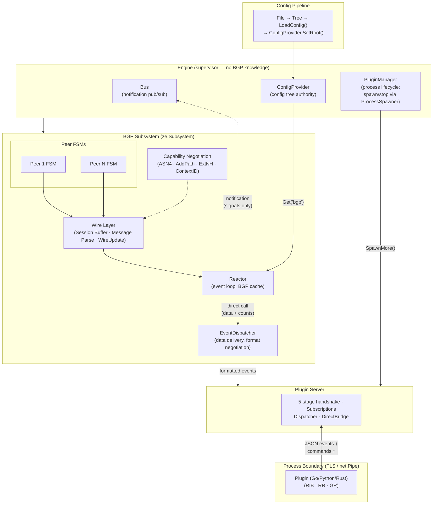

# Ze Core Design

**Status:** Canonical Architecture Reference
**Date:** 2026-01-11

This document captures the fundamental design principles for Ze.
All new code MUST follow these patterns.

---

## Executive Summary

| Concept | Description |
|---------|-------------|
| **Transport Unit** | `WireUpdate` - BGP UPDATE message as bytes |
| **Storage Unit** | NLRI → Attribute references (not WireUpdate) |
| **Deduplication** | Per-attribute-type pools + per-family NLRI pools |
| **API Model** | Pipe communication with text OR raw wire bytes |
| **Route Building** | Unified parser with family-specific NLRI builders |

---

## 1. System Architecture



**Key principles:**
- **Engine** supervises startup/shutdown order. No BGP knowledge. Starts PluginManager, then Subsystems.
- **Bus** is a content-agnostic pub/sub backbone for cross-component signaling. Carries opaque `[]byte` payloads (JSON for FIB pipeline, nil for simple notifications). Topics are hierarchical with `/` separators; subscriptions match on prefixes.
- **ConfigProvider** is the config authority. Populated from YANG-parsed tree via `SetRoot()`. Subsystems and plugins read from it.
- **PluginManager** owns process lifecycle (spawn/stop via `ProcessSpawner`). Server calls `SpawnMore()` for auto-loaded plugins.
- **Protocol-agnostic plugin loading** -- Protocols register with `ConfigRoots` (e.g., BGP uses `["bgp"]`). If the config block is present, the protocol auto-loads; if not, ze runs without it. Protocols can be added or removed at runtime via config reload (SIGHUP). The Coordinator provides reactor-optional operation via named reactor slots (`RegisterReactor`/`Reactor`), returning `ErrNoReactor` for protocol-specific queries when no reactor is present. BGP integrates via `SetReactor` for `ReactorLifecycle` delegation; other protocols use `RegisterReactor` with their own interfaces.
- **EventDispatcher** handles plugin data delivery (format negotiation, DirectBridge with `StructuredEvent`, cache counts). Internal plugins receive `*rpc.StructuredEvent` via DirectBridge (no JSON round-trip); external plugins receive formatted JSON text. Called directly by reactor -- not via Bus.
- **Plugin Server** handles 5-stage handshake, subscriptions, command dispatch. Uses PluginManager for process creation.
- **Five-phase plugin startup** -- Phase 1: config-path plugins (BGP, iface, fib via ConfigRoots). Phase 2: explicit plugins (from config `plugin { }` block). Phase 3: unclaimed families. Phase 4: custom event types. Phase 5: custom send types. Each phase uses tier-ordered handshake based on Dependencies.
- **Pipes** carry JSON events (with base64 wire bytes) and text commands.
- **BGP cache** enables zero-copy forwarding (`bgp cache 123 forward <sel>`).
- **Dynamic event types** -- plugins declare event types they produce via `Registration.EventTypes`. Engine registers them into `ValidEvents` at startup.
- **Dynamic send types** -- plugins declare send types they enable via `Registration.SendTypes`. Engine registers them into `ValidSendTypes` at startup.
<!-- source: internal/component/plugin/registry/ -- plugin registry, Register -->
<!-- source: internal/component/plugin/types.go -- Registration struct -->
<!-- source: internal/component/engine/engine.go -- Engine supervisor -->
<!-- source: internal/component/bgp/plugin/register.go -- BGP plugin with ConfigRoots -->
<!-- source: internal/component/plugin/coordinator.go -- PluginCoordinator, reactor-optional -->
<!-- source: internal/component/plugin/manager/manager.go -- PluginManager with ProcessSpawner -->

---

## 2. Peer Context & Negotiated Capabilities

Decoding/encoding BGP messages requires **negotiated capabilities** from OPEN exchange:

```go
// Simplified view - see internal/component/bgp/capability/ for full struct
type Negotiated struct {
    ASN4            bool                   // AS_PATH: 2-byte or 4-byte ASNs
    AddPath         map[Family]AddPathMode // NLRI: Receive/Send/Both path-id
    ExtendedMessage bool                   // Max message: 4096 or 65535 bytes
    ExtendedNextHop map[Family]AFI         // Per-family next-hop AFI mapping
    Families()      []Family               // Method returning negotiated families
    GracefulRestart *GracefulRestart       // RFC 4724 graceful restart state
    LongLivedGR     *LongLivedGR           // RFC 9494 LLGR per-family LLST
    RouteRefresh    bool                   // RFC 2918 route refresh support
}
```
<!-- source: internal/component/bgp/capability/ -- Negotiated capabilities -->

**Why it matters:**
- Same wire bytes parse differently based on negotiated caps
- `AS_PATH [00 01 FD E8]` = ASN 65000 (ASN4) or two ASNs 1, 64488 (ASN2)
- NLRI `[00 00 00 01 18 0a 00 00]` = path-id + prefix (ADD-PATH) or two prefixes (no ADD-PATH)

**ContextID:** Identifies encoding context for zero-copy forwarding decisions.
- Same ContextID = same negotiated caps = can forward wire bytes unchanged
- Different ContextID = must re-encode for target peer's capabilities

```go
// internal/component/bgp/context/registry.go
type ContextID uint16  // Unique ID per distinct capability set (65535 max)

// Zero-copy decision
if sourceCtxID == destCtxID {
    // Forward wire bytes directly
} else {
    // Parse and re-encode for destination caps
}
```
<!-- source: internal/component/bgp/context/registry.go -- ContextID -->

---

## 3. BGP UPDATE as Container

BGP UPDATE is an **encapsulation format**. It contains:

```
UPDATE Message (wire bytes)
├── Header (19 bytes: marker + length + type)
├── Withdrawn Routes Length (2 bytes)
├── Withdrawn Routes (IPv4 unicast only)
├── Path Attributes Length (2 bytes)
├── Path Attributes
│   ├── ORIGIN, AS_PATH, NEXT_HOP, MED, LOCAL_PREF, ...
│   ├── MP_REACH_NLRI (NLRI for non-IPv4-unicast families)
│   └── MP_UNREACH_NLRI (withdrawals for non-IPv4-unicast)
└── NLRI (IPv4 unicast announce only)
```

**Key insight:** Attributes are WITHIN the UPDATE. NLRI location depends on family:
- IPv4 unicast: NLRI in trailing section, NEXT_HOP as attribute
- All other families: NLRI inside MP_REACH_NLRI attribute

### WireUpdate Type

```go
type WireUpdate struct {
    payload     []byte           // UPDATE body (after BGP header)
    sourceCtxID bgpctx.ContextID // For zero-copy forwarding decisions
    messageID   uint64           // Unique ID for forward-by-id
    sourceID    source.SourceID  // Source that sent/created this message
}

// Lazy-parsed views into payload (zero-copy)
func (u *WireUpdate) Withdrawn() ([]byte, error)
func (u *WireUpdate) Attrs() (*AttributesWire, error)
func (u *WireUpdate) NLRI() ([]byte, error)
func (u *WireUpdate) MPReach() (MPReachWire, error)
func (u *WireUpdate) MPUnreach() (MPUnreachWire, error)

// Iterators (parse on demand)
func (u *WireUpdate) AttrIterator() (AttrIterator, error)
func (u *WireUpdate) NLRIIterator(addPath bool) (*NLRIIterator, error)
```
<!-- source: internal/component/bgp/wireu/wire_update.go -- WireUpdate struct -->

---

## 4. RIB Storage Model

**RIB does NOT store WireUpdate.** It stores individual routes with deduplicated attributes.
RIB storage lives in plugins (`bgp-rib`, `bgp-adj-rib-in`), not in the engine reactor.

### Why Not Store WireUpdate?

A single WireUpdate contains multiple NLRIs sharing the same attributes:
```
WireUpdate:
  Attributes: {ORIGIN=IGP, AS_PATH=[65001], LOCAL_PREF=100}
  NLRIs: [10.0.0.0/24, 10.0.1.0/24, 10.0.2.0/24]
```

In the RIB, we need:
- Individual NLRI lookup (route key)
- Attribute deduplication (many routes share same attrs)
- Per-attribute-type deduplication (many routes share same LOCAL_PREF)

### RIB Structure

```go
type RIB struct {
    // Routes: NLRI key → attribute references
    routes map[NLRIKey]*RouteEntry

    // NLRI pools - one per family (different wire formats)
    nlriPools map[family.Family]*Pool[nlri.NLRI]

    // Attribute pools - per-type deduplication
    originPool         *Pool[Origin]
    asPathPool         *Pool[ASPath]
    localPrefPool      *Pool[uint32]
    medPool            *Pool[uint32]
    communityPool      *Pool[Communities]
    largeCommunityPool *Pool[LargeCommunities]
    extCommunityPool   *Pool[ExtendedCommunities]
    clusterListPool    *Pool[ClusterList]
    originatorPool     *Pool[OriginatorID]

    // Next-hop: pooled but special encoding rules
    nextHopPool *Pool[NextHop]
}
```

### Route Entry (Pool Handles, Not Copies)

```go
// Route entry with pool handles (design reference)
type RouteEntry struct {
    // All fields are opaque handles into attribute pools (not copies)
    // Use pool.Handle for indirection - enables refcounting and deduplication
    Origin           pool.Handle // ORIGIN (type 1)
    ASPath           pool.Handle // AS_PATH (type 2)
    NextHop          pool.Handle // NEXT_HOP (type 3)
    LocalPref        pool.Handle // LOCAL_PREF (type 5)
    MED              pool.Handle // MULTI_EXIT_DISC (type 4)
    Communities      pool.Handle // COMMUNITIES (type 8)
    LargeCommunities pool.Handle // LARGE_COMMUNITIES (type 32)
    ExtCommunities   pool.Handle // EXTENDED_COMMUNITIES (type 16)
    ClusterList      pool.Handle // CLUSTER_LIST (type 10)
    OriginatorID     pool.Handle // ORIGINATOR_ID (type 9)
    // ... other attributes
}
```
<!-- source: internal/component/bgp/attrpool/handle.go -- Handle type -->

### Per-Attribute-Type Deduplication

Each attribute type has its own pool because:
- ORIGIN has only 3 possible values (IGP, EGP, INCOMPLETE)
- LOCAL_PREF typically has few unique values (100, 200, etc.)
- AS_PATH has many unique values but still shares across routes
- Communities have moderate sharing

```
Route 1: 10.0.0.0/24          Route 2: 10.0.1.0/24
  │                              │
  ├─ ORIGIN ──────────────────────┼──→ Pool: IGP (shared)
  ├─ AS_PATH ─→ [65001,65002]    │
  │                              ├─ AS_PATH ─→ [65001,65003] (different)
  ├─ LOCAL_PREF ──────────────────┼──→ Pool: 100 (shared)
  └─ COMMUNITY ───────────────────┴──→ Pool: [65000:100] (shared)
```

### NLRI Pools by Family

Different families have different NLRI wire formats:

```go
nlriPools map[family.Family]*Pool[nlri.NLRI]

// Contents:
//   ipv4/unicast  → Pool[*INETPrefix]
//   ipv6/unicast  → Pool[*INETPrefix]
//   ipv4/mpls     → Pool[*LabeledPrefix]
//   ipv4/mpls-vpn → Pool[*VPNPrefix]
//   ipv4/flowspec → Pool[*FlowSpecRule]
//   l2vpn/evpn    → Pool[*EVPNRoute]
//   ...
```

All NLRI types implement the NLRI interface:

```go
// Base interface - caller guarantees buffer capacity
type BufWriter interface {
    WriteTo(buf []byte, off int) int
}

// Checked interface - validates capacity before writing
type CheckedBufWriter interface {
    BufWriter
    CheckedWriteTo(buf []byte, off int) (int, error)
    Len() int
}

// NLRI interface
type NLRI interface {
    Family() Family
    Bytes() []byte                    // Wire-format encoding (payload only)
    Len() int                         // Payload length (no path ID)
    String() string                   // Human-readable representation
    PathID() uint32                   // ADD-PATH path identifier (0 if not present)
    WriteTo(buf []byte, off int) int  // Write payload (no path ID)
    SupportsAddPath() bool            // Whether this NLRI type supports ADD-PATH
}

// LenWithContext is a standalone function for ADD-PATH aware length:
func LenWithContext(n NLRI, addPath bool) int
// Returns Len() if addPath=false, Len()+4 if addPath=true
```
<!-- source: internal/component/bgp/nlri/nlri.go -- NLRI interface, LenWithContext, WriteNLRI -->

**ADD-PATH encoding:** Use `WriteNLRI()` helper function for ADD-PATH aware encoding,
which prepends the 4-byte path ID when needed.

---

## 5. Next-Hop Special Handling

Next-hop encoding varies by family:

| Family | Next-Hop Location |
|--------|-------------------|
| IPv4 unicast | NEXT_HOP attribute (type 3) |
| IPv6 unicast | Inside MP_REACH_NLRI |
| VPNv4/VPNv6 | Inside MP_REACH_NLRI |
| FlowSpec | Inside MP_REACH_NLRI |
| EVPN | Inside MP_REACH_NLRI |

The NextHop type must handle this context-dependent encoding.

---

## 6. API Pipe Communication

Ze engine communicates with plugins via stdin/stdout pipes.

### Two Input Modes

**Mode A: Text (human readable, attributes parsed)**
```
"update text origin set igp as-path set [65001] community set [65000:100]
        nhop set 1.1.1.1 nlri ipv4/unicast add 10.0.0.0/24"
                    │
                    ▼
             Parser → family NLRI builder → builds wire
                    │
                    ▼
             WireUpdate{payload: [wire bytes]}
```

**Mode B: Binary (raw wire bytes, hex/base64)**
```
"update hex attr set 400101... nlri ipv4/unicast add 180a00"
                    │
                    ▼
             Direct decode (no parsing)
                    │
                    ▼
             WireUpdate{payload: [wire bytes]}
```

Both modes produce the same result: `WireUpdate` with wire bytes.

See `docs/architecture/api/update-syntax.md` for full syntax specification.

### JSON Events (Engine → Plugin)

Engine sends events with base64-encoded wire bytes:

```json
{
  "message": {"type": "update", "id": 12345, "direction": "received"},
  "peer": {"address": "10.0.0.1", "context-id": 42},
  "raw-attributes": "QAEBAQA=",
  "raw-nlri": "GApAAA==",
  "parsed": { ... }
}
```

**`context-id`**: Plugin uses this for zero-copy forwarding decisions. If source and dest peers have same context-id, forward wire bytes unchanged.

Plugin can:
- Use `parsed` for decisions
- Store `raw-*` bytes directly (for forwarding)
- Forward by ID: `"bgp cache 12345 forward !10.0.0.1"` (or batch: `"bgp cache 1,2,3 forward !10.0.0.1"`)

### What Engine Stores vs Plugin Stores

| Component | Engine Stores | Plugin Stores |
|-----------|---------------|---------------|
| **BGP cache** | WireUpdate by ID (for `bgp cache <id>[,<id>...] forward`) | - |
| **Peer state** | Negotiated caps, FSM state | - |
| **RIB** | - | NLRI → attribute refs (with pools) |
| **Policy** | - | Route filters, preferences |

Engine is stateless for routes. It forwards wire bytes to plugins and caches for zero-copy forwarding.

---

## 7. Route Building

### Unified Parser with Family Dispatch

One parser handles all families. Family is determined by `nlri <family>` keyword:

```go
// Single entry point
func ParseUpdate(cmd string, ctx *PackContext) (*WireUpdate, error) {
    // 1. Tokenize command
    // 2. Parse attributes (origin, as-path, community, nhop, etc.)
    // 3. On "nlri <family>", dispatch to family-specific NLRI builder
    // 4. Build wire bytes
    // 5. Return WireUpdate
}
```

### Family-Specific NLRI Builders

Each family has different NLRI wire format:

```go
// NLRI builders - called by parser when it sees "nlri <family>"
func buildIPv4UnicastNLRI(prefixes []string, ctx *PackContext) ([]byte, error)
func buildFlowSpecNLRI(rules []FlowSpecRule, ctx *PackContext) ([]byte, error)
func buildL3VPNNLRI(rd string, labels []uint32, prefix string, ctx *PackContext) ([]byte, error)
// etc.
```

### Intermediate Structs (Parsing Only)

Family-specific structs exist for complex NLRI types during parsing:

```go
// Used during parsing only - NOT stored
type FlowSpecRule struct {
    DestPrefix   *netip.Prefix
    SourcePrefix *netip.Prefix
    Protocols    []uint8
    Ports        []uint16
    Actions      FlowSpecActions
}

// Parsed → built to wire → struct discarded
```

**Key point:** These structs are temporary. Only wire bytes are stored/transmitted.

---

## 8. Attribute Handling

`Builder` and `AttributesWire` are intentionally separate types with distinct roles:
- **`AttributesWire`** — reads/iterates received wire bytes (zero-copy, lazy parsing)
- **`Builder`** — constructs new attribute wire bytes for outgoing UPDATEs

A merged type was considered but rejected: the read path (iterator-based, context-dependent
parsing) and write path (field-at-a-time construction) have fundamentally different lifecycles
and usage patterns. Keeping them separate avoids state confusion and keeps each type focused.

### Builder/Wire Interface (reference)

```go
type Attributes struct {
    // Wire bytes (source of truth)
    wire      []byte
    sourceCtx bgpctx.ContextID

    // Build state (for constructing new attributes)
    building  bool
    origin    *uint8
    asPath    []uint32
    // ... other fields
}

// Reading (from received wire)
func (a *Attributes) Get(code AttributeCode) (Attribute, error)
func (a *Attributes) Iterator() AttrIterator
func (a *Attributes) Packed() []byte

// Building (to wire)
func (a *Attributes) SetOrigin(o uint8) *Attributes
func (a *Attributes) SetASPath(asns []uint32) *Attributes
func (a *Attributes) AddCommunity(c uint32) *Attributes
func (a *Attributes) Build() []byte
func (a *Attributes) WriteTo(buf []byte, off int) int           // pre-allocated buffer
func (a *Attributes) CheckedWriteTo(buf []byte, off int) (int, error)
```
<!-- source: internal/component/bgp/attribute/ -- AttributesWire, Builder -->

---

## 9. Data Flow Summary

### Receive Path

```
Network recv() → WireUpdate → Reactor → EventDispatcher
    ├─ Internal plugin (DirectBridge): StructuredEvent with RawMessage pointer
    │   └─ Plugin reads AttrsWire.Get() + WireUpdate sections (lazy, zero-copy)
    └─ External plugin (socket): JSON text (formatted from filter.ApplyToUpdate)
        └─ Plugin calls ParseEvent → extract NLRIs/attributes → pools/RIB
```

### API Announce Path

```
Text command → ParseUpdate() → WireUpdate → Send to peer
                    │
                    ├─ Parse text → intermediate struct
                    ├─ Build wire bytes
                    └─ Create WireUpdate (struct discarded)
```

### Forwarding Path

```
Receive UPDATE → Assign msg-id → Ingress filters (set meta) → Cache WireUpdate+Meta → API event
                                                                        │
                                                                        ▼
                                                               Plugin decides
                                                                        │
                                                                        ▼
                          "bgp cache 123 forward" → Lookup cache → Egress filters (read meta, write mods) → Apply mods → Send wire
```

<!-- source: internal/component/plugin/registry/registry.go -- ModAccumulator, EgressFilterFunc, IngressFilterFunc -->

### Route Metadata and Modification Accumulator

`ReceivedUpdate.Meta` (`map[string]any`) carries route-level metadata set at ingress by filters.
Read-only after caching. `UpdateRouteInput.Meta` is plumbed to `CommandContext.Meta` for
plugin-originated routes (not yet wired to ReceivedUpdate -- consuming specs connect this).

Egress filters receive `meta` (read) and `*ModAccumulator` (write) per destination peer.
`ModAccumulator` lazily allocates on first `Op()` call -- zero cost when no filter writes mods.

Egress filters write `AttrOp` entries via `mods.Op(code, action, buf)`:

| Field | Type | Purpose |
|-------|------|---------|
| Code | uint8 | Attribute type code (e.g., 35 for OTC) |
| Action | uint8 | `AttrModSet`, `AttrModAdd`, `AttrModRemove`, `AttrModPrepend` |
| Buf | []byte | Pre-built wire bytes of the VALUE |

Multiple entries with the same code accumulate -- the handler receives all ops at once.

### Progressive Build (applyMods)

When `mods.Len() > 0`, the forward path runs a single-pass progressive build into a pooled buffer.
This replaces the source payload's attributes with handler-modified versions:

1. Copy withdrawn section verbatim
2. Skip attr_len field (backfill later)
3. Walk source attributes: for each, check if ops exist for that attr code
4. No ops: copy verbatim. Has ops: call registered `AttrModHandler` with source bytes + ops
5. After walk: call handlers for unconsumed codes (new attributes)
6. Backfill attr_len
7. Copy NLRI section verbatim

`AttrModHandler` is registered per attribute code at init time (e.g., OTC handler for code 35).
Each handler knows its attribute's semantics (scalar set, list add/remove, sequence prepend).
The build engine is generic -- attribute knowledge lives in handlers.

When `mods.Len() == 0` (common case: no role config or no stamping needed), the progressive
build is skipped entirely -- zero allocation, zero copy.

<!-- source: internal/component/bgp/reactor/reactor_api_forward.go -- ForwardUpdate egress filter chain -->
<!-- source: internal/component/bgp/reactor/forward_build.go -- buildModifiedPayload progressive build -->

### Policy Filter Chain (planned)

After in-process filters (role OTC), a configurable policy filter chain runs for
external plugin filters. Filters are referenced by `<plugin>:<filter>` in
`redistribution { import [...] export [...] }` config at bgp/group/peer levels.

```
Ingress:  Wire → In-process (mandatory) → Default filters → Policy chain (user) → Cache
Egress:   Cache → In-process (mandatory) → Default filters → Policy chain (user) → Wire (per-peer)
```

Three categories of filters:

| Category | When it runs | Overridable | Example |
|----------|-------------|-------------|---------|
| Mandatory | Always, first | No | `rfc:otc` |
| Default | Always unless overridden | Yes, per-peer | `rfc:no-self-as` |
| User | When configured | N/A | `rpki:validate` |

Config hierarchy is cumulative (bgp > group > peer). Each filter declares which
attributes it needs; the reactor parses only the union across the chain. Filters
respond accept/reject/modify with delta-only output. Dirty tracking ensures only
modified attributes are re-encoded.

A filter may declare `overrides` to remove a default filter from the chain for
peers where it is configured (e.g., `allow-own-as:relaxed` overrides `rfc:no-self-as`).

<!-- source: plan/spec-redistribution-filter.md -- redistribution filter design -->

---

## 10. What Gets Eliminated

> **Note:** These are planned refactorings.

| Current Type | Status | Action |
|--------------|--------|--------|
| `message.Update` | Keep | Share parsing with WireUpdate via `wire.UpdateSections` (see `plan/spec-update-shared-parsing.md`) |
| `rib.Route` with parsed attrs | Refactor | `RouteEntry` with pool refs |
| `plugin/rib.Route` (strings) | Remove | Use core RIB |
| `plugin/rr.Route` | Remove | Use core RIB |
| `RouteSpec`, `FlowSpecRoute`, etc. | Keep | Parsing intermediates (not stored) |
| `attribute.AttributesWire` | Keep | Read/iterate received wire bytes (zero-copy, lazy parsing) |
| `attribute.Builder` | Keep | Construct new attribute wire bytes for outgoing UPDATEs |

---

## 11. TCP Socket Tuning

Ze applies three optimizations to all production BGP TCP connections in `connectionEstablished()`:
<!-- source: internal/component/bgp/reactor/session_connection.go -- connectionEstablished -->

| Setting | Value | Rationale |
|---------|-------|-----------|
| `TCP_NODELAY` | enabled | BGP messages are application-framed and flushed explicitly via `bufio.Writer`. Nagle's algorithm only adds latency (up to 40ms) with no benefit since messages are never partial writes. |
| `IP_TOS` (IPv4) | `0xC0` (DSCP CS6) | RFC 4271 S5.1 recommends IP precedence for BGP. CS6 (Internet Control) causes network devices with QoS policies to prioritize BGP keepalives and updates over regular data traffic, reducing hold timer expiry risk under congestion. |
| `IPV6_TCLASS` (IPv6) | `0xC0` (DSCP CS6) | Same as above, for IPv6 peers. |

### Graceful TCP Close (Half-Close)

When closing a BGP connection, ze uses TCP half-close (`CloseWrite`) before `Close`. This sends a FIN instead of RST, ensuring the remote peer can read any pending NOTIFICATION message before the connection is fully torn down. A plain `Close()` sends RST when unread data is in the receive buffer, which can cause the remote kernel to discard outbound data before the application reads it.
<!-- source: internal/component/bgp/reactor/session_connection.go -- closeConn -->

The sequence is: flush `bufio.Writer` -> `CloseWrite` (FIN) -> drain unread data (100ms deadline) -> `Close`.

### Send Hold Timer (RFC 9687)

Ze implements the Send Hold Timer to detect when the local side cannot send data to a peer (e.g., the peer's TCP window is full). The timer starts when the session reaches Established and is reset on every successful write. On expiry, ze sends NOTIFICATION code 8 (Send Hold Timer Expired) and closes the session.
<!-- source: internal/component/bgp/reactor/session_write.go -- sendHoldTimerExpired, resetSendHoldTimer -->

Duration: `max(8 minutes, 2x hold-time)`. Not configurable per RFC 9687.

### Hold Timer Congestion Extension

When the hold timer fires, ze checks whether data was recently read from the peer (`recentRead` flag set by the read loop on every successful message read). If true, the peer IS sending data but ze is CPU-congested processing other peers' UPDATEs. Instead of tearing down the session, ze resets the hold timer and logs a warning. This technique is adapted from BIRD.
<!-- source: internal/component/bgp/reactor/session.go -- recentRead, hold timer callback -->

### Write Deadline

Forward pool batch writes set a TCP write deadline (default: 30 seconds, configurable via `ze.fwd.write.deadline`) to prevent a stuck peer from blocking the worker goroutine indefinitely. The deadline is cleared after the batch completes.
<!-- source: internal/component/bgp/reactor/forward_pool.go -- fwdBatchHandler, fwdWriteDeadlineDefault -->

---

## 12. Connection Modes

Each peer has a `connection` setting controlling TCP establishment:
<!-- source: internal/component/bgp/reactor/peersettings.go -- ConnectionMode -->

| Mode | Behavior |
|------|----------|
| `active` | Dial out only. Does not accept inbound connections. |
| `passive` | Accept inbound only. Does not dial out. RFC 4271 S8.1.1 PassiveTcpEstablishment. |
| `both` (default) | Both dial out and accept inbound. The reactor starts a per-peer listener bound to the peer's local address on port 179, then also dials out to the peer's remote address. Whichever connection succeeds first is used; collision detection (RFC 4271 S6.8) resolves races. |

Connection collision detection follows RFC 4271 S6.8: when both sides connect simultaneously, the peer with the higher BGP ID keeps its outgoing connection. If the session is already in OpenConfirm state when a new connection arrives, the OPEN is read from the pending connection to compare BGP IDs before deciding which connection to close.
<!-- source: internal/component/bgp/reactor/reactor_connection.go -- handlePendingCollision, acceptOrReject -->

---

## 13. DNS Resolution

Ze includes a built-in DNS resolver component (`internal/component/dns/`) that provides cached
DNS queries to all Ze components. It is cross-cutting infrastructure, not a plugin.

| Concept | Description |
|---------|-------------|
| **Library** | `github.com/miekg/dns` (the library CoreDNS is built on) |
| **Cache** | O(1) LRU using `container/list`, struct keys, mutex-protected |
| **TTL** | Respects response TTL, caps at configured max, honors TTL=0 (RFC 1035: do not cache) |
| **Config** | YANG under `environment/dns` (server, timeout, cache-size, cache-ttl) |
| **Concurrency** | Thread-safe. Immutable fields after construction, mutex on cache |
| **System fallback** | Reads `/etc/resolv.conf` once at construction when no server configured |

The resolver exposes `Resolve(name, qtype)` and convenience methods (`ResolveA`, `ResolveTXT`,
`ResolvePTR`, etc.). Consumers receive a `*dns.Resolver` instance; they never import miekg/dns
directly. NXDOMAIN returns empty results (not an error) and is not cached.

<!-- source: internal/component/dns/resolver.go -- Resolver type, NewResolver, Resolve -->
<!-- source: internal/component/dns/cache.go -- O(1) LRU cache with TTL and eviction -->
<!-- source: internal/component/dns/schema/ze-dns-conf.yang -- YANG config schema -->

---

## 14. Interface Management

The `iface` component (`internal/component/iface/`) manages OS network interfaces through
a pluggable backend architecture. It is cross-cutting infrastructure, not BGP-specific.

| Concept | Description |
|---------|-------------|
| **Backend interface** | `Backend` (33 methods) in `backend.go`: lifecycle, address, sysctl, mirror, monitor |
| **Backend selection** | YANG `backend` leaf (default: `netlink`). `RegisterBackend`/`LoadBackend` in `backend.go` |
| **Netlink backend** | `internal/plugins/ifacenetlink/`: all Linux operations via `github.com/vishvananda/netlink` |
| **DHCP plugin** | `internal/plugins/ifacedhcp/`: DHCPv4/v6 client lifecycle, separate from backend |
| **Dispatch layer** | `dispatch.go`: package-level functions delegating to active backend |
| **Events** | `interface/created`, `interface/deleted`, `interface/up`, `interface/down`, `interface/addr/*`, `interface/dhcp/*` |
| **Unit model** | JunOS-style two-layer: physical interface + logical units (VLANs) |
| **VLAN mapping** | VLAN units create Linux VLAN subinterfaces (`eth0.100`); non-VLAN units share parent |

BGP subscribes to `interface/` events and reacts: starting listeners when addresses appear,
draining sessions when addresses disappear. The component never imports BGP code and BGP never
imports the component -- all communication flows through the Bus.

<!-- source: internal/component/iface/backend.go -- Backend interface, RegisterBackend, LoadBackend -->
<!-- source: internal/component/iface/iface.go -- topic constants and payload types -->
<!-- source: internal/plugins/ifacenetlink/monitor_linux.go -- netlink monitor -->
<!-- source: internal/component/iface/register.go -- plugin registration -->

---

## 14a. Commit-Time Backend Capability Gate

The `iface`, `firewall`, and `traffic` components expose a `backend` leaf that
selects a pluggable backend. Before those components reach their imperative or
declarative Apply path, a generic walker rejects configs that use features the
active backend does not implement, and names the exact YANG path and backend
in the diagnostic.

| Concept | Description |
|---------|-------------|
| **YANG extension** | `ze:backend "<names>"` on a YANG node declares which backends implement it. Absent annotation = unrestricted. Declared in `ze-extensions.yang` alongside `ze:os`, `ze:listener`, etc. |
| **Schema reader** | `getBackendExtension` in `yang_schema.go` mirrors `getOSExtension`; stores the de-duplicated name list on the schema `Node` (`LeafNode.Backend`, `ContainerNode.Backend`, `ListNode.Backend`). |
| **Walker** | `config.ValidateBackendFeatures(tree, schema, root, activeBackend, backendLeafPath)` descends the parsed JSON tree alongside the schema and emits one error per YANG path where the node's annotation excludes the active backend. |
| **Narrowest wins** | A descendant annotation that accepts the active backend suppresses an outer annotation that rejects it, so per-case overrides work. |
| **Wiring** | iface plugin calls the gate in `OnConfigure` (startup) and `OnConfigVerify` (reload). `ze config validate` calls the same helper so offline validation matches daemon commit. Runtime `errNotSupported` returns in `ifacevpp` stay as defence-in-depth. |
| **Initial coverage** | iface: `bridge`, `tunnel`, `wireguard`, `veth`, `mirror` annotated `ze:backend "netlink"`. firewall and traffic carry a `leaf backend` default (`nft`, `tc`); per-feature annotations land when fw-3 and fw-5 implement the declarative Apply paths. |

<!-- source: internal/component/config/yang/modules/ze-extensions.yang -- extension backend -->
<!-- source: internal/component/config/yang_schema.go -- getBackendExtension, Backend population on LeafNode/ContainerNode/ListNode -->
<!-- source: internal/component/config/backend_gate.go -- ValidateBackendFeatures, walkBackendNode, walkBackendListEntry -->
<!-- source: internal/component/iface/register.go -- validateBackendGate, called from OnConfigure and OnConfigVerify -->
<!-- source: cmd/ze/config/cmd_validate.go -- runValidation, backend-gate loop over gated components -->

---

## 14b. Firewall and Traffic Control

Ze manages nftables firewall tables and tc traffic control through the same pluggable
backend pattern as interfaces. Two independent components, each with its own backend
interface and data model.

| Component | Package | Backend interface | Linux plugin | VPP plugin |
|-----------|---------|-------------------|-------------|------------|
| Firewall | `internal/component/firewall/` | `Apply([]Table)`, `ListTables()`, `GetCounters()` | `firewallnft` (google/nftables) | `firewallvpp` (GoVPP) |
| Traffic | `internal/component/traffic/` | `Apply(map[string]InterfaceQoS)`, `ListQdiscs()` | `trafficnetlink` (vishvananda/netlink) | `trafficvpp` (GoVPP) |

The firewall data model uses 42 abstract expression types (18 match, 16 action, 8 modifier)
that model firewall concepts (MatchSourceAddress, Accept, SetMark), not nftables register
operations. The nft backend lowers abstract types to nftables expressions internally. The
VPP backend maps them directly to ACL rules and policers.

Table ownership: ze tables are prefixed `ze_*`. Backends only touch `ze_*` tables and never
modify tables owned by other software (e.g., Lachesis). Apply receives the full desired state
and reconciles against the kernel atomically.

The traffic component also has its own reactor (`internal/component/traffic/register.go`, spec-fw-9):
`init()` calls `registry.Register(Name="traffic", ConfigRoots=["traffic-control"])`, and `runEngine`
uses the SDK 5-stage protocol (`OnConfigure`, `OnConfigVerify`, `OnConfigApply`, `OnConfigRollback`)
to drive the active backend's `Apply` on boot and on every SIGHUP reload, with `sdk.Journal` recording
a rollback Apply when the reload fails. The backend feature gate (`config.ValidateBackendFeaturesJSON`)
runs in both `OnConfigure` and `OnConfigVerify`, so tc-only feature annotations land as a one-line
declaration once `spec-fw-7-traffic-vpp` introduces a second backend. Firewall will follow the same
pattern in `spec-fw-8`.

<!-- source: internal/component/firewall/model.go -- Table, Chain, Term, Match, Action types -->
<!-- source: internal/component/firewall/backend.go -- Backend interface, RegisterBackend -->
<!-- source: internal/component/traffic/model.go -- InterfaceQoS, Qdisc, TrafficClass types -->
<!-- source: internal/component/traffic/backend.go -- Backend interface, RegisterBackend -->
<!-- source: internal/component/traffic/register.go -- runEngine, OnConfigure, OnConfigApply, validateBackendGate -->

---

## 15. Operational Report Bus

Ze's `internal/core/report/` package is the single cross-subsystem place where
operator-visible warnings and errors live. It is a leaf package: it imports
only `env` and `slogutil`, and no subsystem imports reverse-depend on it
except via its public push API. Operators query the aggregate through
`ze show warnings` and `ze show errors`; the login banner reads the same
source filtered by subsystem.

| Concept | Description |
|---------|-------------|
| **Severity contract** | Warnings are state-based (condition is currently problematic, may resolve). Errors are event-based (something already happened; no clear API). Producers pick deliberately; the bus does not auto-promote. |
| **Warning storage** | `map[warningKey]*Issue` keyed by `(Source, Code, Subject)`. Bounded by `warningCap` (default 1024, max 10000). Oldest-by-Updated evicted at cap. |
| **Error storage** | Fixed-size ring buffer of `*Issue`, `errorCap` default 256, max 10000. Oldest event evicted on overflow. |
| **Concurrency** | Package store held in `atomic.Pointer[store]` so `reset()` is race-safe with concurrent readers. Inside the store, `sync.RWMutex` protects the warning map and error ring. Snapshots return copies with shallow-cloned detail maps. |
| **Capacity env vars** | `ze.report.warnings.max`, `ze.report.errors.max`. Registered via `env.MustRegister`. Operator values above the max are clamped with a warn log. |
| **Field bounds** | Source/Code up to 64 bytes, Subject up to 256, Message up to 1024, Detail up to 16 keys. Over-limit raises rejected at the boundary with a debug log. |
| **Login banner** | The BGP config loader reads `report.Warnings()` filtered by source `bgp` to build the banner. One source of truth across `show warnings` and the login path. |

The bus sits alongside the other cross-cutting core registries:

| Package | Purpose |
|---------|---------|
| `internal/core/family/` | Address family registry |
| `internal/core/metrics/` | Prometheus metrics registration |
| `internal/core/env/` | Environment variable registry and typed getters |
| `internal/core/clock/` | Injectable clock for test determinism |
| `internal/core/report/` | Operator-visible warnings and errors |
| `internal/core/slogutil/` | Structured logging helpers |

Subsystem authors add new producers by calling the push API:

| Function | When to use |
|----------|-------------|
| `report.RaiseWarning(source, code, subject, message, detail)` | A condition is currently problematic. Dedupes on `(Source, Code, Subject)`. Safe to call repeatedly. |
| `report.ClearWarning(source, code, subject)` | The condition has resolved. |
| `report.ClearSource(source)` | Subsystem shutdown: drop all warnings from this subsystem. |
| `report.RaiseError(source, code, subject, message, detail)` | An event already happened. No dedup. Oldest ring entry is evicted if full. |

BGP is the first producer and ships five codes (`bgp/prefix-threshold`,
`bgp/prefix-stale`, `bgp/notification-sent`, `bgp/notification-received`,
`bgp/session-dropped`). Future subsystems will add their own codes without
any changes to the bus.

<!-- source: internal/core/report/report.go -- package godoc, Severity, Issue, Raise/Clear/Warnings/Errors, newStore, validFields -->
<!-- source: internal/component/cmd/show/show.go -- handleShowWarnings, handleShowErrors -->
<!-- source: internal/component/bgp/reactor/session_prefix.go -- BGP report code constants and raise helpers -->
<!-- source: internal/component/bgp/config/loader.go -- collectPrefixWarnings reads from report bus for login banner -->

See [`docs/guide/operational-reports.md`](../guide/operational-reports.md) for
the operator workflow and [`docs/architecture/api/commands.md`](api/commands.md#operational-report-bus-ze-showwarnings-ze-showerrors)
for the RPC contract and push API.

---

## 16. FIB Pipeline

The FIB pipeline carries best-path decisions from protocol RIBs through to kernel
route installation. All communication flows through the Bus; no component imports
another directly.

```
BGP RIB (bgp-rib plugin)
  |  best-path change detected per prefix
  |  publishes batch to Bus
  v
bgp-rib/best-change/bgp  ──>  System RIB (rib plugin)
                             |  selects system-wide best per prefix
                             |  by administrative distance (lower wins)
                             |  publishes batch to Bus
                             v
                           system-rib/best-change  ──>  FIB Kernel (fib-kernel plugin)
                                                      |  programs OS routes via netlink
                                                      |  RTPROT_ZE=250 identifies ze routes
                                                      |  crash recovery: stale-mark-then-sweep
                                                      |  monitors kernel for external changes
                                                      v
                                                    Linux kernel routing table
```
<!-- source: internal/component/bgp/plugins/rib/rib_bestchange.go -- bestChangeTopic, best-path tracking -->
<!-- source: internal/plugins/sysrib/sysrib.go -- system-rib topic, admin distance selection -->
<!-- source: internal/plugins/fibkernel/fibkernel.go -- fibKernel, netlink backend, stale sweep -->
<!-- source: internal/plugins/fibkernel/monitor_linux.go -- kernel route change monitor -->

### BGP RIB Best-Path Tracking

The `bgp-rib` plugin detects best-path changes in real time. After each INSERT or
REMOVE, the affected prefix is checked for best-path changes. Changes are collected
into a batch under the RIB lock, then published to `bgp-rib/best-change/bgp` after lock
release. Each entry contains the prefix, action (add/update/withdraw), next-hop,
priority (admin distance), and metric (MED).
<!-- source: internal/component/bgp/plugins/rib/rib_bestchange.go -- bestChangeEntry, publishBestChanges -->

### System RIB

The `rib` plugin subscribes to the `bgp-rib/best-change/` Bus topic prefix (matching
all protocols). It maintains a per-prefix table of each protocol's best route and
selects the system-wide best by administrative distance (lower wins). When the
system best changes, it publishes a batch to `system-rib/best-change`.
<!-- source: internal/plugins/sysrib/sysrib.go -- protocolRoute, admin distance, outgoingBatch -->
<!-- source: internal/plugins/sysrib/register.go -- rib plugin registration -->

### FIB Kernel

The `fib-kernel` plugin subscribes to `system-rib/best-change` and programs OS routes
via netlink on Linux. It uses a custom rtm_protocol ID (RTPROT_ZE=250) so ze-installed
routes are distinguishable from other routing daemons. On startup, existing ze routes
are marked stale; after reconvergence, stale routes are swept. A kernel route monitor
detects external modifications (other daemons, manual changes) and re-asserts ze routes
when overwritten.
<!-- source: internal/plugins/fibkernel/fibkernel.go -- routeBackend, startupSweep, sweepStale -->
<!-- source: internal/plugins/fibkernel/backend_linux.go -- netlink backend, RTPROT_ZE -->
<!-- source: internal/plugins/fibkernel/monitor_linux.go -- kernel route change detection -->
<!-- source: internal/plugins/fibkernel/register.go -- fib-kernel plugin registration -->

### Sysctl

The `sysctl` plugin centralizes kernel tunable management. Plugins declare required
defaults via `(sysctl, default)` EventBus events (e.g., fib-kernel declares forwarding=1).
Users override via YANG config or transient CLI commands. Three-layer precedence:
config > transient > default.

A known-keys registry (`internal/core/sysctl/`) provides metadata for validation,
tab completion, and description. Per-interface keys use `<iface>` templates to match
concrete interface names. Platform backends: Linux writes to `/proc/sys/`, Darwin uses
`sysctlbyname(3)`. Original kernel values are saved before first write and restored on
clean daemon stop.

A profile registry (`internal/core/sysctl/profiles.go`) holds named collections of
kernel tunables. Five built-in profiles (dsr, router, hardened, multihomed, proxy) are
registered at init time. User-defined profiles are registered from sysctl config at
load/reload time. Profiles are applied per interface unit via `sysctl-profile` leaf-list
in the iface YANG schema. The iface plugin resolves profiles, substitutes `<iface>`
templates, and emits settings as `(sysctl, default)` events. A conflict table
(`internal/core/sysctl/conflicts.go`) warns when incompatible keys are active on the
same interface (e.g., arp_ignore + proxy_arp).
<!-- source: internal/plugins/sysctl/sysctl.go -- store, three-layer precedence -->
<!-- source: internal/core/sysctl/known.go -- known-keys registry -->
<!-- source: internal/core/sysctl/profiles.go -- profile registry, builtinProfiles -->
<!-- source: internal/core/sysctl/conflicts.go -- conflict table, CheckConflicts -->
<!-- source: internal/plugins/sysctl/register.go -- plugin registration, EventBus wiring -->

---

## 17. Implementation Priority

1. **Implement RIB with pools** - Per-attribute-type deduplication
2. **Unified parser** - Family-specific NLRI builders
3. **Remove duplicates** - Share UPDATE parsing between message.Update and WireUpdate

---

## 18. Config Transaction Protocol

<!-- source: internal/component/config/transaction/orchestrator.go -- TxCoordinator -->

Config changes (SIGHUP, CLI commit, API) use a bus-based transaction protocol
with verify, apply, and rollback phases. The engine orchestrates; plugins participate
via bus events.

| Phase | Engine publishes | Plugin responds | On failure |
|-------|-----------------|-----------------|------------|
| Verify | `config/verify/<plugin>` (filtered diffs) | `config/ack/verify/ok` or `failed` | Abort (no apply) |
| Apply | `config/apply/<plugin>` (diffs + deadline) | `config/ack/apply/ok` or `failed` | Rollback all |
| Commit | `config/committed` | Discard journal | N/A |
| Rollback | `config/rollback` | `config/ack/rollback/ok` | Restart if broken |

Transaction exclusion: one transaction at a time. CLI/API rejected during active
transaction. SIGHUP queued and replayed after completion.

Plugin SDK provides a `Journal` for rollback: `Record(apply, undo)` during apply,
`Rollback()` replays undos in reverse, `Discard()` on commit.

Full protocol: `config/transaction-protocol.md`. Per-plugin wiring: `spec-config-tx-consumers`.

## 19. Component Boundaries

Each component under `internal/component/` is independently removable.
Cross-component coupling follows a strict hierarchy:

| Component | Allowed imports (other components) |
|-----------|-----------------------------------|
| authz | config/yang (schema registration) |
| bgp | config, plugin (no cli, ssh, web, iface) |
| cli | command, config, plugin/server |
| cmd (protocol-agnostic) | config/yang, plugin, plugin/server |
| config | plugin, plugin/registry, command |
| hub | everything (orchestrator) |
| iface | config/yang, plugin, plugin/registry |
| l2tp | config/yang (schema registration only) |
| ssh | cli, authz, config, plugin/server |
| web | cli, authz, config |

**Authentication** lives in `authz` (not `ssh`). Both `ssh` and `web`
import `authz` for `UserConfig`, `CheckPassword`, `AuthenticateUser`.
The `authz` package also provides profile-based command authorization
(allow/deny rules per user role).

**Pluggable AAA backends.** `internal/component/aaa` defines the
`Authenticator`, `Authorizer`, and `Accountant` interfaces and a
backend registry (`aaa.Default`). Each backend (local bcrypt, TACACS+,
future RADIUS/LDAP) self-registers via `init()` and implements `Build()`
to translate the YANG config tree into a `Contribution` (one bridge per
function it provides). The hub's `infra_setup.buildAAABundle` calls
`aaa.Default.Build()` to compose a `ChainAuthenticator` ordered by
backend priority (TACACS+ = 100, local bcrypt = 200). The chain
distinguishes explicit rejection (`ErrAuthRejected` -> stop) from
connection error (-> next backend), so a wrong TACACS+ password cannot
silently fall through to a stale local hash. The composed bundle is
swapped atomically on every config reload (`aaaBundle atomic.Pointer`)
and `Close()`d so backend workers (e.g. TACACS+ accounting) drain
cleanly. The TACACS+ accountant hooks into `Dispatcher.Dispatch()` so
START/STOP records cover SSH exec, interactive TUI, and local CLI
commands through a single point.

**Infrastructure wiring** (SSH server creation, command executor, monitor
factory, login warnings) is handled by the hub via `bgpconfig.InfraHook`.
The BGP config package extracts plain data; the hub creates servers.
This avoids bgp importing ssh, cli, or web.

<!-- source: internal/component/authz/auth.go -- UserConfig, AuthenticateUser -->
<!-- source: internal/component/aaa/aaa.go -- Authenticator/Authorizer/Accountant interfaces, ChainAuthenticator -->
<!-- source: internal/component/aaa/all/all.go -- backend blank-imports (authz, tacacs) -->
<!-- source: internal/component/tacacs/register.go -- tacacsBackend.Build, AAA registration -->
<!-- source: cmd/ze/hub/aaa_lifecycle.go -- atomic bundle swap on reload -->
<!-- source: cmd/ze/hub/infra_setup.go -- buildAAABundle, SSH wiring, accountant hook installation -->
<!-- source: internal/component/bgp/config/infra_hook.go -- InfraHook, SSHExtractedConfig -->

---

## Related Documents

- `buffer-architecture.md` - Iterators and lazy parsing
- `pool-architecture.md` - Deduplication pool design
- `update-building.md` - Wire format construction
- `api/architecture.md` - Pipe communication protocol
- `config/transaction-protocol.md` - Config transaction protocol design

---

**Last Updated:** 2026-04-08 (Added component boundaries section)
