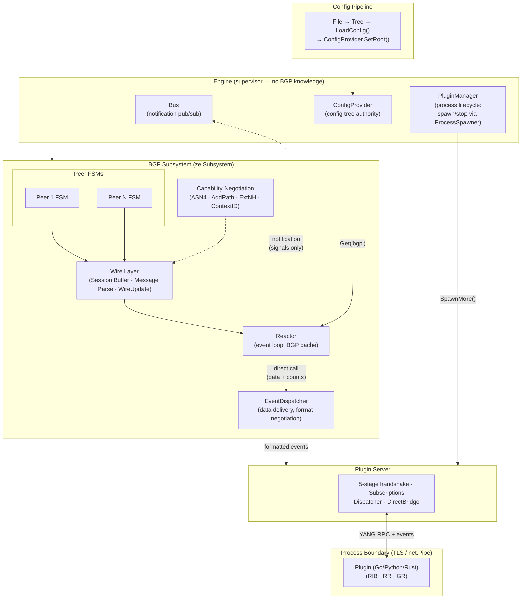

# Ze Core Design

**Status:** Canonical Architecture Reference
**Date:** 2026-01-11

This document captures the fundamental design principles for Ze.
All new code MUST follow these patterns.

---

## Executive Summary

| Concept | Description |
|---------|-------------|
| **Transport Unit** | `WireUpdate` - BGP UPDATE message as bytes |
| **Storage Unit** | NLRI → Attribute references (not WireUpdate) |
| **Deduplication** | Per-attribute-type pools + per-family NLRI pools |
| **API Model** | Pipe communication with text OR raw wire bytes |
| **Route Building** | Unified parser with family-specific NLRI builders |

---

## 1. System Architecture


```mermaid
flowchart TB
    subgraph Engine["Engine (supervisor — no BGP knowledge)"]
        BUS["Bus\n(notification pub/sub)"]
        CP["ConfigProvider\n(config tree authority)"]
        PM["PluginManager\n(process lifecycle:\nspawn/stop via ProcessSpawner)"]
    end

    subgraph BGPSub["BGP Subsystem (ze.Subsystem)"]
        subgraph Peers["Peer FSMs"]
            P1[Peer 1 FSM]
            PN[Peer N FSM]
        end
        CAP["Capability Negotiation\n(ASN4 · AddPath · ExtNH · ContextID)"]
        WIRE["Wire Layer\n(Session Buffer · Message Parse · WireUpdate)"]
        REACTOR["Reactor\n(event loop, BGP cache)"]
        ED["EventDispatcher\n(data delivery, format negotiation)"]

        P1 & PN --> WIRE
        CAP -.-> WIRE
        WIRE --> REACTOR
        REACTOR -->|"direct call\n(data + counts)"| ED
        REACTOR -.->|"notification\n(signals only)"| BUS
    end

    subgraph ConfigPipeline["Config Pipeline"]
        LOAD["File → Tree → LoadConfig()\n→ ConfigProvider.SetRoot()"]
    end

    subgraph PluginServer["Plugin Server"]
        HANDSHAKE["5-stage handshake · Subscriptions\nDispatcher · DirectBridge"]
    end

    subgraph PluginProcs["Process Boundary (TLS / net.Pipe)"]
        PLUGIN["Plugin (Go/Python/Rust)\n(RIB · RR · GR)"]
    end

    Engine --> BGPSub
    PM -->|"SpawnMore()"| PluginServer
    CP -->|"Get('bgp')"| REACTOR
    LOAD --> CP
    ED -->|"formatted events"| PluginServer
    HANDSHAKE <-->|"YANG RPC + events"| PLUGIN
```

**Key principles:**
- **Engine** supervises startup/shutdown order. No BGP knowledge. Starts PluginManager, then Subsystems.
- **Bus** is a content-agnostic pub/sub backbone for cross-component signaling. Carries opaque `[]byte` payloads (JSON for FIB pipeline, nil for simple notifications). Topics are hierarchical with `/` separators; subscriptions match on prefixes.
- **ConfigProvider** is the config authority. Populated from YANG-parsed tree via `SetRoot()`. Subsystems and plugins read from it.
- **PluginManager** owns process lifecycle (spawn/stop via `ProcessSpawner`). Server calls `SpawnMore()` for auto-loaded plugins.
- **Protocol-agnostic plugin loading** -- Protocols register with `ConfigRoots` (e.g., BGP uses `["bgp"]`). If the config block is present, the protocol auto-loads; if not, ze runs without it. Protocols can be added or removed at runtime via config reload (SIGHUP). The Coordinator provides reactor-optional operation via named reactor slots (`RegisterReactor`/`Reactor`), returning `ErrNoReactor` for protocol-specific queries when no reactor is present. BGP integrates via `SetReactor` for `ReactorLifecycle` delegation; other protocols use `RegisterReactor` with their own interfaces.
- **OSPF edge plugin** registers `ConfigRoots ["ospf"]`, embeds
  `ze-ospf-conf.yang`, and runs the SDK lifecycle through
  `runOSPFEngine`. The component owns OSPFv2 config parsing, area/interface
  validation, event namespace registration, packet dispatch, the Interface State
  Machine, Neighbor State Machine, LSDB flooding/aging, intra-area SPF, ABR
  Summary-LSA origination, and inter-area route computation. SPF reads the LSDB,
  resolves next-hops, inserts `locrib.Path` values into the shared Loc-RIB, and
  lets sysrib/fibkernel own kernel FIB programming. SPF deltas use
  `redistevents` only for redistribution. Imported routes take the reverse
  redistribution path and originate Type 5 or Type 7 LSAs.
<!-- source: internal/plugins/ospf/register.go -- registerOSPF and runOSPFEngine -->
<!-- source: internal/plugins/ospf/config.go -- parseOSPFConfig and validateConfig -->
<!-- source: internal/plugins/ospf/iface/iface.go -- Interface, ReceiveHello, runElectionLocked -->
<!-- source: internal/plugins/ospf/neighbor/table.go -- Table, Hello -->
<!-- source: internal/plugins/ospf/neighbor/dd.go -- HandleDBDesc -->
<!-- source: internal/plugins/ospf/lsdb/lsdb.go -- LSDB, Install, Snapshot, SetOnChange -->
<!-- source: internal/plugins/ospf/lsdb/flooding.go -- ReceiveUpdate, ReceiveAck -->
<!-- source: internal/plugins/ospf/spf_wiring.go -- initSPF and triggerSPF -->
<!-- source: internal/plugins/ospf/spf/computer.go -- Computer Run -->
<!-- source: internal/plugins/ospf/spf/install.go -- Installer Apply -->
<!-- source: internal/plugins/ospf/spf/interarea.go -- ComputeInterArea -->
<!-- source: internal/plugins/ospf/spf/summary.go -- OriginateSummaries -->
<!-- source: internal/plugins/ospf/redistribute/source.go -- Source.OnSPFChange and emitDelta -->
<!-- source: internal/plugins/ospf/redist_wiring.go -- engine.InjectExternal -->
- **OSPF raw IPv4 transport** uses per-interface Linux `AF_INET/SOCK_RAW` sockets for protocol 89, opened through the shared iface resolver so logical names, `os-name`, and MAC selectors bind to the intended kernel device. The receive socket joins `224.0.0.5` (`AllSPFRouters`) at startup; the ISM asks the transport to join or leave `224.0.0.6` (`AllDRouters`) when this router becomes or stops being DR or BDR. The transmit socket owns TTL 1, per-interface source selection, and multicast loop suppression, so the engine sees only raw OSPF payload bytes plus source and interface identity.
<!-- source: internal/plugins/ospf/transport/backend_linux.go -- OpenInterface, readLoop, Send -->
<!-- source: internal/plugins/ospf/transport/transport.go -- Transport, RawPacket, StripIPv4Header -->
- **OSPFv3 raw IPv6 transport** is the IPv6 transport leaf (`internal/plugins/ospf/v3/transport`) consumed by the unified OSPF engine, running IPv6 protocol 89 over one `golang.org/x/net/ipv6.PacketConn` per interface. Unlike the OSPFv2 IPv4 transport there is no IP header to strip: the destination group, receiving ifindex, and hop limit come from the IPv6 control message, and the source is the interface link-local. It joins `ff02::5` always and `ff02::6` as DR/BDR, sends with hop limit 1, and finalizes the address-bound IPv6 checksum on transmit (binding the link-local source so the on-wire source matches the pseudo-header). It is the first raw IPv6 proto-number multicast transport in Ze.
<!-- source: internal/plugins/ospf/v3/transport/backend_linux.go -- OpenInterface, setupSocket, Send -->
<!-- source: internal/plugins/ospf/v3/transport/transport.go -- Transport, RawPacket, SendPacket, rxLoop -->
- **EventDispatcher** handles plugin data delivery (format negotiation, DirectBridge with `StructuredEvent`, cache counts). Internal plugins receive `*rpc.StructuredEvent` via DirectBridge (no JSON round-trip); external plugins receive formatted JSON text. Called directly by reactor -- not via Bus.
- **Plugin Server** handles 5-stage handshake, subscriptions, command dispatch. Uses PluginManager for process creation.
- **Five-phase plugin startup** -- Phase 1: config-path plugins (BGP, iface, fib via ConfigRoots). Phase 2: explicit plugins (from config `plugin { }` block). Phase 3: unclaimed families. Phase 4: custom event types. Phase 5: custom send types. Each phase uses tier-ordered handshake based on Dependencies.
- **Plugin IPC** uses newline-framed YANG RPC over one bidirectional connection. Internal plugins use `net.Pipe()` for startup and DirectBridge after ready; external plugins use TLS connect-back. External event payloads are formatted text or JSON according to the process binding.
- **BGP cache** enables zero-copy forwarding (`bgp cache forward 123 <sel>`).
- **Dynamic event types** -- plugins declare event types they produce via `Registration.EventTypes`. Engine registers them into `ValidEvents` at startup.
- **Dynamic send types** -- plugins declare send types they enable via `Registration.SendTypes`. Engine registers them into `ValidSendTypes` at startup.
<!-- source: internal/component/plugin/registry/ -- plugin registry, Register -->
<!-- source: internal/component/plugin/types.go -- Registration struct -->
<!-- source: internal/component/engine/engine.go -- Engine supervisor -->
<!-- source: internal/component/bgp/plugin/register.go -- BGP plugin with ConfigRoots -->
<!-- source: internal/component/plugin/coordinator.go -- Coordinator, reactor-optional -->
<!-- source: internal/component/plugin/manager/manager.go -- PluginManager with ProcessSpawner -->

---

## 2. Peer Context & Negotiated Capabilities

Decoding/encoding BGP messages requires **negotiated capabilities** from OPEN exchange:

```go
// Simplified view - see internal/core/bgp/capability/ for full struct
type Negotiated struct {
    ASN4            bool                   // AS_PATH: 2-byte or 4-byte ASNs
    AddPath         map[Family]AddPathMode // NLRI: Receive/Send/Both path-id
    ExtendedMessage bool                   // Max message: 4096 or 65535 bytes
    ExtendedNextHop map[Family]AFI         // Per-family next-hop AFI mapping
    Families()      []Family               // Method returning negotiated families
    GracefulRestart *GracefulRestart       // RFC 4724 graceful restart state
    LongLivedGR     *LongLivedGR           // RFC 9494 LLGR per-family LLST
    RouteRefresh    bool                   // RFC 2918 route refresh support
}
```
<!-- source: internal/core/bgp/capability/ -- Negotiated capabilities -->

**Why it matters:**
- Same wire bytes parse differently based on negotiated caps
- `AS_PATH [00 01 FD E8]` = ASN 65000 (ASN4) or two ASNs 1, 64488 (ASN2)
- NLRI `[00 00 00 01 18 0a 00 00]` = path-id + prefix (ADD-PATH) or two prefixes (no ADD-PATH)

**ContextID:** Identifies encoding context for zero-copy forwarding decisions.
- Same ContextID = same negotiated caps = can forward wire bytes unchanged
- Different ContextID = must re-encode for target peer's capabilities

```go
// internal/core/bgp/context/registry.go
type ContextID uint16  // Unique ID per distinct capability set (65535 max)

// Zero-copy decision
if sourceCtxID == destCtxID {
    // Forward wire bytes directly
} else {
    // Parse and re-encode for destination caps
}
```
<!-- source: internal/core/bgp/context/registry.go -- ContextID -->

---

## 3. BGP UPDATE as Container

BGP UPDATE is an **encapsulation format**. It contains:

```
UPDATE Message (wire bytes)
├── Header (19 bytes: marker + length + type)
├── Withdrawn Routes Length (2 bytes)
├── Withdrawn Routes (IPv4 unicast only)
├── Path Attributes Length (2 bytes)
├── Path Attributes
│   ├── ORIGIN, AS_PATH, NEXT_HOP, MED, LOCAL_PREF, ...
│   ├── MP_REACH_NLRI (NLRI for non-IPv4-unicast families)
│   └── MP_UNREACH_NLRI (withdrawals for non-IPv4-unicast)
└── NLRI (IPv4 unicast announce only)
```

**Key insight:** Attributes are WITHIN the UPDATE. NLRI location depends on family:
- IPv4 unicast: NLRI in trailing section, NEXT_HOP as attribute
- All other families: NLRI inside MP_REACH_NLRI attribute

### WireUpdate Type

```go
type WireUpdate struct {
    payload     []byte           // UPDATE body (after BGP header)
    sourceCtxID bgpctx.ContextID // For zero-copy forwarding decisions
    messageID   uint64           // Unique ID for forward-by-id
    sourceID    source.SourceID  // Source that sent/created this message
}

// Lazy-parsed views into payload (zero-copy)
func (u *WireUpdate) Withdrawn() ([]byte, error)
func (u *WireUpdate) Attrs() (*AttributesWire, error)
func (u *WireUpdate) NLRI() ([]byte, error)
func (u *WireUpdate) MPReach() (MPReachWire, error)
func (u *WireUpdate) MPUnreach() (MPUnreachWire, error)

// Iterators (parse on demand)
func (u *WireUpdate) AttrIterator() (AttrIterator, error)
func (u *WireUpdate) NLRIIterator(addPath bool) (*NLRIIterator, error)
```
<!-- source: internal/component/bgp/wireu/wire_update.go -- WireUpdate struct -->

---

## 4. RIB Storage Model

**RIB does NOT store WireUpdate.** It stores individual routes with deduplicated attributes.
RIB storage lives in plugins (`bgp-rib`, `bgp-adj-rib-in`), not in the engine reactor.

### Why Not Store WireUpdate?

A single WireUpdate contains multiple NLRIs sharing the same attributes:
```
WireUpdate:
  Attributes: {ORIGIN=IGP, AS_PATH=[65001], LOCAL_PREF=100}
  NLRIs: [10.0.0.0/24, 10.0.1.0/24, 10.0.2.0/24]
```

In the RIB, we need:
- Individual NLRI lookup (route key)
- Attribute deduplication (many routes share same attrs)
- Per-attribute-type deduplication (many routes share same LOCAL_PREF)

### RIB Structure

```go
type RIB struct {
    // Routes: NLRI key → attribute references
    routes map[NLRIKey]*RouteEntry

    // NLRI pools - one per family (different wire formats)
    nlriPools map[family.Family]*Pool[nlri.NLRI]

    // Attribute pools - per-type deduplication
    originPool         *Pool[Origin]
    asPathPool         *Pool[ASPath]
    localPrefPool      *Pool[uint32]
    medPool            *Pool[uint32]
    communityPool      *Pool[Communities]
    largeCommunityPool *Pool[LargeCommunities]
    extCommunityPool   *Pool[ExtendedCommunities]
    clusterListPool    *Pool[ClusterList]
    originatorPool     *Pool[OriginatorID]

    // Next-hop: pooled but special encoding rules
    nextHopPool *Pool[NextHop]
}
```

### Route Entry (Pool Handles, Not Copies)

```go
// Route entry with pool handles (design reference)
type RouteEntry struct {
    // All fields are opaque handles into attribute pools (not copies)
    // Use pool.Handle for indirection - enables refcounting and deduplication
    Origin           pool.Handle // ORIGIN (type 1)
    ASPath           pool.Handle // AS_PATH (type 2)
    NextHop          pool.Handle // NEXT_HOP (type 3)
    LocalPref        pool.Handle // LOCAL_PREF (type 5)
    MED              pool.Handle // MULTI_EXIT_DISC (type 4)
    Communities      pool.Handle // COMMUNITIES (type 8)
    LargeCommunities pool.Handle // LARGE_COMMUNITIES (type 32)
    ExtCommunities   pool.Handle // EXTENDED_COMMUNITIES (type 16)
    ClusterList      pool.Handle // CLUSTER_LIST (type 10)
    OriginatorID     pool.Handle // ORIGINATOR_ID (type 9)
    // ... other attributes
}
```
<!-- source: internal/component/bgp/attrpool/handle.go -- Handle type -->

### Per-Attribute-Type Deduplication

Each attribute type has its own pool because:
- ORIGIN has only 3 possible values (IGP, EGP, INCOMPLETE)
- LOCAL_PREF typically has few unique values (100, 200, etc.)
- AS_PATH has many unique values but still shares across routes
- Communities have moderate sharing

```
Route 1: 10.0.0.0/24          Route 2: 10.0.1.0/24
  │                              │
  ├─ ORIGIN ──────────────────────┼──→ Pool: IGP (shared)
  ├─ AS_PATH ─→ [65001,65002]    │
  │                              ├─ AS_PATH ─→ [65001,65003] (different)
  ├─ LOCAL_PREF ──────────────────┼──→ Pool: 100 (shared)
  └─ COMMUNITY ───────────────────┴──→ Pool: [65000:100] (shared)
```

### NLRI Pools by Family

Different families have different NLRI wire formats:

```go
nlriPools map[family.Family]*Pool[nlri.NLRI]

// Contents:
//   ipv4/unicast  → Pool[*INETPrefix]
//   ipv6/unicast  → Pool[*INETPrefix]
//   ipv4/mpls     → Pool[*LabeledPrefix]
//   ipv4/mpls-vpn → Pool[*VPNPrefix]
//   ipv4/flowspec → Pool[*FlowSpecRule]
//   l2vpn/evpn    → Pool[*EVPNRoute]
//   ...
```

All NLRI types implement the NLRI interface:

```go
// Base interface - caller guarantees buffer capacity
type BufWriter interface {
    WriteTo(buf []byte, off int) int
}

// Checked interface - validates capacity before writing
type CheckedBufWriter interface {
    BufWriter
    CheckedWriteTo(buf []byte, off int) (int, error)
    Len() int
}

// NLRI interface
type NLRI interface {
    Family() Family
    Bytes() []byte                    // Wire-format encoding (payload only)
    Len() int                         // Payload length (no path ID)
    String() string                   // Human-readable representation
    PathID() uint32                   // ADD-PATH path identifier (0 if not present)
    WriteTo(buf []byte, off int) int  // Write payload (no path ID)
    SupportsAddPath() bool            // Whether this NLRI type supports ADD-PATH
}

// LenWithContext is a standalone function for ADD-PATH aware length:
func LenWithContext(n NLRI, addPath bool) int
// Returns Len() if addPath=false, Len()+4 if addPath=true
```
<!-- source: internal/core/bgp/nlri/nlri.go -- NLRI interface, LenWithContext, WriteNLRI -->

**ADD-PATH encoding:** Use `WriteNLRI()` helper function for ADD-PATH aware encoding,
which prepends the 4-byte path ID when needed.

---

## 5. Next-Hop Special Handling

Next-hop encoding varies by family:

| Family | Next-Hop Location |
|--------|-------------------|
| IPv4 unicast | NEXT_HOP attribute (type 3) |
| IPv6 unicast | Inside MP_REACH_NLRI |
| VPNv4/VPNv6 | Inside MP_REACH_NLRI |
| FlowSpec | Inside MP_REACH_NLRI |
| EVPN | Inside MP_REACH_NLRI |

The NextHop type must handle this context-dependent encoding.

---

## 6. Plugin API Communication

Ze engine communicates with plugins via newline-framed YANG RPC over a single bidirectional connection. Internal plugins start on `net.Pipe()` and switch supported hot paths to DirectBridge after Stage 5. External plugins connect back to the plugin hub over TLS.

### Two Input Modes

**Mode A: Text (human readable, attributes parsed)**
```
"update text origin set igp as-path set [65001] community set [65000:100]
        nhop set 1.1.1.1 nlri ipv4/unicast add 10.0.0.0/24"
                    │
                    ▼
             Parser → family NLRI builder → builds wire
                    │
                    ▼
             WireUpdate{payload: [wire bytes]}
```

**Mode B: Binary (raw wire bytes, hex/base64)**
```
"update hex attr set 400101... nlri ipv4/unicast add 180a00"
                    │
                    ▼
             Direct decode (no parsing)
                    │
                    ▼
             WireUpdate{payload: [wire bytes]}
```

Both modes produce the same result: `WireUpdate` with wire bytes.

See `docs/architecture/api/update-syntax.md` for full syntax specification.

### JSON Events (Engine → Plugin)

When a process binding requests JSON output, the engine sends formatted BGP event payloads via `deliver-event` or `deliver-batch`:

```json
{
  "type": "bgp",
  "bgp": {
    "message": {"type": "update", "id": 12345, "direction": "received"},
    "peer": {"address": "10.0.0.1", "local": {"address": "10.0.0.2", "as": 65000}, "remote": {"address": "10.0.0.1", "as": 65001}},
    "update": {"attr": {"origin": "igp"}, "nlri": {}}
  }
}
```

**Message ID**: Plugins use the `message.id` for cache-control operations such as forwarding or releasing cached UPDATEs.

Plugin can:
- Use formatted `attr` and `nlri` fields for decisions
- Use raw fields when the binding format includes them
- Forward by ID: `"bgp cache forward 12345 !10.0.0.1"` (or batch: `"bgp cache forward 1,2,3 !10.0.0.1"`)

### What Engine Stores vs Plugin Stores

| Component | Engine Stores | Plugin Stores |
|-----------|---------------|---------------|
| **BGP cache** | WireUpdate by ID (for `bgp cache forward <id>[,<id>...] <sel>`) | - |
| **Peer state** | Negotiated caps, FSM state | - |
| **RIB** | - | NLRI → attribute refs (with pools) |
| **Policy** | - | Route filters, preferences |

Engine is stateless for routes. It forwards wire bytes to plugins and caches for zero-copy forwarding.

---

## 7. Route Building

### Unified Parser with Family Dispatch

One parser handles all families. Family is determined by `nlri <family>` keyword:

```go
// Single entry point
func ParseUpdate(cmd string, ctx *PackContext) (*WireUpdate, error) {
    // 1. Tokenize command
    // 2. Parse attributes (origin, as-path, community, nhop, etc.)
    // 3. On "nlri <family>", dispatch to family-specific NLRI builder
    // 4. Build wire bytes
    // 5. Return WireUpdate
}
```

### Family-Specific NLRI Builders

Each family has different NLRI wire format:

```go
// NLRI builders - called by parser when it sees "nlri <family>"
func buildIPv4UnicastNLRI(prefixes []string, ctx *PackContext) ([]byte, error)
func buildFlowSpecNLRI(rules []FlowSpecRule, ctx *PackContext) ([]byte, error)
func buildL3VPNNLRI(rd string, labels []uint32, prefix string, ctx *PackContext) ([]byte, error)
// etc.
```

### Intermediate Structs (Parsing Only)

Family-specific structs exist for complex NLRI types during parsing:

```go
// Used during parsing only - NOT stored
type FlowSpecRule struct {
    DestPrefix   *netip.Prefix
    SourcePrefix *netip.Prefix
    Protocols    []uint8
    Ports        []uint16
    Actions      FlowSpecActions
}

// Parsed → built to wire → struct discarded
```

**Key point:** These structs are temporary. Only wire bytes are stored/transmitted.

---

## 8. Attribute Handling

`Builder` and `AttributesWire` are intentionally separate types with distinct roles:
- **`AttributesWire`** — reads/iterates received wire bytes (zero-copy, lazy parsing)
- **`Builder`** — constructs new attribute wire bytes for outgoing UPDATEs

A merged type was considered but rejected: the read path (iterator-based, context-dependent
parsing) and write path (field-at-a-time construction) have fundamentally different lifecycles
and usage patterns. Keeping them separate avoids state confusion and keeps each type focused.

### Builder/Wire Interface (reference)

```go
type Attributes struct {
    // Wire bytes (source of truth)
    wire      []byte
    sourceCtx bgpctx.ContextID

    // Build state (for constructing new attributes)
    building  bool
    origin    *uint8
    asPath    []uint32
    // ... other fields
}

// Reading (from received wire)
func (a *Attributes) Get(code AttributeCode) (Attribute, error)
func (a *Attributes) Iterator() AttrIterator
func (a *Attributes) Packed() []byte

// Building (to wire)
func (a *Attributes) SetOrigin(o uint8) *Attributes
func (a *Attributes) SetASPath(asns []uint32) *Attributes
func (a *Attributes) AddCommunity(c uint32) *Attributes
func (a *Attributes) Build() []byte
func (a *Attributes) WriteTo(buf []byte, off int) int           // pre-allocated buffer
func (a *Attributes) CheckedWriteTo(buf []byte, off int) (int, error)
```
<!-- source: internal/core/bgp/attribute/ -- AttributesWire, Builder -->

---

## 9. Data Flow Summary

### Receive Path

```
Network recv() → WireUpdate → Reactor → EventDispatcher
    ├─ Internal plugin (DirectBridge): StructuredEvent with RawMessage pointer
    │   └─ Plugin reads AttrsWire.Get() + WireUpdate sections (lazy, zero-copy)
    └─ External plugin (socket): JSON text (formatted from filter.ApplyToUpdate)
        └─ Plugin calls ParseEvent → extract NLRIs/attributes → pools/RIB
```

### API Announce Path

```
Text command → ParseUpdate() → WireUpdate → Send to peer
                    │
                    ├─ Parse text → intermediate struct
                    ├─ Build wire bytes
                    └─ Create WireUpdate (struct discarded)
```

### Forwarding Path

```
Receive UPDATE → Assign msg-id → Ingress filter pipeline → Cache WireUpdate+Meta → StructuredEvent dispatched ONCE
                                  (set meta AND/OR             (post-filter bytes              │
                                   modify wire bytes,           are canonical)         ┌───────┴────────┐
                                   see "Ingress Filter                                 ▼                 ▼
                                   Pipeline" below)                              forwarders        state trackers
                                                                                 (RS, RR, ...)     (rib plugin)
                                                                                 │                 │
                                                                                 │                 ├─ update bestPrev
                                                                                 │                 ├─ mirror best to locrib
                                                                                 │                 └─ Change subscribers
                                                                                 │                    (sysrib, FIB,
                                                                                 │                     observability;
                                                                                 │                     may take wire via
                                                                                 │                     ForwardHandle.Bytes())
                                                                                 ▼
                     ┌──────────────────── slow path (text RPC) ───────┬──── fast path (typed SDK) ────┐
                     ▼                                                  ▼                              ▼
          "bgp cache forward 123 <sel>" → tokenise → command registry → ForwardUpdate     Plugin.ForwardCached(ids, destinations) → DirectBridge → ForwardUpdatesDirect
                     │                                                                                  │
                     └──────────────────────────── ForwardUpdate (shared core) ─────────────────────────┘
                                                                │
                                                                ▼
                                Lookup cache → Egress filters (read meta, write mods) → Apply mods → Send wire
```

Three forwarding paths exist. The **reactor RS fast path** (rs-gap-1) runs
inline in `notifyMessageReceiver` on the session read goroutine, after cache
Add but before `deliverChan` enqueue. It calls the egress pipeline directly
(`reactorForwardRS` in `forward_rs.go`), bypassing plugin dispatch, bgp-rs
workers, and ForwardCached entirely. Peers with `ExportFilters` fall back to
the plugin path via `FastPathSkipped` on `RawMessage`. Enabled per peer group
via `PeerSettings.RSFastPath`.

Two consumer categories. **Forwarders** (route server, route reflector, future
mirror) need every received UPDATE to make a per-peer forwarding decision.
**State trackers** (BGP RIB plugin, then locrib subscribers like sysrib / FIB)
need only best-path-change events. Both subscribe to the same StructuredEvent
dispatch from the reactor; the reactor fires it once per received UPDATE
(post-ingress-filter). Forwarders go through the slow / fast paths shown above;
state trackers consume the cached `WireUpdate` and emit `locrib.Change` events
for downstream best-change consumers. The two trigger shapes coexist by design:
forwarder needs differ from state-tracker needs (per-event vs. per-best-change).

**Slow path** (`bgp cache forward <id> <sel>`) still exists for ad-hoc and external
callers. Tokenises the text command, walks the plugin command registry, dispatches
to `ForwardUpdate`.

**Fast path** (rs-fastpath-3) is used by high-throughput plugin forwarders (route
server today; route reflector / redistribute next). `Plugin.ForwardCached(ctx,
ids, destinations)` goes through `DirectBridge` when the plugin is in-process
(zero socket I/O, zero tokenisation, zero registry walk) and falls back to
`ze-plugin-engine:forward-cached` over the newline-framed plugin RPC connection
for out-of-process plugins. The engine entry point is `reactorAPIAdapter.ForwardUpdatesDirect`, which
builds a selector from the `netip.AddrPort` list once, de-dupes IDs, and calls
`ForwardUpdate` per id. Symmetric `ReleaseCached` handles the "decided not to
forward" ack path. Destinations are capped at `ze.fwd.dest.cap` (default 4096).
Both paths share the same egress filter chain, AS-PATH prepend, next-hop policy,
and replay-on-new-peer invariants.

**Batched cache retains (rs-gap-0):** `ForwardUpdate` accumulates per-peer
dispatch items during the egress loop and calls `RetainN(id, peerCount)` once
per id instead of per-peer `Retain` calls, reducing cache-lock acquisitions.

**Outbound attribute buckets (rs-gap-0):** The forward-pool batch handler
(`fwdBatchHandler`) groups queued items with byte-identical path attributes
and merges their NLRIs into fewer outbound UPDATEs before writing to TCP.
This reduces per-message header overhead and write-syscall count for the
grouped-input route-server benchmark. Items with per-peer modifications
(copy-on-modify) or the parsed-update path bypass bucketing.

**bgp-rs dispatch (rs-gap-0):** Work items carry source peer, raw message,
and text payload directly instead of round-tripping through a `sync.Map`.
Peer-down route inventory (withdrawal map) uses extract-then-forward: NLRI
records are extracted as compact `netip.Prefix` values before forwarding,
then string keys are produced off the forward critical path.

<!-- source: internal/component/bgp/filterapi/filterapi.go -- ModAccumulator, EgressFilterFunc, IngressFilterFunc -->
<!-- source: pkg/plugin/sdk/sdk_engine.go -- Plugin.ForwardCached, Plugin.ReleaseCached -->
<!-- source: pkg/plugin/rpc/bridge.go -- DirectBridge.ForwardCached, SetForwardCached -->
<!-- source: internal/component/bgp/reactor/reactor_api_forward_batch.go -- ForwardUpdatesDirect, ReleaseUpdates, maxForwardDestinations -->

### Ingress Filter Pipeline

Per-peer inbound filtering runs in the reactor on every received UPDATE,
**before** the bytes are cached and **before** the StructuredEvent is dispatched.
All ingress filtering runs in **one stage-ordered pass** over
`r.orderedIngressSteps` (built once at `startAPIServer`). The pass merges two
kinds of executor, ordered by declared Stage, then Priority, then name -- never by
code position:

1. **In-process ingress filters** (registered via `filterapi.Register`, ordered by
   `filterapi` Stage: Protocol `loop` → Policy `bgp-filter-community` /
   `bgp-redistribute` → Annotation `bgp-role`/OTC). Signature
   `func(source PeerFilterInfo, payload []byte, meta map[string]any) (accept bool, modifiedPayload []byte)`.
   `accept=false` drops the route (no caching, no dispatch). A non-nil
   `modifiedPayload` REPLACES the original bytes; the reactor builds a fresh
   `WireUpdate` and updates `RawMessage.RawBytes / WireUpdate / AttrsWire`. The
   modified buffer is heap-allocated (not pool-backed).

2. **The external-plugin per-peer policy chain** (`peer.settings.ImportFilters`,
   resolved via `filter { import [...] }` config), which the reactor binds as ONE
   ordered step at `filterapi.FilterStagePeerChain` (300) -- so it sorts **after**
   every in-process filter, including OTC. It runs `PolicyFilterChain` with
   `direction="import"` only when the peer has configured import filters and the
   API server is present (text serialization is gated to that case). `Reject`
   drops the route; `Teardown` closes the session (import only); a raw override or
   a `Modify` text delta is converted to wire-attribute mods (`ModAccumulator`)
   and rebuilds the cached `WireUpdate` via the same `buildModifiedPayload`
   progressive build used on the egress path.

Because the external chain is a declared terminal stage (not a second back-to-back
code block), the cross-system order is inspectable and a future filter registered
at any stage below 300 interleaves correctly. The observable order is
`Protocol < Policy (in-process) < Annotation/OTC < external per-peer chain`.

After the pass, the cached `WireUpdate` is the **canonical post-filter
representation** that every downstream consumer sees: forwarders read it from
the recent-updates cache when they call `ForwardUpdate` / `ForwardUpdatesDirect`;
state trackers read it via the StructuredEvent's `RawMessage` pointer.

Copy semantics: every modify produces a new buffer (heap or pool-backed
depending on path); the original wire buffer is released when the
`ReceivedUpdate` cache entry is evicted or all consumers have ack'd. The
"copy on modify" principle (`rules/design-principles.md`) applies to ingress
filtering as well as egress.

<!-- source: internal/component/bgp/reactor/reactor_notify.go -- notifyMessageReceiver unified ordered ingress pass -->
<!-- source: internal/component/bgp/reactor/filter_ordered.go -- orderedIngressStep, buildOrderedIngressSteps, runIngressPolicyChain -->
<!-- source: internal/component/bgp/filterapi/filterapi.go -- FilterStagePeerChain, IngressFilterFunc contract -->

### Route Metadata and Modification Accumulator

`ReceivedUpdate.Meta` (`map[string]any`) carries route-level metadata set at ingress by filters.
Read-only after caching. `UpdateRouteInput.Meta` is plumbed to `CommandContext.Meta` for
plugin-originated routes (not yet wired to ReceivedUpdate -- consuming specs connect this).

Egress filters receive `meta` (read) and `*ModAccumulator` (write) per destination peer.
`ModAccumulator` lazily allocates on first `Op()` call -- zero cost when no filter writes mods.

Both forward rails declare ONE accumulator above the destination loop and call
`Reset()` at the top of each iteration. The storage is therefore shared across
destinations, which makes `Reset` an isolation boundary rather than a
micro-optimization: nothing may retain a slice returned by `Ops()` past the
`Reset` that follows it, or one peer receives the previous peer's attributes.
`buildModifiedPayload` honors that contract by copying every operation value
into the destination's own output buffer before it returns.

A modification that CANNOT be applied suppresses the route for that destination.
`buildModifiedPayload` returns a typed `modifyFailure` (buffer overflow, an
attribute-length result outside the two-octet range, or an oversize
withdrawn-rewrite) that every caller reads as a failure, distinct from the nil
that means "no modification was needed". The route is never forwarded
unmodified, because forwarding it would leak whatever the policy exists to
strip. Each suppression increments `ze_bgp_update_modify_failed_total{reason}`
and logs at most one line per reason per second, carrying the count it replaced.

Egress filters write `AttrOp` entries via `mods.Op(code, action, buf)`:

| Field | Type | Purpose |
|-------|------|---------|
| Code | uint8 | Attribute type code (e.g., 35 for OTC) |
| Action | uint8 | `AttrModSet`, `AttrModAdd`, `AttrModRemove`, `AttrModPrepend` |
| Buf | []byte | Pre-built wire bytes of the VALUE |

<!-- source: internal/component/bgp/filterapi/filterapi.go -- ModAccumulator.Reset, ModAccumulator.Op -->
<!-- source: internal/component/bgp/reactor/forward_modify_failure.go -- modifyFailure, recordModifyFailure, modifyFailureLogInterval -->
<!-- source: internal/component/bgp/reactor/reactor_api_forward.go -- forwardUpdateCore hoisted accumulator and per-destination Reset -->
<!-- source: internal/component/bgp/reactor/forward_rs.go -- reactorForwardRS hoisted accumulator and per-destination Reset -->

Multiple entries with the same code accumulate -- the handler receives all ops at once.
When policy actions produce both an AS_PATH Set and Prepend, Set establishes the
base path and Prepend is inserted in front of that base. This keeps export
actions such as `remove-private-as` ordered before the normal EBGP local-AS
prepend.

**Buffer arity, list-valued attributes (caller obligation).** For an attribute
whose value is a list of fixed-width wire values -- COMMUNITY (4 octets),
EXTENDED_COMMUNITY (8), LARGE_COMMUNITY (12) -- `Buf` MUST hold a whole number of
those values, concatenated. Several values in ONE operation is explicitly
allowed and means "every one of them". `Op` does not check this: it has no
attribute-width table and runs per forwarded UPDATE, so the check belongs to the
handler that already knows its own width. `filter_community.wholeValues` makes
it, and `filter_community.genericCommunityHandler` refuses the operation, logs
the producing code and width, and counts
`ze_bgp_attr_mod_remove_buffer_refused_total`.

The rule is written here because leaving it implicit cost a live leak.
`wireu.StripControlCommunities` emits every route-server control community as one
concatenated buffer, both forward rails pass that buffer as a single
`AttrModRemove`, and the consumer accepted exactly one value and returned the
list untouched otherwise -- in silence. Every route carrying two or more control
communities kept all of them.

<!-- source: internal/component/bgp/plugins/filter_community/handler.go -- wholeValues, genericCommunityHandler -->
<!-- source: internal/component/bgp/wireu/community.go -- StripControlCommunities -->
<!-- source: internal/component/bgp/filterapi/metrics.go -- RecordRemoveBufferRefused -->

### Progressive Build (applyMods)

When `mods.Len() > 0`, the forward path runs a single-pass progressive build into a pooled buffer.
This replaces the source payload's attributes with handler-modified versions:

1. Copy withdrawn section verbatim
2. Skip attr_len field (backfill later)
3. Walk source attributes: for each, check if ops exist for that attr code
4. No ops: copy verbatim. Has ops: call registered `AttrModHandler` with source bytes + ops
5. After walk: call handlers for unconsumed codes (new attributes)
6. Backfill attr_len
7. Copy NLRI section verbatim

`AttrModHandler` is registered per attribute code at init time (e.g., OTC handler for code 35).
Each handler knows its attribute's semantics (scalar set, list add/remove, sequence prepend).
The build engine is generic -- attribute knowledge lives in handlers.

When `mods.Len() == 0` (common case: no role config or no stamping needed), the progressive
build is skipped entirely -- zero allocation, zero copy.

No attribute is CREATED on a body that advertises nothing: see
`docs/architecture/wire/mp-nlri-ordering.md`, "A relayed UPDATE that advertises
nothing gains no attribute".

<!-- source: internal/component/bgp/reactor/reactor_api_forward.go -- ForwardUpdate egress filter chain -->
<!-- source: internal/component/bgp/reactor/forward_build.go -- buildModifiedPayload progressive build -->

### Policy Filter Chain

After in-process filters (role OTC), a configurable policy filter chain runs for
external plugin filters. Filters are referenced by `<plugin>:<filter>` in
`filter { import [...] export [...] }` config at bgp/group/peer levels.

```
Ingress:  Wire → In-process (mandatory) → Default filters → Policy chain (user) → Cache
Egress:   Cache → In-process (mandatory) → Default filters → Policy chain (user) → Wire (per-peer)
```

Both the ingress pass and the egress pass in `forwardUpdateCore` run as a single
stage-ordered pipeline: the in-process filters and the external user policy chain
are merge-sorted by declared Stage, with the per-peer policy chain bound at the
terminal `filterapi.FilterStagePeerChain`, so "Policy chain (user)" above is an
ordering property rather than a separate hardcoded code block.

<!-- source: internal/component/bgp/reactor/filter_ordered.go -- orderedIngressStep/orderedEgressStep merge-sort at FilterStagePeerChain -->

Three categories of filters:

| Category | When it runs | Overridable | Example |
|----------|-------------|-------------|---------|
| Mandatory | Always, first | No | `rfc:otc` |
| Default | Always unless overridden | Yes, per-peer | `rfc:no-self-as` |
| User | When configured | N/A | `rpki:validate` |

Config hierarchy is cumulative (bgp > group > peer). Each filter declares which
attributes it needs; the reactor parses only the union across the chain. Filters
respond accept/reject/modify with delta-only output. Dirty tracking ensures only
modified attributes are re-encoded.

A filter may declare `overrides` to remove a default filter from the chain for
peers where it is configured (e.g., `allow-own-as:relaxed` overrides `rfc:no-self-as`).

<!-- source: internal/component/bgp/yang/ze-bgp-conf.yang -- filter containers -->
<!-- source: internal/component/bgp/config/redistribution.go -- extractFilterChain and canonicalizeFilterRefs -->

---

## 10. What Gets Eliminated

> **Note:** These are planned refactorings.

| Current Type | Status | Action |
|--------------|--------|--------|
| `message.Update` | Keep | Share parsing with WireUpdate via `wire.UpdateSections` (see `plan/spec-update-shared-parsing.md`) |
| `rib.Route` with parsed attrs | Refactor | `RouteEntry` with pool refs |
| `plugin/rib.Route` (strings) | Remove | Use core RIB |
| `plugin/rr.Route` | Remove | Use core RIB |
| `RouteSpec`, `FlowSpecRoute`, etc. | Keep | Parsing intermediates (not stored) |
| `attribute.AttributesWire` | Keep | Read/iterate received wire bytes (zero-copy, lazy parsing) |
| `attribute.Builder` | Keep | Construct new attribute wire bytes for outgoing UPDATEs |

---

## 11. TCP Socket Tuning

Ze applies three optimizations to all production BGP TCP connections in `connectionEstablished()`:
<!-- source: internal/component/bgp/reactor/session_connection.go -- connectionEstablished -->

| Setting | Value | Rationale |
|---------|-------|-----------|
| `TCP_NODELAY` | enabled | BGP messages are application-framed and flushed explicitly via `bufio.Writer`. Nagle's algorithm only adds latency (up to 40ms) with no benefit since messages are never partial writes. |
| `IP_TOS` (IPv4) | `0xC0` (DSCP CS6) | RFC 4271 S5.1 recommends IP precedence for BGP. CS6 (Internet Control) causes network devices with QoS policies to prioritize BGP keepalives and updates over regular data traffic, reducing hold timer expiry risk under congestion. |
| `IPV6_TCLASS` (IPv6) | `0xC0` (DSCP CS6) | Same as above, for IPv6 peers. |

### Graceful TCP Close (Half-Close)

When closing a BGP connection, ze uses TCP half-close (`CloseWrite`) before `Close`. This sends a FIN instead of RST, ensuring the remote peer can read any pending NOTIFICATION message before the connection is fully torn down. A plain `Close()` sends RST when unread data is in the receive buffer, which can cause the remote kernel to discard outbound data before the application reads it.
<!-- source: internal/component/bgp/reactor/session_connection.go -- closeConn -->

The sequence is: flush `bufio.Writer` -> `CloseWrite` (FIN) -> drain unread data (100ms deadline) -> `Close`.

### Send Hold Timer (RFC 9687)

Ze implements the Send Hold Timer to detect when the local side cannot send data to a peer (e.g., the peer's TCP window is full). The timer starts when the session reaches Established and is reset on every successful write. On expiry, ze sends NOTIFICATION code 8 (Send Hold Timer Expired) and closes the session.
<!-- source: internal/component/bgp/reactor/session_write.go -- sendHoldTimerExpired, resetSendHoldTimer -->

Duration: `max(8 minutes, 2x hold-time)`. Not configurable per RFC 9687.

### Write Deadline

Forward pool batch writes set a TCP write deadline (default: 30 seconds, configurable via `ze.fwd.write.deadline`) to prevent a stuck peer from blocking the worker goroutine indefinitely. The deadline is cleared after the batch completes.
<!-- source: internal/component/bgp/reactor/forward_pool.go -- fwdBatchHandler, fwdWriteDeadlineDefault -->

---

## 12. Connection Modes

Each peer has a `connection` setting controlling TCP establishment:
<!-- source: internal/component/bgp/reactor/peersettings.go -- ConnectionMode -->

| Mode | Behavior |
|------|----------|
| `active` | Dial out only. Does not accept inbound connections. |
| `passive` | Accept inbound only. Does not dial out. RFC 4271 S8.1.1 PassiveTcpEstablishment. |
| `both` (default) | Both dial out and accept inbound. The reactor starts a per-peer listener bound to the peer's local address on port 179, then also dials out to the peer's remote address. Whichever connection succeeds first is used; collision detection (RFC 4271 S6.8) resolves races. |

Connection collision detection follows RFC 4271 S6.8: when both sides connect simultaneously, the peer with the higher BGP ID keeps its outgoing connection. If the session is already in OpenConfirm state when a new connection arrives, the OPEN is read from the pending connection to compare BGP IDs before deciding which connection to close.
<!-- source: internal/component/bgp/reactor/reactor_connection.go -- handlePendingCollision, acceptOrReject -->

---

## 13. DNS Resolution

Ze includes a built-in DNS resolver component (`internal/component/dns/`) that provides cached
DNS queries to all Ze components. It is cross-cutting infrastructure, not a plugin.

| Concept | Description |
|---------|-------------|
| **Library** | `github.com/miekg/dns` (the library CoreDNS is built on) |
| **Cache** | O(1) LRU using `container/list`, struct keys, mutex-protected |
| **TTL** | Respects response TTL, caps at configured max, honors TTL=0 (RFC 1035: do not cache) |
| **Config** | YANG under `system/name-server` (servers) and `system/dns` (timeout, cache-size, cache-ttl, resolv-conf-path) |
| **Concurrency** | Thread-safe. Immutable fields after construction, mutex on cache |
| **System fallback** | Reads `/etc/resolv.conf` once at construction when no server configured |

The resolver exposes `Resolve(name, qtype)` and convenience methods (`ResolveA`, `ResolveTXT`,
`ResolvePTR`, etc.). Consumers receive a `*dns.Resolver` instance; they never import miekg/dns
directly. NXDOMAIN returns empty results (not an error) and is not cached.

<!-- source: internal/component/resolve/dns/resolver.go -- Resolver type, NewResolver, Resolve -->
<!-- source: internal/component/resolve/dns/cache.go -- O(1) LRU cache with TTL and eviction -->
<!-- source: internal/component/config/system/yang/ze-system-conf.yang -- system DNS config -->

---

## 14. Interface Management

The `iface` component (`internal/component/iface/`) manages OS network interfaces through
a pluggable backend architecture. It is cross-cutting infrastructure, not BGP-specific.

| Concept | Description |
|---------|-------------|
| **Backend interface** | `Backend` (33 methods) in `backend.go`: lifecycle, address, sysctl, mirror, monitor |
| **Backend selection** | YANG `backend` leaf (default: `netlink`). `RegisterBackend`/`LoadBackend` in `backend.go` |
| **Netlink backend** | `internal/plugins/iface/netlink/`: all Linux operations via `github.com/vishvananda/netlink` |
| **DHCP plugin** | `internal/plugins/iface/dhcp/`: DHCPv4/v6 client lifecycle, separate from backend |
| **Dispatch layer** | `dispatch.go`: package-level functions delegating to active backend |
| **Events** | `interface/created`, `interface/deleted`, `interface/up`, `interface/down`, `interface/addr/*`, `interface/dhcp/*` |
| **Unit model** | JunOS-style two-layer: physical interface + logical units (VLANs) |
| **VLAN mapping** | VLAN units create Linux VLAN subinterfaces (`eth0.100`); non-VLAN units share parent |
| **Plugin-owned address registry** | `RegisterOwnedAddresses`/`UnregisterOwnedAddresses` in `address_owner.go`: an in-process plugin (e.g. as112) declares addresses it owns on an interface; `desiredState()` merges them with YANG-declared addresses so reconciliation adds/removes them without duplicated operator config. Mutations fire a reconcile-trigger so the change lands in the same operation, not a later commit |

BGP subscribes to `interface/` events and reacts: starting listeners when addresses appear,
draining sessions when addresses disappear. The component never imports BGP code and BGP never
imports the component -- all communication flows through the Bus.

<!-- source: internal/component/iface/backend.go -- Backend interface, RegisterBackend, LoadBackend -->
<!-- source: internal/component/iface/iface.go -- topic constants and payload types -->
<!-- source: internal/plugins/iface/netlink/monitor_linux.go -- netlink monitor -->
<!-- source: internal/component/iface/register.go -- plugin registration -->
<!-- source: internal/component/iface/address_owner.go -- plugin-owned address registry -->
<!-- source: internal/component/iface/config_apply.go -- desiredState() registry merge, reconcileOnRegistryChange -->

---

## 14a. Commit-Time Backend Capability Gate

The `iface`, `firewall`, and `traffic` components expose a `backend` leaf that
selects a pluggable backend. Before those components reach their imperative or
declarative Apply path, a generic walker rejects configs that use features the
active backend does not implement, and names the exact YANG path and backend
in the diagnostic.

| Concept | Description |
|---------|-------------|
| **YANG extension** | `ze:backend "<names>"` on a YANG node declares which backends implement it. Absent annotation = unrestricted. Declared in `ze-extensions.yang` alongside `ze:os`, `ze:listener`, etc. |
| **Schema reader** | `getBackendExtension` in `yang_schema.go` mirrors `getOSExtension`; stores the de-duplicated name list on the schema `Node` (`LeafNode.Backend`, `ContainerNode.Backend`, `ListNode.Backend`). |
| **Walker** | `config.ValidateBackendFeatures(tree, schema, root, activeBackend, backendLeafPath)` descends the parsed JSON tree alongside the schema and emits one error per YANG path where the node's annotation excludes the active backend. |
| **Narrowest wins** | A descendant annotation that accepts the active backend suppresses an outer annotation that rejects it, so per-case overrides work. |
| **Wiring** | iface, firewall, and traffic plugins call the gate in `OnConfigure` (startup) and `OnConfigVerify` (reload). `ze config validate` calls the same helper so offline validation matches daemon commit. Runtime `errNotSupported` returns in `ifacevpp` stay as defence-in-depth. |
| **Initial coverage** | iface: `bridge`, `tunnel`, `wireguard`, `veth`, `mirror` annotated `ze:backend "netlink"`. firewall: seven `ze:backend "nft"` annotations on conntrack-driven matches (`connection-state`, `connection-mark`) and nft-only action/modifier leaves. traffic: carries a `leaf backend` default (`tc`); per-feature annotations land with `spec-fw-7-traffic-vpp`. |

<!-- source: internal/component/config/yang/modules/ze-extensions.yang -- extension backend -->
<!-- source: internal/component/config/yang_schema.go -- getBackendExtension, Backend population on LeafNode/ContainerNode/ListNode -->
<!-- source: internal/component/config/backend_gate.go -- ValidateBackendFeatures, walkBackendNode, walkBackendListEntry -->
<!-- source: internal/component/iface/register.go -- validateBackendGate, called from OnConfigure and OnConfigVerify -->
<!-- source: internal/component/firewall/engine.go -- validateBackendGate, called from OnConfigure and OnConfigVerify -->
<!-- source: internal/component/traffic/register.go -- validateBackendGate, called from OnConfigure and OnConfigVerify -->
<!-- source: internal/component/config/cli/cmd_validate.go -- runValidation, backend-gate loop over gated components -->

---

## 14b. Firewall and Traffic Control

Ze manages nftables firewall tables and tc traffic control through the same pluggable
backend pattern as interfaces. Two independent components, each with its own backend
interface and data model.

| Component | Package | Backend interface | Linux plugin | VPP plugin |
|-----------|---------|-------------------|-------------|------------|
| Firewall | `internal/component/firewall/` | `Apply([]Table)`, `ListTables()`, `GetCounters()` | `firewallnft` (google/nftables) | `firewallvpp` (GoVPP) |
| Traffic | `internal/component/traffic/` | `Apply(ctx, map[string]InterfaceQoS)`, `ListQdiscs()` | `trafficnetlink` (vishvananda/netlink) | `trafficvpp` (GoVPP) |

The firewall data model uses 42 abstract expression types (18 match, 16 action, 8 modifier)
that model firewall concepts (MatchSourceAddress, Accept, SetMark), not nftables register
operations. The nft backend lowers abstract types to nftables expressions internally. The
VPP backend maps them directly to ACL rules and policers.

Table ownership: ze tables are prefixed `ze_*`. Backends only touch `ze_*` tables and never
modify tables owned by other software (e.g., Lachesis). Apply receives the full desired state
and reconciles against the kernel atomically.

### Firewall reconcile concurrency

Several owners register tables into one shared registry: the firewall engine, copp,
policy-routes and ddos-local. `ApplyAll` merges every owner's tables and calls the backend
once, so it serializes the whole snapshot-plus-apply behind a single process-wide
`reconcileMu`. At most one `Apply` is ever in flight, which is why a backend may keep
un-synchronized per-backend state; it also means no owner can land a stale snapshot over a
newer one.

The cost of that single-writer design is that `reconcileMu` is held for the entire kernel
round-trip, so an `Apply` that never returns stalls *every* firewall owner, not merely
concurrent reconciles of the same one. `Backend.Apply` therefore carries a hard obligation:
bound every dataplane call with a deadline and surface a timeout as an error. Both backends
carry it, and each had to be given it: the library default in each case is "wait forever".

| Backend | Bound | Knob |
|---------|-------|------|
| nft | per-dial netlink deadline, re-applied on every dial because ze's `nftables.Conn` is not lasting, so each operation gets a full deadline rather than sharing one absolute instant | `ze.firewall.nft.netlink-timeout` |
| vpp | per-request binary-API reply deadline, bound to the channel when the ops facade is constructed. govpp's `DefaultReplyTimeout` is 0, which it documents as disabling the timeout | `ze.firewall.vpp.reply-timeout` |

Both default to 10s and clamp to 1..60s. Zero is refused rather than honored: it is each
library's spelling of "no deadline", which is the defect the bound exists to remove.

A timeout is reported as `firewall.ErrKernelTimeout`, which lives on the `Backend` contract
rather than in a backend package so an owner can react without importing a backend. It means
the dataplane accepted the request and went quiet, and it deliberately excludes a dataplane
that is ABSENT: the vpp backend's connect wait also times out, but "VPP is not running" is a
different condition with a different fix, and both consumers of the sentinel would read it
wrongly. The distinction matters to callers: on a timeout the registry's desired state is already correct
and only the kernel is behind, so re-applying cannot help and merely burns a second full
deadline. ddos-local relies on this -- it rolls the registry back but skips the rollback
reconcile, because its detector re-fires about once a second and spending two deadlines would
leave an attack unmitigated far longer than one.

`ApplyAll` also measures what it serializes. Every reconcile observes
`ze_firewall_apply_duration_seconds`, labeled by `result` (`ok`, `timeout`, `error`,
`panic`), and a reconcile that ends in `ErrKernelTimeout` also increments
`ze_firewall_apply_timeout_total` and logs at the registry. The label is load-bearing:
latency alone cannot separate a 10s timeout from a 10s slow success, and a backend that
panics must not read as a healthy reconcile, so the observation is deferred and the result
starts at `panic` until `Apply` returns.

Both series live at that layer because it is the only caller of `Backend.Apply`: an owner
sees its own failed apply, and only this layer can report that the dataplane is behind the
registry for every owner. The timeout count means the same thing under either backend, which
is why both are bound above. The log does not wait for a metrics registry, so a wedged
dataplane speaks even with telemetry disabled.
<!-- source: internal/component/firewall/registry.go -- ApplyAll, reconcileMu -->
<!-- source: internal/component/firewall/backend.go -- Backend.Apply contract, ErrKernelTimeout -->
<!-- source: internal/component/firewall/metrics.go -- observeApply, the apply latency and timeout count -->
<!-- source: internal/plugins/firewall/vpp/timeout_linux.go -- per-request VPP reply deadline -->
<!-- source: internal/plugins/firewall/nft/deadline_linux.go -- per-dial netlink deadline -->
<!-- source: internal/plugins/ddos/local/responder.go -- rollback skips reconcile on a timeout -->

The traffic component also has its own reactor (`internal/component/traffic/register.go`, spec-fw-9):
`init()` calls `registry.Register(Name="traffic", ConfigRoots=["traffic/control"])`, and `runEngine`
uses the SDK 5-stage protocol (`OnConfigure`, `OnConfigVerify`, `OnConfigApply`, `OnConfigRollback`)
to drive the active backend's `Apply` on boot and on every SIGHUP reload, with `sdk.Journal` recording
a rollback Apply when the reload fails. The backend feature gate (`config.ValidateBackendFeaturesJSON`)
runs in both `OnConfigure` and `OnConfigVerify`, so tc-only feature annotations land as a one-line
declaration once `spec-fw-7-traffic-vpp` introduces a second backend. Firewall will follow the same
pattern in `spec-fw-8`.

`Backend.Apply` accepts a `context.Context` as its first parameter, plumbed from the traffic
component's plugin lifetime. The `trafficvpp` backend honors the caller's ctx for its
`conn.WaitConnected` call so a SIGTERM mid-reload does not block for the full VPP-reach timeout
when VPP is unreachable. The `trafficnetlink` backend accepts but does not use the ctx because
vishvananda/netlink's tc syscalls have no ctx-aware variant. For unit-testing, `trafficvpp` uses a
narrow unexported `vppOps` interface (dump/policerAddDel/policerDel/policerOutput) that the
`govppOps` adapter implements on top of `api.Channel`; tests substitute a scripted `fakeOps` to
exercise the create/update/undo/reconcile/orphan branches without a running VPP daemon.

<!-- source: internal/component/traffic/backend.go -- Backend.Apply(ctx, desired) interface -->
<!-- source: internal/plugins/traffic/vpp/ops.go -- vppOps interface (dumpInterfaces, policerAddDel, policerDel, policerOutput) -->
<!-- source: internal/plugins/traffic/vpp/backend_linux.go -- govppOps adapter, applyWithOps, and WaitConnected honoring caller ctx -->
<!-- source: internal/plugins/traffic/vpp/apply_test.go -- fakeOps + Apply-path unit tests -->
<!-- source: internal/component/traffic/register.go -- runCtx synthesized from plugin lifetime, threaded to Backend.Apply call sites -->

<!-- source: internal/component/firewall/model.go -- Table, Chain, Term, Match, Action types -->
<!-- source: internal/component/firewall/backend.go -- Backend interface, RegisterBackend -->
<!-- source: internal/component/traffic/model.go -- InterfaceQoS, Qdisc, TrafficClass types -->
<!-- source: internal/component/traffic/backend.go -- Backend interface, RegisterBackend -->
<!-- source: internal/component/traffic/register.go -- runEngine, OnConfigure, OnConfigApply, validateBackendGate -->

---

## 15. Operational Report Bus

Ze's `internal/core/report/` package is the single cross-subsystem place where
operator-visible warnings and errors live. It is a leaf package: it imports
only `env` and `slogutil`, and no subsystem imports reverse-depend on it
except via its public push API. Operators query the aggregate through
`ze show warnings` and `ze show errors`; the login banner reads the same
source filtered by subsystem.

| Concept | Description |
|---------|-------------|
| **Severity contract** | Warnings are state-based (condition is currently problematic, may resolve). Errors are event-based (something already happened; no clear API). Producers pick deliberately; the bus does not auto-promote. |
| **Warning storage** | `map[warningKey]*Issue` keyed by `(Source, Code, Subject)`. Bounded by `warningCap` (default 1024, max 10000). Oldest-by-Updated evicted at cap. |
| **Error storage** | Fixed-size ring buffer of `*Issue`, `errorCap` default 256, max 10000. Oldest event evicted on overflow. |
| **Concurrency** | Package store held in `atomic.Pointer[store]` so `reset()` is race-safe with concurrent readers. Inside the store, `sync.RWMutex` protects the warning map and error ring. Snapshots return copies with shallow-cloned detail maps. |
| **Capacity env vars** | `ze.report.warnings.max`, `ze.report.errors.max`. Registered via `env.MustRegister`. Operator values above the max are clamped with a warn log. |
| **Field bounds** | Source/Code up to 64 bytes, Subject up to 256, Message up to 1024, Detail up to 16 keys. Over-limit raises rejected at the boundary with a debug log. |
| **Login banner** | The BGP config loader reads `report.Warnings()` filtered by source `bgp` to build the banner. One source of truth across `show warnings` and the login path. |

The bus sits alongside the other cross-cutting core registries:

| Package | Purpose |
|---------|---------|
| `internal/core/family/` | Address family registry |
| `internal/core/metrics/` | Prometheus metrics registration |
| `internal/core/env/` | Environment variable registry and typed getters |
| `internal/core/clock/` | Injectable clock for test determinism |
| `internal/core/report/` | Operator-visible warnings and errors |
| `internal/core/slogutil/` | Structured logging helpers |

Subsystem authors add new producers by calling the push API:

| Function | When to use |
|----------|-------------|
| `report.RaiseWarning(source, code, subject, message, detail)` | A condition is currently problematic. Dedupes on `(Source, Code, Subject)`. Safe to call repeatedly. |
| `report.ClearWarning(source, code, subject)` | The condition has resolved. |
| `report.ClearSource(source)` | Subsystem shutdown: drop all warnings from this subsystem. |
| `report.RaiseError(source, code, subject, message, detail)` | An event already happened. No dedup. Oldest ring entry is evicted if full. |

BGP is the first producer and ships five codes (`bgp/prefix-threshold`,
`bgp/prefix-stale`, `bgp/notification-sent`, `bgp/notification-received`,
`bgp/session-dropped`). Future subsystems will add their own codes without
any changes to the bus.

<!-- source: internal/core/report/report.go -- package godoc, Severity, Issue, Raise/Clear/Warnings/Errors, newStore, validFields -->
<!-- source: internal/component/cmd/show/show.go -- handleShowWarnings, handleShowErrors -->
<!-- source: internal/component/bgp/reactor/session_prefix.go -- BGP report code constants and raise helpers -->
<!-- source: internal/component/bgp/config/loader.go -- collectPrefixWarnings reads from report bus for login banner -->

See [`docs/guide/operational-reports.md`](../guide/operational-reports.md) for
the operator workflow and [`docs/architecture/api/commands.md`](api/commands.md#operational-report-bus-ze-showwarnings-ze-showerrors)
for the RPC contract and push API.

---

## 16. FIB Pipeline

The FIB pipeline carries best-path decisions from protocol RIBs through to kernel
route installation. All communication flows through the Bus; no component imports
another directly.

```
BGP RIB (bgp-rib plugin)
  |  best-path change detected per prefix
  |  publishes batch to Bus
  v
bgp-rib/best-change/bgp  ──>  System RIB (rib plugin)
                             |  selects system-wide best per prefix
                             |  by administrative distance (lower wins)
                             |  publishes batch to Bus
                             v
                           system-rib/best-change  ──>  FIB Kernel (fib-kernel plugin)
                                                      |  programs OS routes via netlink
                                                      |  RTPROT_ZE=250 identifies ze routes
                                                      |  crash recovery: stale-mark-then-sweep
                                                      |  monitors kernel for external changes
                                                      v
                                                    Linux kernel routing table
```
<!-- source: internal/component/bgp/plugins/rib/rib_bestchange.go -- bestChangeEntry, bestChangeBatch, packBestPath -->
<!-- source: internal/component/sysrib/sysrib.go -- system-rib topic, admin distance selection -->
<!-- source: internal/plugins/fib/kernel/fibkernel.go -- fibKernel, netlink backend, stale sweep -->
<!-- source: internal/plugins/fib/kernel/monitor_linux.go -- kernel route change monitor -->

### BGP RIB Best-Path Tracking

The `bgp-rib` plugin detects best-path changes in real time. After each INSERT or
REMOVE, the affected prefix is checked for best-path changes. Changes are collected
into a batch under the RIB lock, then published to `bgp-rib/best-change/bgp` after lock
release. Each entry contains the prefix, action (add/update/withdraw), next-hop,
priority (admin distance), metric (MED), and optional MPLS label stack (for labeled
unicast, SAFI 4). Labels are stored as side-data on FamilyRIB (not on RouteEntry) and
populated from the winning peer's label pool handle at emission time.
<!-- source: internal/component/bgp/plugins/rib/rib_bestchange.go -- bestChangeEntry, publishBestChanges -->

### System RIB

The `rib` plugin subscribes to the `bgp-rib/best-change/` Bus topic prefix (matching
all protocols). It maintains a per-prefix table of each protocol's best route and
selects the system-wide best by administrative distance (lower wins). When the
system best changes, it publishes a batch to `system-rib/best-change`.

After admin-distance selection, the system RIB performs two additional phases:

1. **Recursive NH resolution** (`nhresolver.go`): resolves next-hops that are not
   directly connected by walking the Loc-RIB via LPM, up to 8 levels deep. Tracks
   dependencies so that when a covering route changes (reachability or metric),
   all dependent prefixes are re-evaluated via cascade. Exposes `IGPMetric()` for
   best-path step 6 (RFC 4271 Section 9.1.2.2).

2. **ECMP grouping** (`ecmp.go`): collects all protocol routes for a prefix that
   share the winner's effective priority and metric into a single `BestChangeEntry`
   with `ECMPPaths[]`. FIB backends receive one event per prefix, not N separate
   single-path events.

CLI: `show nexthop-table` (resolver tracking table), `show ecmp-groups` (active groups).
<!-- source: internal/component/sysrib/sysrib.go -- protocolRoute, admin distance, outgoingBatch -->
<!-- source: internal/component/sysrib/nhresolver.go -- recursive NH resolution, IGP metric, cascade -->
<!-- source: internal/component/sysrib/ecmp.go -- ECMP path collection -->
<!-- source: internal/component/sysrib/register.go -- rib plugin registration -->

### Shared Route Watcher

The `routewatch` package (`internal/core/routewatch/`) owns a single netlink route
subscription with `ListExisting: true`. It parses each `RouteUpdate`, applies common
filters (nil Dst, non-NEWROUTE/DELROUTE, `rtproto.IsZe()`), and fans out parsed
`RouteEvent` values to registered consumers via synchronous callbacks. Both `fib-kernel`
(route re-assertion) and `kernel` (BGP redistribution) register as consumers. Late
registration is supported; the handler slice is snapshotted on each event. On non-Linux,
`subscribe()` blocks without delivering events.
<!-- source: internal/core/routewatch/routewatch.go -- Watcher, Register, deliver -->
<!-- source: internal/core/routewatch/routewatch_linux.go -- netlink subscription -->

### FIB Kernel

The `fib-kernel` plugin subscribes to `system-rib/best-change` and programs OS routes
via netlink on Linux. It uses a custom rtm_protocol ID (RTPROT_ZE=250) so ze-installed
routes are distinguishable from other routing daemons. On startup, existing ze routes
are marked stale; after reconvergence, stale routes are swept. A routewatch consumer
detects external modifications (other daemons, manual changes) and re-asserts ze routes
when overwritten.

When `BestChangeEntry` carries rich fields (route type, metric, table ID, ECMP paths,
MPLS labels, or SRv6 SID), the backend dispatches to `richRouteBackend` which builds
a full `netlink.Route` with `RTN_BLACKHOLE`/`RTN_UNREACHABLE`/`RTN_PROHIBIT` type,
`Priority` from metric, per-route `Table`, `MultiPath` for ECMP, `MPLSEncap` for
MPLS lwtunnel, and `SEG6Encap` for SRv6.
<!-- source: internal/plugins/fib/kernel/fibkernel.go -- routeBackend, startupSweep, sweepStale -->
<!-- source: internal/plugins/fib/kernel/richroute.go -- RichRoute, richRouteBackend interface -->
<!-- source: internal/plugins/fib/kernel/nexthop_linux.go -- buildRichRoute, routeTypeToLinux, buildMultiPath -->
<!-- source: internal/plugins/fib/kernel/backend_linux.go -- netlink backend, rtprotZE -->
<!-- source: internal/plugins/fib/kernel/monitor_linux.go -- routewatch consumer for external change detection -->
<!-- source: internal/plugins/fib/kernel/register.go -- fib-kernel plugin registration -->

### Kernel Route Redistribution

The `kernel` plugin registers as a routewatch consumer and emits `redistevents.RouteChangeBatch`
events for externally-installed kernel routes. Consumer-side filtering excludes RTPROT_KERNEL (2)
to avoid overlap with the `connected` plugin and RTPROT_REDIRECT (1) to avoid transient ICMP
redirect churn. Routes from DHCP (16), PPP/manual (BOOT=3), and admin static (STATIC=4) are
redistributed. Tracks announced prefixes; withdraws all on shutdown. Configured via
`redistribute { destination bgp { import kernel; } }`.
<!-- source: internal/plugins/kernel/kernel.go -- routeObserver, handleRouteEvent, withdrawAll -->
<!-- source: internal/plugins/kernel/events/events.go -- redistevents producer registration -->

### Redistribute Late-Join Replay

Redistribute injection is a point-in-time fan-out: `AnnounceNLRIBatch` only reaches
peers present in the reactor's peer map at emit time (established peers are sent
immediately, configured-but-unestablished peers are queued). A peer that FIRST
enters the map after the injection (a dynamic/passive peer accepted on inbound
connect, or a peer added by a later config apply) would otherwise never receive the
route -- unlike OSPF/IS-IS redistribute consumers, whose routes live in the
flooded/synchronized link-state DB and reach a new adjacency via database exchange.

The BGP path closes this gap with a **re-emit-on-request** mechanism. All three
late-join replay hops (`bgp-rib`, `system-rib`, `redistribute`) share one request
vocabulary in `internal/core/replay`: a `replay.Request{ReplayID}` opaque token
payload, a reserved `replay.Broadcast` sentinel, and the `replay.IsReplay(token)`
marker predicate. The `bgp-rib` and `system-rib` hops are the BROADCAST case (the
token is `replay.Broadcast`, the handler ignores it and walks its whole table for
every subscriber); the `redistribute` hop below is the TARGETED case, where the
token addresses one new peer. Broadcast is simply the case where the token
addresses everyone, which a payload-carrying request absorbs but a payload-less
signal could not. The redistribute orchestrator subscribes to peer `state`
events (like the watchdog). On a peer's down->up edge it allocates a monotonic
`ReplayID`, records `ReplayID -> peer` in a bounded, TTL-evicted map, and emits
`redistevents.ReplayRequest{ReplayID}` (only when an import feeds BGP). Each producer
(static, connected, l2tp, as112) re-emits its current
route set as a `RouteChangeBatch` with `ReplayID` echoed -- the producer never learns
the peer, so the batch stays peer-agnostic. The orchestrator maps the returning
`ReplayID` back to the one peer, applies the destination-scoped `Accept` filter, and
injects to that single peer via `UpdateRoute(<peer>)`. Distinct `ReplayID`s per
peer-up mean concurrent replays never cross-deliver; an unknown/expired `ReplayID` is
dropped. The map is held for a TTL (not dropped right after `Emit`) because
out-of-process producers deliver their re-emit asynchronously. The replay reflects
the CURRENT live set, so a route withdrawn before the peer joined is not replayed.
Replays increment `ze_bgp_redistribute_replay_total{source}`.

Destination scoping: an `ImportRule` records the `destination` protocol it was parsed
under, and `Accept(route, importingProtocol)` requires the importing protocol to match
that destination -- so an import under `destination bgp` no longer satisfies
`Accept(_, "ospf")`. An empty `Destination` stays destination-agnostic (back-compat).
<!-- source: internal/component/bgp/plugins/redistribute_egress/replay.go -- replayCoordinator, onPeerUp, handleReplayBatch, ReplayID->peer TTL map -->
<!-- source: internal/core/replay/replay.go -- shared Request token, Broadcast sentinel, IsReplay marker (all three replay hops) -->
<!-- source: internal/core/redistevents/events.go -- ReplayRequest (alias of replay.Request) + RouteChangeBatch.ReplayID + IsReplay -->
<!-- source: internal/component/config/redistribute/route.go -- ImportRule.Destination, destination-scoped Accept -->

### Redistribute Origin ASN and Community

The redistribute payload carries two generic, protocol-agnostic attribute fields so a source can originate routes as a virtual router with its own identity: `RouteChangeBatch.OriginASN` (when nonzero the consumer emits the `origin igp origin-as <asn>` directive) and `RouteChangeBatch.Community` (a standard-community list rendered as `community [ ... ]`). `origin-as` is distinct from a verbatim `as-path`: the reactor applies the normal export rule to it, synthesizing AS_PATH `[asn]` for iBGP peers and `[localAS, asn]` for eBGP peers (`buildBatchASPath`/`writeASPath`), so an eBGP peer sees ze's own AS first (enforce-first-as safe). A verbatim `as-path` stays untouched (route-server transparency). Both fields default to zero/nil, so every existing producer stays byte-for-byte unchanged. The `as112` plugin is the first user: it announces its covering prefixes under a configurable origin AS (default 112) and community list, while the pipeline itself stays protocol-agnostic.

Origin AS also exists at per-entry granularity as `RouteChangeEntry.OriginAS`, because a source such as BGP carries a distinct origin AS on every best-path prefix that one batch-level `OriginASN` cannot express. The consumer prefers the per-entry `OriginAS` when nonzero and falls back to the batch `OriginASN` otherwise, so the as112 single-ASN case is unchanged. The BGP RIB-to-redistribute bridge (`EmitBestChange`/`convertBestChange`) populates it (plus the per-entry `Metric`) losslessly from the winning `BestChangeEntry`, and skips-with-a-warn (never silently drops) any best-change action it cannot map to add/remove.
<!-- source: internal/core/redistevents/events.go -- RouteChangeBatch.OriginASN/Community + RouteChangeEntry.OriginAS -->
<!-- source: internal/component/bgp/redistribute/producer.go -- EmitBestChange/convertBestChange lossless bridge (Metric + OriginAS, log-and-count unknown action) -->
<!-- source: internal/component/bgp/redistribute/consumer.go -- formatAnnounce -->

### FIB VPP

The `fib-vpp` plugin subscribes to `system-rib/best-change` and programs VPP's FIB
via GoVPP binary API. For entries with MPLS labels, it dispatches to the MPLS backend:
label push uses `IPRouteAddDel` with `LabelStack` on the FibPath, label swap/pop uses
`MplsRouteAddDel`. Entries without labels use standard `IPRouteAddDel`. The MPLS table
(0) is created implicitly by VPP on first use. Interface MPLS enable uses
`SwInterfaceSetMplsEnable`.

When `BestChangeEntry` carries rich fields (route type, metric, table ID, or ECMP
paths), the backend dispatches to `addRichRoute` which maps route types to VPP path
types (`FIB_API_PATH_TYPE_DROP`/`ICMP_UNREACH`/`ICMP_PROHIBIT`), propagates metric
to `FibPath.Weight`, uses per-change table ID, and builds multi-path routes with
`NPaths > 1`.
<!-- source: internal/plugins/fib/vpp/fibvpp.go -- processEvent, processMPLSChange, hasRichFields -->
<!-- source: internal/plugins/fib/vpp/backend.go -- vppRichRoute, richRouteAddDel, routeTypeToVPP -->
<!-- source: internal/plugins/fib/vpp/mpls.go -- govppMPLSBackend, mplsBackend interface -->
<!-- source: internal/plugins/fib/vpp/register.go -- fib-vpp plugin registration -->

### Flow Export

The `flowexport` component is a registered component that loads only when a
`flow-export { }` config section is present. It exports interface counters and
per-flow records to external collectors over UDP (sFlow v5, NetFlow v9, IPFIX).
Counter export is driven by the `iface` rate tracker's snapshot callback rather
than its own poll loop, so it reuses the same 1s interface sampler. For BGP
next-hop enrichment (`enrichment { bgp true }`) the component consumes the RIB
best-change event so flow records can carry the destination prefix's next-hop.
<!-- source: internal/plugins/flowexport/exporter.go -- exporter, newExporter, rate-snapshot callback consumer -->
<!-- source: internal/plugins/flowexport/yang/ze-flowexport-conf.yang -- flow-export config surface -->

### Sysctl

The `sysctl` plugin centralizes kernel tunable management. Plugins declare required
defaults via `(sysctl, default)` EventBus events (e.g., fib-kernel declares forwarding=1).
Users override via YANG config or transient CLI commands. Three-layer precedence:
config > transient > default.

A known-keys registry (`internal/core/sysctl/`) provides metadata for validation,
tab completion, and description. Per-interface keys use `<iface>` templates to match
concrete interface names. Platform backends: Linux writes to `/proc/sys/`, Darwin uses
`sysctlbyname(3)`. Original kernel values are saved before first write and restored on
clean daemon stop.

A profile registry (`internal/core/sysctl/profiles.go`) holds named collections of
kernel tunables. Five built-in profiles (dsr, router, hardened, multihomed, proxy) are
registered at init time. User-defined profiles are registered from sysctl config at
load/reload time. Profiles are applied per interface unit via `sysctl-profile` leaf-list
in the iface YANG schema. The iface plugin resolves profiles, substitutes `<iface>`
templates, and emits settings as `(sysctl, default)` events. A conflict table
(`internal/core/sysctl/conflicts.go`) warns when incompatible keys are active on the
same interface (e.g., arp_ignore + proxy_arp).
<!-- source: internal/component/sysctl/sysctl.go -- store, three-layer precedence -->
<!-- source: internal/core/sysctl/known.go -- known-keys registry -->
<!-- source: internal/core/sysctl/profiles.go -- profile registry, builtinProfiles -->
<!-- source: internal/core/sysctl/conflicts.go -- conflict table, CheckConflicts -->
<!-- source: internal/component/sysctl/register.go -- plugin registration, EventBus wiring -->

---

## 17. Implementation Priority

1. **Implement RIB with pools** - Per-attribute-type deduplication
2. **Unified parser** - Family-specific NLRI builders
3. **Remove duplicates** - Share UPDATE parsing between message.Update and WireUpdate

---

## 18. Config Transaction Protocol

<!-- source: internal/component/config/transaction/orchestrator.go -- TxCoordinator -->

Config changes (SIGHUP, CLI commit, API) use a bus-based transaction protocol
with verify, apply, and rollback phases. The engine orchestrates; plugins participate
via bus events.

| Phase | Engine publishes | Plugin responds | On failure |
|-------|-----------------|-----------------|------------|
| Verify | `config/verify/<plugin>` (filtered diffs) | `config/ack/verify/ok` or `failed` | Abort (no apply) |
| Apply | `config/apply/<plugin>` (diffs + deadline) | `config/ack/apply/ok` or `failed` | Rollback all |
| Commit | `config/committed` | Discard journal | N/A |
| Rollback | `config/rollback` | `config/ack/rollback/ok` | Restart if broken |

Transaction exclusion: one transaction at a time. CLI/API rejected during active
transaction. SIGHUP queued and replayed after completion.

Plugin SDK provides a `Journal` for rollback: `Record(apply, undo)` during apply,
`Rollback()` replays undos in reverse, `Discard()` on commit.

Full protocol: `config/transaction-protocol.md`. Per-plugin wiring: `spec-config-tx-consumers`.

## 18a. BGP Peer Reload: Swap or Restart

<!-- source: internal/component/bgp/reactor/peer_settings_apply.go -- peerSettingsSwapPlan, hotSwappableSettings, applyHotSwappableSettings -->

A reload diffs each configured peer against the running one and takes one of three
branches. `peerSettingsEqual` (`reactor_api.go`) compares the whole `PeerSettings`
struct, so a field nobody classified still counts as a change.

| Branch | Condition | Effect on the session |
|--------|-----------|----------------------|
| No change | the two structs compare equal | nothing happens, and nothing is logged |
| Swap | every difference is in a field a running session re-reads or republishes | the FSM, the TCP connection and the negotiated capabilities all survive |
| Restart | any other difference | the peer is removed and re-added, and one log line names every field that forced it |

`hotSwappableSettings` is the swap set, and it is a SUBTRACTION from the whole
struct rather than a list of what matters. Three fields qualify: `ImportFilters`,
`ExportFilters` and `PrefixUpdated`. Every other field forces a restart, so a field
added to `PeerSettings` tomorrow is restart-scoped until somebody classifies it on
purpose. A wrongly restarted session is visible and self-healing; a session left
running on settings nobody checked is silent.

The capability set is the one conditional member. `negotiationOutcomeUnchanged`
(`peer_settings_negotiation.go`) re-runs the negotiation: it builds the candidate
OPEN from the new settings with `buildOpen`, negotiates it against the capabilities
the peer really advertised, and compares the result with the running session's. An
identical outcome means the session is already what the new config asks for, so the
set is delivered and the session stays up. Anything the probe cannot prove
identical restarts, an unparsable OPEN and a peer with no session included. RFC 5492
Section 2 is why there is no third option: a peer's capabilities come from its OPEN
alone, so a change applies at the next OPEN or not at all.

<!-- source: internal/component/bgp/reactor/peer_settings_negotiation.go -- negotiationOutcomeUnchanged, openHeaderEqual -->

The swap writes onto the struct the peer points at, under `p.mu`, rather than
replacing the pointer: `Session` holds its own copy of the same pointer, so
replacing it would leave every `s.settings` reader on the old struct. Cross-goroutine
readers of the three swappable fields go through the `p.mu`-guarded accessors
`Peer.ImportFilters` and `Peer.OldestPrefixUpdated` (`peer.go`), and the egress
snapshot and the prefix-stale alarm are rebuilt after the lock is released.

Reload delivers a policy change to routes received AFTER the swap. It does not
re-run policy over already-imported routes. BIRD behaves the same way on
reconfigure; doing more needs a route refresh or route retention
(`docs/research/bird-bgp-reference.md`).

## 19. Component Boundaries

Each component under `internal/component/` is independently removable.
Cross-component coupling follows a strict hierarchy:

| Component | Allowed imports (other components) |
|-----------|-----------------------------------|
| api | audit, config/yang |
| authz | aaa, config/yang (schema registration) |
| bgp | config, plugin (no cli, ssh, web, iface) |
| cli | audit, command, config, plugin/server |
| cmd (protocol-agnostic) | audit, config/yang, plugin, plugin/server |
| config | plugin, plugin/registry, command |
| hub | everything (orchestrator) |
| iface | config/yang, plugin, plugin/registry |
| l2tp | config/yang, plugin/server (CLI RPCs), events (observer, route-change), web (handler_l2tp) |
| mcp | audit |
| plugin/server | aaa, audit |
| ppp | none (leaf: PPP/LCP/NCP state machines; only `internal/core/textbuf` outside stdlib) |
| pppoe | config/yang, plugin/server (CLI RPCs), ppp (Driver, DevPPPSetup), iface |
| ssh | audit, cli, authz, config, plugin/server |
| web | aaa, audit, cli, authz, config |

**Local authentication data** and the base `system.authentication.user` schema
live in `authz`, not `ssh`. `ze-ssh-conf` owns the SSH listener settings and
augments those users with SSH public keys. The `authz` package also provides
password checks and profile-based command authorization.

The hub resolves configured users over the zefs bootstrap users, pairs that
credential set with its authorization store, and publishes one accepted
generation. SSH, web, REST, and gRPC read the accepted live users, while command
authorization reads the policy from the same generation. Reload retains the
previous generation until the candidate succeeds.

**Pluggable AAA backends.** `internal/component/aaa` defines the
`Authenticator`, `Authorizer`, and `Accountant` interfaces and a
backend registry (`aaa.Default`). Each backend (local bcrypt, TACACS+,
future RADIUS/LDAP) self-registers via `init()` and implements `Build()`
to translate the YANG config tree into a `Contribution` (one bridge per
function it provides). The hub's `infra_setup.buildAAABundle` calls
`aaa.Default.Build()` to compose a `ChainAuthenticator` ordered by
backend priority (TACACS+ = 100, local bcrypt = 200). The chain
distinguishes explicit rejection (`ErrAuthRejected` -> stop) from
connection error (-> next backend), so a wrong TACACS+ password cannot
silently fall through to a stale local hash. The composed bundle is
swapped atomically on every config reload (`aaaBundle atomic.Pointer`)
and `Close()`d so backend workers (e.g. TACACS+ accounting) drain
cleanly. The TACACS+ accountant hooks into `Dispatcher.Dispatch()` so
START/STOP records cover SSH exec, interactive TUI, and local CLI
commands through a single point.

**Audit trail.** `internal/core/audit` owns the local structured audit
log and exposes a small `Recorder` interface. Transport components accept
that interface for user-facing failures or direct config mutations: SSH, web,
REST, gRPC, MCP, and the dispatcher record through it, while the hub owns log
creation and provider registration for `show audit`. Components do not open
audit files themselves.

**Infrastructure wiring** (SSH server creation, command executor, monitor
factory, login warnings) is handled by the hub via `bgpconfig.InfraHook`.
The BGP config package extracts plain data; the hub creates servers.
This avoids bgp importing ssh, cli, or web.

<!-- source: internal/component/authz/auth.go -- LocalAuthenticator.Authenticate, CheckPassword, authenticateUser -->
<!-- source: internal/component/authz/yang/ze-authz-conf.yang -- system.authentication.user base fields and system.authorization.profile -->
<!-- source: internal/component/ssh/yang/ze-ssh-conf.yang -- environment.ssh and public-keys augmentation -->
<!-- source: cmd/ze/hub/main_servers.go -- liveLocalUsers candidate assembly -->
<!-- source: cmd/ze/hub/aaa_lifecycle.go -- acceptedLocalIdentityState, publishAcceptedLocalIdentity, liveAcceptedLocalUsers, liveLocalAuthorizer -->
<!-- source: cmd/ze/hub/main.go -- runYANGConfig boot publication -->
<!-- source: cmd/ze/hub/main_reload.go -- runReloadContext reload publication -->
<!-- source: internal/component/aaa/aaa.go -- Authenticator/Authorizer/Accountant interfaces -->
<!-- source: internal/component/aaa/types.go -- ChainAuthenticator -->
<!-- source: internal/component/aaa/all/all.go -- backend blank-imports (authz, tacacs) -->
<!-- source: internal/core/audit/audit.go -- Recorder and Entry -->
<!-- source: internal/component/cmd/show/audit.go -- RegisterAuditProvider -->
<!-- source: internal/component/tacacs/register.go -- tacacsBackend.Build, AAA registration -->
<!-- source: cmd/ze/hub/aaa_lifecycle.go -- atomic bundle swap on reload -->
<!-- source: cmd/ze/hub/infra_setup.go -- buildAAABundle, SSH wiring, accountant hook installation -->
<!-- source: internal/component/bgp/config/infra_hook.go -- LoginWarning, the BGP-side alias -->
<!-- source: internal/component/config/infra/hook.go -- SSHExtractedConfig, HookParams, Hook, SetHook -->

---

## 20. System Update Backend

The system update surface is a single registered backend interface in `internal/component/config/system`. The hub selects `ze-self-update` for normal Linux, systemd, container, and Darwin platforms, and `gokrazy-ab` for gokrazy appliances. CLI and API handlers read the active backend through `ActiveBackend()` rather than holding separate checker/updater globals.
<!-- source: internal/component/config/system/backend.go -- UpdateBackend, ActiveBackend, SetActiveBackend -->
<!-- source: cmd/ze/hub/main_system.go -- startUpdateBackend platform selection -->

The `ze-self-update` backend delegates to the existing passive `UpdateChecker` when only version checking is configured, and to `SelfUpdater` when auto-apply or restart policy is configured. This preserves the existing download, verification, staging, restart, and history code path.
<!-- source: internal/component/config/system/backend_ze_distro.go -- newZeBackend -->
<!-- source: internal/component/config/system/update.go -- UpdateChecker -->
<!-- source: internal/component/config/system/selfupdate.go -- SelfUpdater -->

The `gokrazy-ab` backend does not perform Ze binary replacement. It returns `managed by gokrazy` status, probes the gokrazy management Unix socket for reachability and update features, and makes manual firmware commands return a structured unsupported response.
<!-- source: internal/component/config/system/backend_gokrazy.go -- gokrazyBackend status and firmware operations -->

---

## 21. Appliance Config Loading Priority

On gokrazy appliances, `cmdStart` resolves the effective config with a priority chain before calling `hub.Run`:

| Step | Source | Condition |
|------|--------|-----------|
| 1 | Bootstrap from ZeFS seed template + interface discovery | First boot (no active config in blob) |
| 2 | `/perm/ze/config-pushed.conf` | Exists and passes `config.LoadConfig` validation |
| 3 | `file/active/{name}.conf` in blob store | Default (seed-derived from step 1) |

Invalid pushed configs are deleted and logged. After loading, the SHA-256 of the effective config is written to `/perm/ze/config-active-hash` for fleet drift detection.

Build-time: `ze appliance build` writes the seed config's SHA-256 to `meta/config/last-known-good` in ZeFS (immutable baseline).

Runtime: after `config-push` applies a new config, a 30-second health window monitors BGP sessions via `PeerLifecycleObserver`. If any session flaps, the device reverts to the previous config (or seed config as fallback).

<!-- source: cmd/ze/ze_core_start.go -- cmdStart -->
<!-- source: cmd/ze/pushed_config.go -- checkPushedConfig, writeConfigActiveHash -->
<!-- source: cmd/ze/pushed_config.go -- pushed config loading and validation -->
<!-- source: cmd/ze/health_revert.go -- auto-revert health monitor -->
<!-- source: internal/appliance/cmd_assemble.go -- runAssemble, assembleZeFS, resolveSeedConfig -->

---

## Related Documents

- `buffer-architecture.md` - Iterators and lazy parsing
- `pool-architecture.md` - Deduplication pool design
- `update-building.md` - Wire format construction
- `api/architecture.md` - Pipe communication protocol
- `config/transaction-protocol.md` - Config transaction protocol design
- `bgp/structural-forwarding.md` - What left the forwarding critical path (Section 9)
- `bgp/fanout-dedup.md` - One materialization per policy group (Section 9)
- `rib/unified-locrib.md` - Cross-source best path, and the two triggers (Section 4)
- `rib/forward-handle.md` - Zero-copy wire access for state trackers (Section 4)
- `plugin/component-boundaries.md` - The four interfaces behind Section 19
- `config/system-update.md` - Why the update backend has its shape (Section 20)
- `diagnostics/crash-capture.md` - Capturing a panic when stderr goes nowhere
- `diagnostics/procfs-diagnostics.md` - The built-in ss, dmesg, lsof, and dig
- `storage/smart-health.md` - SMART polling, alerting, and self-test scheduling

---

**Last Updated:** 2026-05-27 (Added system update backend section)
