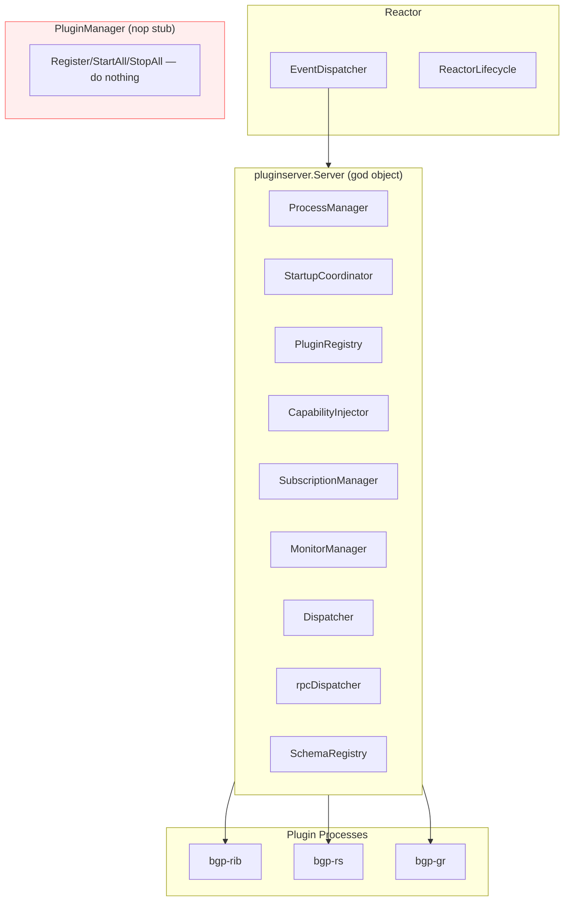
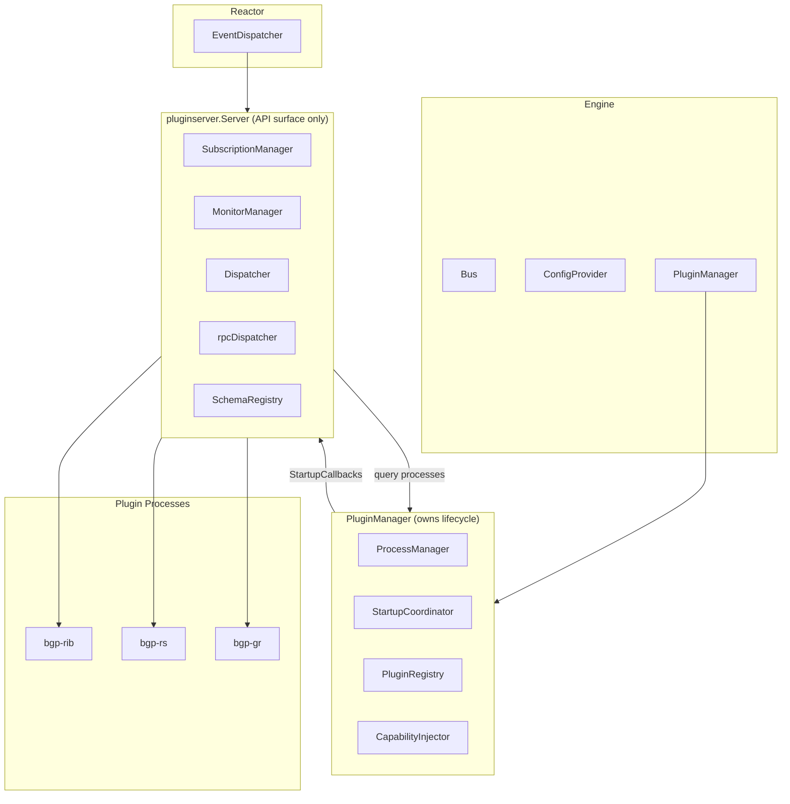
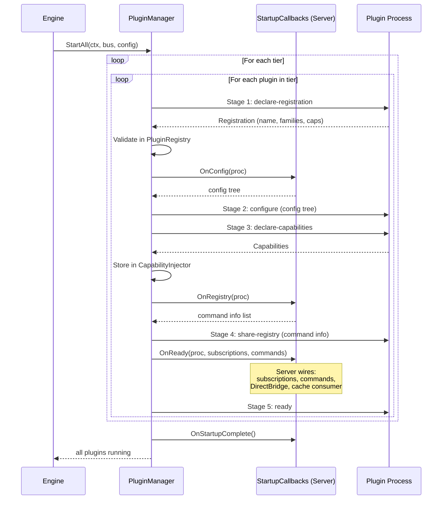
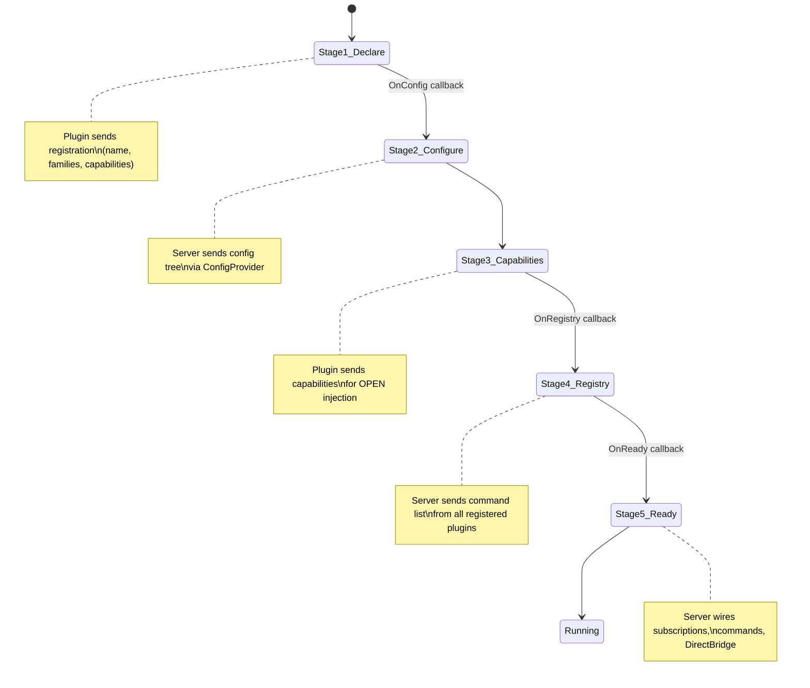
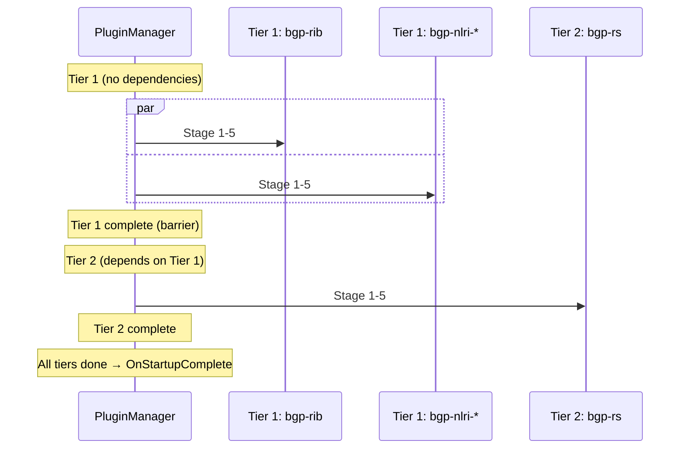

# Plugin Manager Wiring: Extracting Lifecycle from Server

This document describes the migration of plugin lifecycle management from
`pluginserver.Server` to `PluginManager`, completing the arch-0 decomposition
of the plugin god object.

## Problem

`pluginserver.Server` is a god object doing 10 jobs:
plugin lifecycle, event subscription, event dispatch, command routing,
RPC transport, schema management, capability injection, process management,
startup coordination, and reactor integration.

The arch-0 boundary design splits this into:
- **PluginManager** — plugin lifecycle (registration, startup, shutdown, process ownership)
- **Server** — API surface (event delivery, command dispatch, subscriptions, transport)

## Current Architecture

Server owns everything. PluginManager exists but is a stub.

## Target Architecture

PluginManager owns process lifecycle. Server provides stage hooks via callbacks.

## StartupCallbacks Interface

The seam between PluginManager and Server. PluginManager drives the 5-stage protocol
and calls back into Server at each stage for BGP-specific wiring.

### Hook Methods (11 methods — matches actual call sites in handleProcessStartupRPC)

| Method | Called at | Server does |
|--------|----------|-------------|
| `RegisterInRegistry(reg)` | Stage 1 complete | Validates registration, detects conflicts |
| `RegisterCacheConsumer(name, unordered)` | Stage 1 complete | Tracks cache participation in reactor |
| `GetConfigForPlugin(proc)` | Between Stage 1→2 | Returns config subtree from ConfigProvider |
| `AddCapabilities(caps)` | Stage 3 complete | Stores capabilities for OPEN injection |
| `GetRegistryForPlugin(proc)` | Between Stage 3→4 | Returns command info list |
| `RegisterSubscriptions(proc, subs)` | Stage 5 ready | Registers event subscriptions |
| `WireBridgeDispatch(proc)` | Stage 5 ready | Wires DirectBridge callback |
| `RegisterCommands(proc, defs)` | Stage 5 ready | Registers commands in Dispatcher |
| `SignalAPIReady()` | Stage 5 done | Notifies reactor one plugin is ready |
| `StartAsyncHandlers(procs)` | All tiers done | Starts runtime RPC goroutines |
| `SignalStartupComplete()` | All phases done | Notifies reactor all plugins done |

### Query Methods (Server → PluginManager)

| Method | Purpose |
|--------|---------|
| `Plugin(name) (PluginProcess, bool)` | Event delivery to specific plugin |
| `Plugins() []PluginProcess` | Broadcast events to all |
| `Capabilities() []Capability` | OPEN message building |
| `ProcessManager() *ProcessManager` | Subscription matching, process iteration |

### Critical Detail: ProcessManager per Phase

`runPluginPhase` creates a new ProcessManager each time (explicit plugins, then auto-loaded
families, then auto-loaded events, then auto-loaded send-types). Each phase overwrites the
previous ProcessManager reference. PluginManager must accumulate all processes across phases
or maintain a list of ProcessManagers.

## 5-Stage Protocol

The protocol is per-plugin, executed in tiers (dependency order).

### Tier Execution

Plugins are grouped into tiers by dependency. Tier N must complete all 5 stages
before Tier N+1 begins. Within a tier, plugins proceed through stages in parallel
with barrier synchronization (all reach Stage X before any proceeds to Stage X+1).

## Auto-Loading

PluginManager discovers and loads plugins that are not explicitly configured
but are needed for families, custom event types, or custom send types declared
by peers.

| Phase | Trigger | Discovery |
|-------|---------|-----------|
| 1 | Explicit plugins from config | Config `plugin { }` block |
| 2 | Unclaimed families | Peer capabilities declare families not owned by Phase 1 plugins |
| 3 | Custom event types | Peer process bindings request events not produced by Phase 1-2 plugins |
| 4 | Custom send types | Peer process bindings request send types not enabled by Phase 1-3 plugins |

Auto-loaded plugins use the same 5-stage protocol but run in additional tiers
after explicit plugins complete.

## What Moves

| Component | From | To |
|-----------|------|----|
| ProcessManager creation + ownership | Server | PluginManager |
| StartupCoordinator creation + tier execution | Server.Start() / startup.go | PluginManager.StartAll() |
| PluginRegistry (command/family/cap validation) | Server | PluginManager |
| CapabilityInjector | Server | PluginManager |
| Auto-load discovery (phases 2-4) | startup_autoload.go | PluginManager |
| Process lifecycle (start/stop/wait) | Server.Start/Stop | PluginManager.StartAll/StopAll |

## What Stays

| Component | Why |
|-----------|-----|
| SubscriptionManager | BGP-specific event filtering (namespace, direction, peer) |
| MonitorManager | CLI monitor sessions |
| Dispatcher | Text command routing, authorization |
| rpcDispatcher | Socket RPC transport layer |
| SchemaRegistry | Two-phase config parsing |
| ReactorLifecycle reference | EventDispatcher peer queries |
| Event delivery functions | Format negotiation, DirectBridge, dependency ordering |

## Migration Phases

### Phase 1: Define StartupCallbacks interface

New interface in `pkg/ze/plugin.go`. Server implements it. No behavior change.

### Phase 2: Move ProcessManager ownership

PluginManager creates ProcessManager. Server receives it via reference.
Startup still driven by Server (temporary).

### Phase 3: Move startup protocol

PluginManager.StartAll() drives the 5-stage protocol using StartupCallbacks.
Server.Start() delegates to PluginManager.StartAll(). startup.go logic moves.

### Phase 4: Move registry + capability injection

PluginManager owns PluginRegistry and CapabilityInjector. Server queries through
PluginManager methods. Server no longer creates these components.

Each phase ends with `make ze-verify` passing. No phase changes observable behavior.
