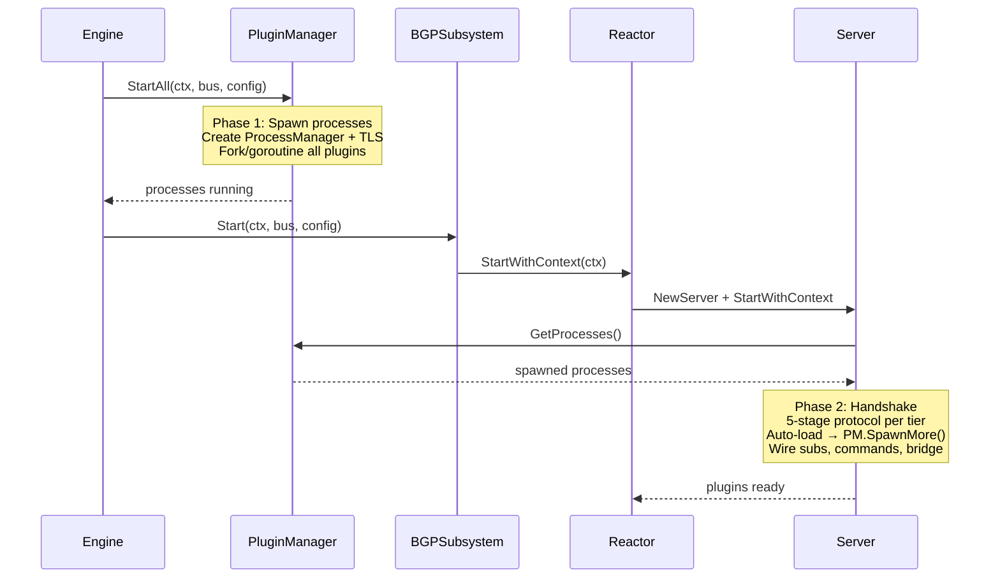
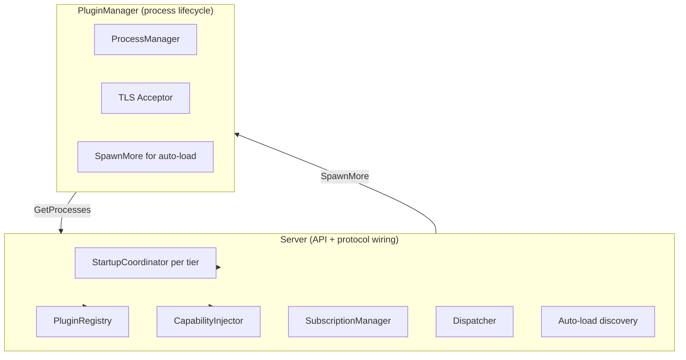
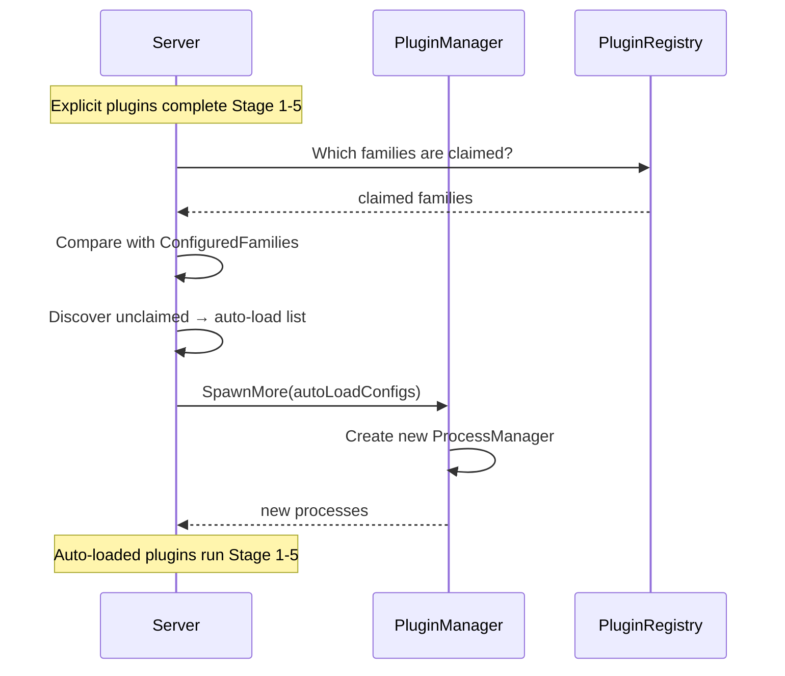

# Plugin Manager Wiring: Two-Phase Startup

This document describes the decomposition of plugin startup into two phases:
process spawning (PluginManager) and protocol handshake (Server).

## Problem

`pluginserver.Server` is a god object owning both process lifecycle AND protocol
wiring. The Engine expects PluginManager to own lifecycle, but Server is created
inside the reactor (a subsystem) — after Engine.Start calls PluginManager.StartAll.

## Solution: Two-Phase Startup

Split plugin startup at the natural seam: process spawning vs protocol handshake.

### Phase 1: Process Spawning (PluginManager owns)

PluginManager.StartAll does real work:
- Reads explicit plugin configs from the reactor config
- Creates ProcessManager for all explicit plugins
- Sets up TLS acceptor for external plugin connect-back
- Forks external processes / starts internal goroutines
- Returns with processes running but not yet handshaked

PluginManager does NOT:
- Run the 5-stage protocol (needs Server)
- Discover auto-load plugins (needs Stage 1 registration results)
- Wire subscriptions, commands, or DirectBridge

### Phase 2: Protocol Handshake (Server owns)

Server receives spawned processes from PluginManager and runs the handshake:
- Computes dependency tiers
- Runs 5-stage protocol per tier (registration → config → capabilities → registry → ready)
- After explicit plugins complete: discovers auto-load plugins
- Calls PluginManager.SpawnMore() for auto-loaded plugins
- Runs 5-stage for auto-loaded plugins
- Starts async RPC handlers after all tiers
- Signals reactor ready

Server does NOT:
- Create ProcessManager (PluginManager owns it)
- Fork processes (PluginManager does it)
- Own process lifecycle (stop/wait — PluginManager does it)

## Component Ownership

## Interface Changes

PluginManager gains process-management methods:

| Method | Purpose |
|--------|---------|
| `StartAll(ctx, bus, config)` | Phase 1: spawn explicit plugins |
| `SpawnMore(configs) error` | Spawn additional plugins (auto-load) |
| `GetProcessManager() *ProcessManager` | Server reads spawned processes |
| `StopAll(ctx)` | Kill all processes |

Server gains a handshake entry point:

| Method | Purpose |
|--------|---------|
| `RunHandshake(pm) error` | Phase 2: 5-stage protocol with PM's processes |

## Auto-Load Flow

Auto-load happens during Phase 2 because it depends on Stage 1 registration results:

## What Moves vs What Stays

| Component | Before | After |
|-----------|--------|-------|
| ProcessManager creation | Server.runPluginPhase | PluginManager.StartAll |
| TLS acceptor setup | Server.runPluginPhase | PluginManager.StartAll |
| Process fork/goroutine | Server.runPluginPhase | PluginManager.StartAll |
| Tier computation | Server.runPluginPhase | Server.RunHandshake (unchanged) |
| 5-stage protocol | Server.handleProcessStartupRPC | Server.RunHandshake (unchanged) |
| Auto-load discovery | Server.runPluginStartup | Server.RunHandshake (unchanged) |
| Auto-load spawning | Server.runPluginPhase | PluginManager.SpawnMore |
| Subscription wiring | Server | Server (unchanged) |
| Command registration | Server | Server (unchanged) |
| DirectBridge wiring | Server | Server (unchanged) |
| Process stop/cleanup | Server.cleanup | PluginManager.StopAll |

## Stage 1 Registration: Config Transaction Fields

<!-- source: pkg/plugin/rpc/types.go -- DeclareRegistrationInput -->

Stage 1 (`declare-registration`) includes fields for the config transaction protocol:

| Field | Type | Purpose |
|-------|------|---------|
| `wants-config` | `[]string` | Config roots the plugin owns or watches (existing) |
| `verify-budget` | `int` | Estimated verify time in seconds (0 = trivial) |
| `apply-budget` | `int` | Estimated apply time in seconds (0 = trivial) |

Budgets are capped at 600 seconds. The engine uses the maximum across all participants
as the phase deadline. Plugins update their budgets in verify/apply ack events; the
engine stores updated values for the next transaction.

See `docs/architecture/config/transaction-protocol.md` for the full protocol.
