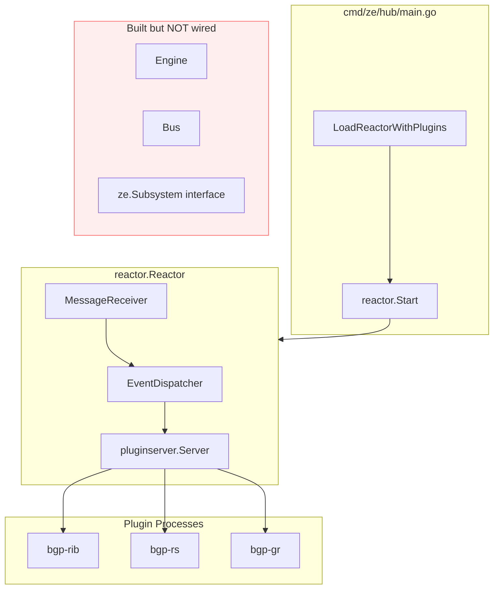
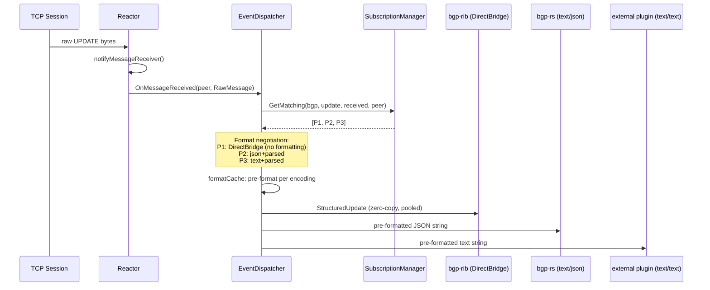
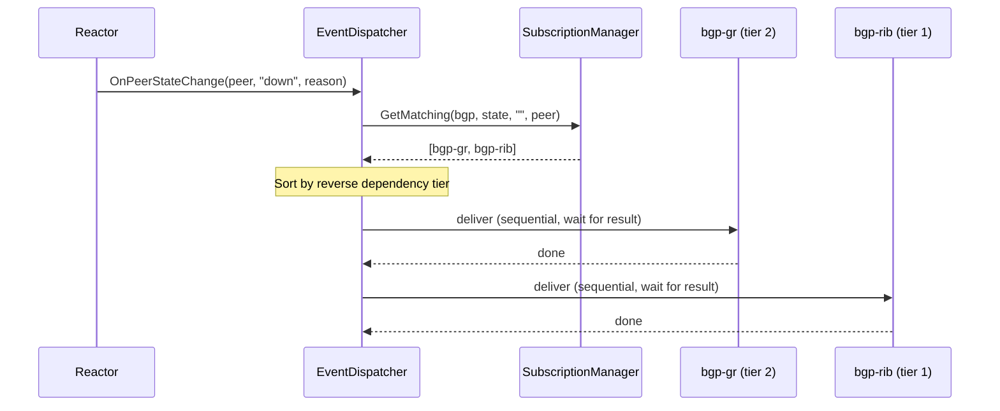
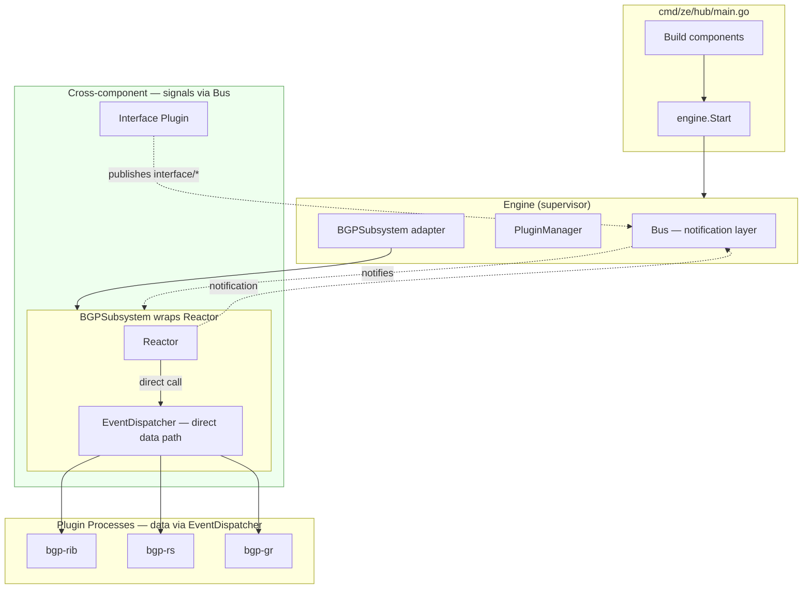
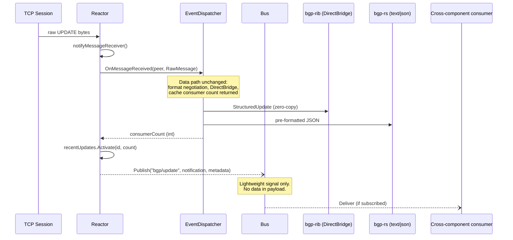
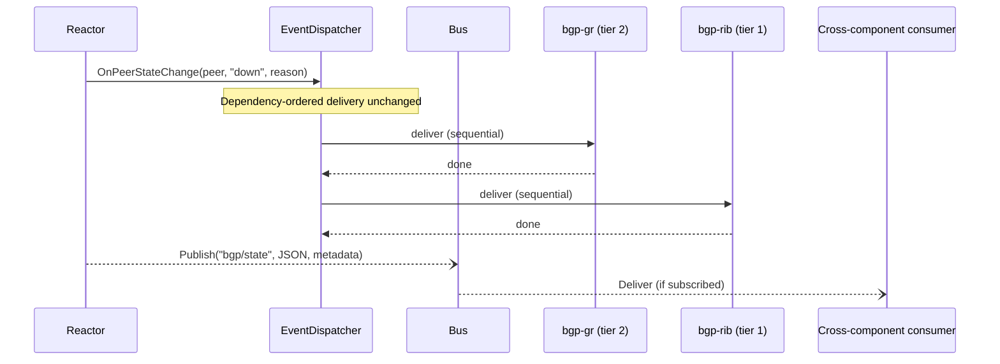
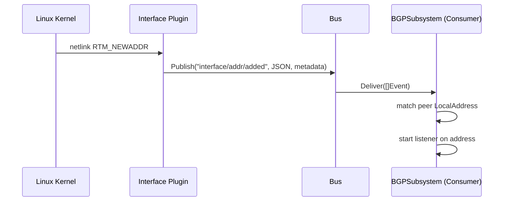
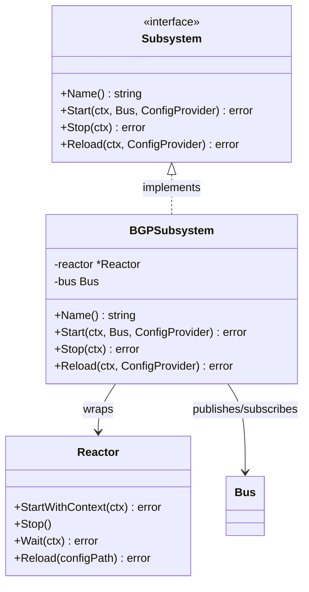
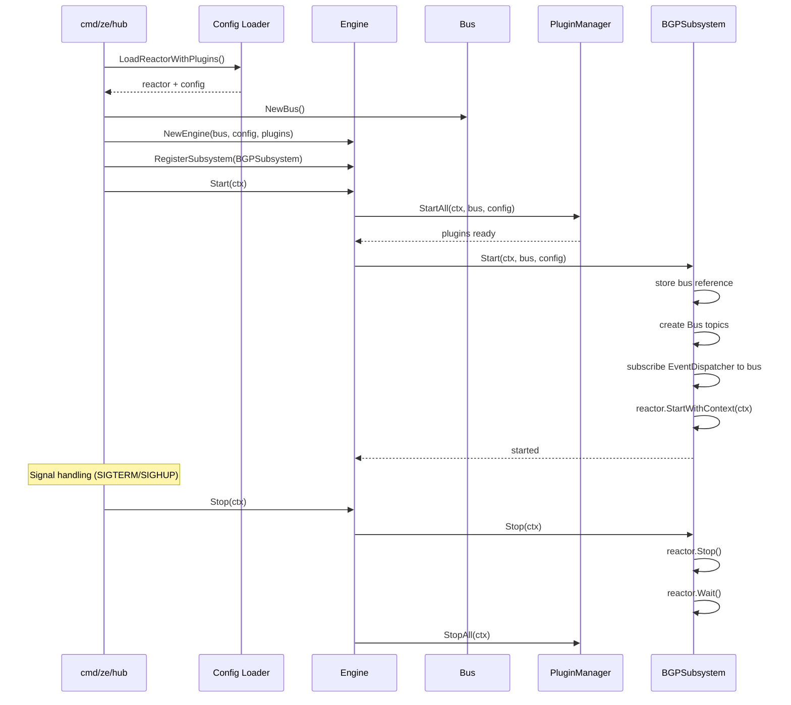

# Subsystem Wiring: Reactor as ze.Subsystem

> **Note (2026-04-24):** This document was written during the arch-0 migration.
> The startup path has since evolved: the plugin server uses topological tier
> ordering (`startup.go`), the coordinator owns config distribution, and the
> reactor starts via the BGP plugin's `OnStarted` hook rather than direct
> `LoadReactorWithPlugins`. The diagrams below describe the pre-migration state
> and the planned target; the live code in `cmd/ze/hub/main.go` is authoritative.

This document describes the migration from direct reactor startup to Engine-supervised
startup with Bus integration, completing the arch-0 component boundary work.

## Pre-Migration Architecture

The reactor was created and started directly by `cmd/ze/hub/main.go`. It held a
`*pluginserver.Server` and `*EventDispatcher` for plugin communication. The Engine,
Bus, and Subsystem interface existed but were not wired into the startup path.

### Current Event Flow (UPDATE hot path)

The EventDispatcher handles per-subscriber format negotiation. Each plugin process
has a format preference (text/json, parsed/raw). The dispatcher pre-formats once
per distinct format combination and delivers the right format to each process.

### Current Event Flow (peer state change)

State events are delivered sequentially in reverse dependency order.

## Target Architecture

The reactor is wrapped in a `BGPSubsystem` adapter that implements `ze.Subsystem`.
The Engine supervises startup. The Bus is a **notification layer** for cross-component
signaling. The EventDispatcher keeps its existing direct calling convention for plugin
data delivery (format negotiation, cache consumer counts, DirectBridge zero-copy).

The key insight: **Bus is for signaling, not data transport.** The reactor publishes
lightweight notifications to Bus topics in parallel with the existing EventDispatcher
data path. Cross-component consumers (e.g., interface plugin) subscribe to Bus signals.
Plugins that need data access the reactor directly — they already have direct access
via pluginserver.Server and DirectBridge.

### Target Event Flow (UPDATE hot path)

The EventDispatcher data path is unchanged — reactor calls it directly, it returns
the cache consumer count, format negotiation and DirectBridge work exactly as before.
In parallel, the reactor publishes a lightweight Bus notification so cross-component
consumers know an UPDATE arrived.

### Target Event Flow (peer state change)

State events use the same dual-path pattern. EventDispatcher handles plugin delivery
with dependency ordering. Bus publishes a notification for cross-component consumers.

### Target Event Flow (cross-component: interface plugin)

The Bus enables cross-component communication without direct imports.

## Component Changes

### BGPSubsystem Adapter

A thin wrapper around `reactor.Reactor` satisfying `ze.Subsystem`:

### Startup Sequence

## Bus as Notification Layer

The Bus is a **signaling mechanism**, not a data transport. Plugin data delivery stays
on the existing EventDispatcher direct path. The Bus publishes lightweight notifications
so cross-component consumers can react to events without importing BGP internals.

### Bus Payload

All Bus payloads are JSON-encoded notifications with minimal information:

| Field | Type | Purpose |
|-------|------|---------|
| `peer` | string | Peer address |
| `event` | string | Event type (update, state, eor, etc.) |

Additional fields per event type (e.g., `state`, `reason`, `family`).

### Why Not Data Transport?

The EventDispatcher returns cache consumer counts, handles per-subscriber format
negotiation, manages DirectBridge zero-copy delivery, and enforces dependency-ordered
delivery for state events. These are tightly coupled to synchronous calling conventions.
The Bus is fire-and-forget — it cannot return values or enforce ordering.

Plugins that need UPDATE data already have direct access via `pluginserver.Server`
and DirectBridge. Cross-component consumers (like the interface plugin) only need
signals ("a peer went down") to react — they don't need the raw UPDATE bytes.

## Bus Topics

The BGP subsystem creates these topics at startup:

| Topic | Published when | Payload |
|-------|---------------|---------|
| `bgp/update` | UPDATE received or sent | update-id reference |
| `bgp/state` | Peer state change (up/down) | JSON: peer, state, reason |
| `bgp/negotiated` | Capability negotiation complete | JSON: peer, capabilities |
| `bgp/eor` | End-of-RIB marker detected | JSON: peer, family |
| `bgp/congestion` | Forward path congestion change | JSON: peer, event-type |

> **See also:** [Config Transaction Protocol](config/transaction-protocol.md) for `config/`
> bus topics used during verify/apply/rollback of config changes.

## Migration Path

The migration preserves all existing behavior while adding Bus integration:

1. **BGPSubsystem adapter** -- wraps reactor, implements ze.Subsystem
2. **Wire startup through Engine** -- cmd/ze/hub/main.go uses Engine.Start()
3. **Reactor publishes Bus notifications** -- in parallel with existing EventDispatcher calls
4. **Existing tests continue to pass** -- behavior unchanged, only startup plumbing changes

### What Changes

| Before | After |
|--------|-------|
| `reactor.Start()` called directly | `engine.Start()` calls `BGPSubsystem.Start()` |
| No Bus reference in reactor | Reactor holds Bus, publishes notifications |
| No cross-component events | Bus enables interface/addr events for BGP |

### What Does NOT Change

| Concern | Status |
|---------|--------|
| EventDispatcher direct calling convention | Unchanged — reactor calls ED methods directly |
| Format negotiation per subscriber | Unchanged |
| DirectBridge zero-copy for in-process plugins | Unchanged |
| StructuredUpdate pooling | Unchanged |
| Cache consumer count tracking | Unchanged — returned synchronously from ED |
| Dependency-ordered state delivery | Unchanged |
| Subscription matching semantics | Unchanged |
| Plugin 5-stage startup protocol | Unchanged |
| SIGHUP config reload | Unchanged (routed through Engine.Reload) |
