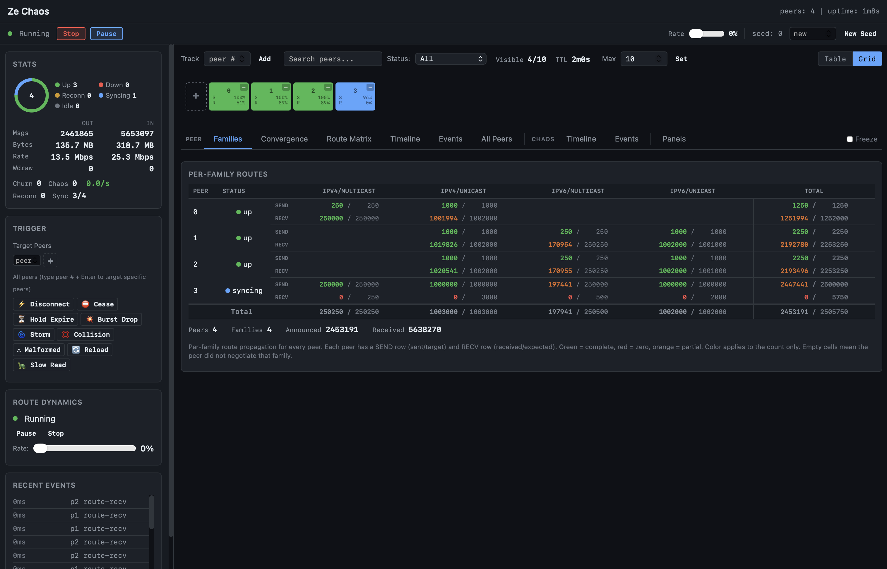

# Chaos Testing

Ze includes a chaos testing mode that injects faults during operation to verify the daemon handles failures correctly. This is useful for validating configuration changes, testing plugin resilience, and finding edge cases before production.

## Quick Start

```bash
# Run all chaos tests
make ze-chaos-test

# Start ze with chaos mode enabled
ze --chaos-seed 42 --chaos-rate 0.1 config.conf
```

## Flags

| Flag | Description | Default |
|------|-------------|---------|
| `--chaos-seed <N>` | PRNG seed for reproducible faults. `-1` = time-based. `0` = disabled. | 0 (off) |
| `--chaos-rate <f>` | Probability of fault per operation (0.0 to 1.0) | 0.1 |
<!-- source: cmd/ze/ze_core_dispatch.go -- chaosSeed, chaosRate global flags -->
<!-- source: internal/component/bgp/config/loader.go -- injectChaos -->
<!-- source: internal/component/bgp/cli/childmode.go -- injectChaosFromEnv, ze.bgp.chaos.seed/rate -->

## ze-chaos Tool

The `ze-chaos` tool is a chaos simulator that runs multiple BGP peers against a ze route server, validates route propagation, and injects faults.



The web dashboard shows real-time peer status, per-family route propagation, convergence progress, and fault triggers. Color coding indicates propagation state: green = complete, orange = partial, red = zero.

```bash
# Fork mode (default): ze-chaos starts ze as a child process
ze-chaos --seed 42 --peers 8 --duration 60s

# Specify ze binary path
ze-chaos --binary ./bin/ze --seed 42 --peers 8 --duration 60s

# Pipeline mode: config on stdout, diagnostics on stderr
ze-chaos --pipe --seed 42 --peers 8 --duration 60s | ./bin/ze -

# Write config to file
ze-chaos --config-out chaos.conf --seed 42 --peers 8
ze start chaos.conf

# In-process mode: mock network + virtual clock (fully deterministic)
ze-chaos --in-process --seed 42 --duration 30s

# In-process with chaos and route dynamics
ze-chaos --in-process --seed 42 --duration 60s --chaos-rate 0.1 --route-rate 0.05

# Multi-family
ze-chaos --families ipv4/unicast,ipv6/unicast --chaos-rate 0.2 --pipe | ./bin/ze -
```

### Multi-Daemon Testing (FRR, BIRD)

ze-chaos can generate configs for and fork FRR (bgpd) or BIRD, so the same
chaos scenario runs against different BGP implementations.

```bash
# Generate FRR config to inspect
ze-chaos --config-only --application frr --seed 42 --peers 4

# Generate BIRD config to inspect
ze-chaos --config-only --application bird --seed 42 --peers 4

# Fork FRR bgpd (auto-discovers bgpd in PATH)
ze-chaos --application frr --seed 42 --peers 4 --duration 60s

# Fork BIRD with explicit binary path
ze-chaos --application bird --binary /usr/sbin/bird --seed 42 --peers 4 --duration 60s

# Write config to file, start daemon manually
ze-chaos --config-only --application frr --config-out chaos-frr.conf
bgpd -f chaos-frr.conf -p 1850 -l 127.0.0.1 -P 0 -n -Z -S
```

FRR and BIRD use a single BGP port with peers identified by source IP address
(127.0.0.x), unlike Ze's per-peer port model. On Linux, the 127.0.0.0/8 range
is routed to loopback by default. On macOS, loopback aliases are needed:

```bash
# macOS only: create loopback aliases for each peer
for i in $(seq 2 $((peers+1))); do
  sudo ifconfig lo0 alias 127.0.0.$i
done
```

#### Running via Docker

When FRR or BIRD is not installed locally, use Docker. The `--network host`
flag shares the host network so ze-chaos simulators can connect directly
(Linux only; macOS Docker Desktop does not support host networking).

```bash
# Start FRR in Docker, ze-chaos on the host
ze-chaos --config-only --application frr --seed 42 --peers 4 \
  --config-out chaos-frr.conf
docker run --rm --network host \
  -v ./chaos-frr.conf:/etc/frr/bgpd.conf:ro \
  quay.io/frrouting/frr:10.3.1 \
  /usr/lib/frr/bgpd -f /etc/frr/bgpd.conf -p 1850 -l 127.0.0.1 -P 0 -n -Z -S

# In another terminal: run ze-chaos against the FRR instance
ze-chaos --application frr --seed 42 --peers 4 --duration 60s \
  --config-out /dev/null

# Same pattern for BIRD
ze-chaos --config-only --application bird --seed 42 --peers 4 \
  --config-out chaos-bird.conf
docker run --rm --network host \
  -v ./chaos-bird.conf:/etc/bird.conf:ro \
  --entrypoint bird bird-interop:latest \
  -f -c /etc/bird.conf -s /tmp/bird.ctl
```

#### Config Validation (no live session)

Validate generated configs without running a full session:

```bash
# FRR: -C flag checks config and exits
ze-chaos --config-only --application frr > frr.conf
docker run --rm -v ./frr.conf:/etc/frr/bgpd.conf:ro \
  quay.io/frrouting/frr:10.3.1 \
  /usr/lib/frr/bgpd -C -f /etc/frr/bgpd.conf -n -Z -S -p 0 -P 0

# BIRD: -p flag parses config and exits
ze-chaos --config-only --application bird > bird.conf
docker run --rm -v ./bird.conf:/etc/bird.conf:ro \
  --entrypoint sh bird-interop:latest \
  -c 'bird -p -c /etc/bird.conf'
```
<!-- source: internal/chaos/orchestrator/cli.go -- --application, --binary flags; internal/chaos/scenario/config_frr.go, config_bird.go -->

### Event Logging and Replay

```bash
# Record events
ze-chaos --event-log run.ndjson --seed 42 | ./bin/ze -

# Replay a recorded failure
ze-chaos --replay run.ndjson

# Shrink to minimal reproduction
ze-chaos --shrink run.ndjson
```
<!-- source: internal/chaos/orchestrator/subcommand.go -- event logging, replay, shrink modes -->

### Property Validation

```bash
ze-chaos --properties all --convergence-deadline 5s | ./bin/ze -
ze-chaos --properties list    # Show available properties
```

Properties validated:
- **Convergence:** All routes reach all peers despite faults
- **State consistency:** RIB matches peer state after recovery
- **No data loss:** Updates eventually delivered
- **Graceful degradation:** Sessions restart on critical faults

## Fault Types

| Category | Examples |
|----------|---------|
| Network I/O | Connection failures, partial writes, read timeouts |
| Wire parsing | Malformed messages, truncated packets |
| FSM | State machine violations, invalid transitions |
| Route processing | Dropped updates, corrupted NLRI |
| Event delivery | Lost messages, out-of-order events |

## Deterministic Replay

With a fixed seed, chaos testing is fully reproducible:

```bash
# These two runs produce identical fault sequences
ze --chaos-seed 42 --chaos-rate 0.1 config.conf
ze --chaos-seed 42 --chaos-rate 0.1 config.conf
```

Seed `0` disables chaos entirely (zero overhead). Seed `-1` uses the current time (non-reproducible).
<!-- source: cmd/ze/main.go -- chaosSeed handling -->

## Make Targets

| Target | Description |
|--------|-------------|
| `make ze-chaos-test` | Run chaos unit + functional tests |
| `make ze-chaos` | Build ze-chaos binary |

## When to Use

- **Before deployment:** Validate your config handles peer failures
- **CI pipeline:** Catch race conditions and edge cases
- **Debugging:** Reproduce intermittent failures with a fixed seed
- **Benchmarking:** Measure convergence time under fault conditions
<!-- source: internal/chaos/orchestrator/cli.go -- ze-chaos tool; test/ -- chaos functional tests -->
