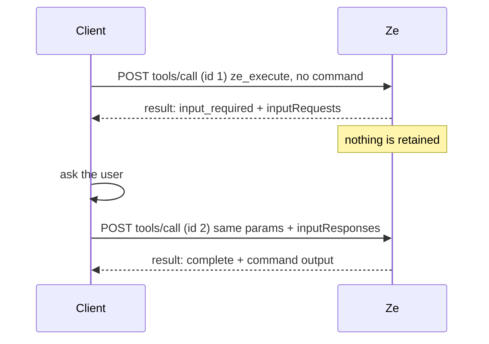

# MCP Elicitation

Ze can ask an MCP client for a value it needs but was not given. Under protocol
revision `2026-07-28` it does so through
[Multi Round-Trip Requests](https://modelcontextprotocol.io/specification/2026-07-28/basic/patterns/mrtr)
(MRTR): the server does not send the client a request, it **returns** one.

The single place this happens is the `ze_execute` tool called without a
`command` argument.

<!-- source: internal/component/mcp/mrtr.go -- newInputRequiredResult, inputRequiredForMissingCommand -->
<!-- source: internal/component/mcp/tools.go -- ze_execute handler -->

## The round trip

A server that needs more input answers the original request with
`resultType: "input_required"` and an `inputRequests` map, which **ends**
that request. The client gathers the input and retries the original request,
under a different JSON-RPC id, carrying `inputResponses`.



There is no server-initiated message anywhere in that exchange. The transport
is explicit that there cannot be: "The server **MUST NOT** send independent
JSON-RPC *requests* on this stream. Server-to-client interactions (sampling,
elicitation, list-roots) are embedded as input requests inside an
`InputRequiredResult`."

<!-- source: internal/component/mcp/streamable_tools.go -- runMethod, ok -->

## Declaring the capability

The elicitation capability is **mode-structured**, and a client declares it on
**every** request in `params._meta`, not once at a handshake (there is no
handshake in this revision).

```json
{
  "_meta": {
    "io.modelcontextprotocol/clientCapabilities": {
      "elicitation": { "form": {} }
    }
  }
}
```

| Declared value | Form mode supported? | Ze prompts? |
|----------------|----------------------|-------------|
| capability absent | no | no |
| `{}` | yes -- an empty object means form mode only | yes |
| `{"form":{}}` | yes | yes |
| `{"form":{},"url":{}}` | yes | yes |
| `{"url":{}}` | no | no |

The gate is form-mode **support**, not the presence of the `elicitation` key:

> Servers **MUST NOT** send elicitation requests with modes that are not
> supported by the client.

A client that declares only `url` supports elicitation, and it does not support
the one mode Ze emits. Ze therefore treats that client exactly like a client
that declared nothing.

<!-- source: internal/component/mcp/mrtr.go -- elicitationFormSupported -->
<!-- source: internal/component/mcp/meta.go -- parseClientCapabilities, clientCapabilities.ElicitForm -->

The same capability shapes the tool descriptor, so a client does not have to
know this page to find the round trip. Declare form mode, and the `ze_execute`
entry in `tools/list` omits `command` from its `inputSchema.required`. That
omission tells a schema-validating host that the argument-less call is legal.
Declare nothing, or `url` only, and `required` names `command`, which is honest:
that client will get an error rather than a prompt.

<!-- source: internal/component/mcp/mrtr.go -- gateExecuteCommandRequired -->
<!-- source: internal/component/mcp/streamable_tools.go -- allTools -->

## What Ze returns

```json
{
  "jsonrpc": "2.0",
  "id": 1,
  "result": {
    "resultType": "input_required",
    "inputRequests": {
      "ze_execute_command": {
        "method": "elicitation/create",
        "params": {
          "mode": "form",
          "message": "Which ze command should be run? For example: show bgp summary",
          "requestedSchema": {
            "type": "object",
            "properties": {
              "command": {
                "type": "string",
                "title": "ze command",
                "description": "The ze command to execute, for example 'show bgp peer list'."
              }
            },
            "required": ["command"]
          }
        }
      }
    }
  }
}
```

`ze_execute_command` is the server-assigned key the retry must echo. `mode` is
stated explicitly even though form is the default, so the absence of url-mode
support is visible at the emission point rather than implied.

<!-- source: internal/component/mcp/mrtr.go -- inputKeyExecuteCommand, elicitPromptCommand -->
<!-- source: internal/component/mcp/elicit.go -- newElicitRequest, elicitModeForm -->

## What the client sends back

The retry is the original request plus `inputResponses`, under a new id.

```json
{
  "jsonrpc": "2.0",
  "id": 2,
  "method": "tools/call",
  "params": {
    "name": "ze_execute",
    "arguments": {},
    "inputResponses": {
      "ze_execute_command": {
        "action": "accept",
        "content": { "command": "show bgp summary" }
      }
    },
    "_meta": { "...": "the same required per-request fields" }
  }
}
```

| `action` | Ze's response |
|----------|---------------|
| `accept` with a non-empty `command` | the command is dispatched. `resultType: "complete"` |
| `accept` with an empty or absent `command` | a **new** `input_required`: an empty answer is an omission, not a refusal |
| `decline` | a terminal tool error naming the refusal. Ze does not ask again |
| `cancel` | a terminal tool error naming the cancellation. Ze does not ask again |
| key absent entirely | a **new** `input_required` |
| keys Ze did not ask for | ignored. The request proceeds on the keys it did ask for |

Ze distinguishes an omission from a refusal. That distinction stops a repeated
prompt to a user who has said no. And a repeated prompt after an omission is
explicitly permitted:

> Servers **MAY** choose to return an `InputRequiredResult` on multiple attempts
> at the same request.

<!-- source: internal/component/mcp/mrtr.go -- resolveElicitedValue, inputOutcome -->
<!-- source: internal/component/mcp/mrtr.go -- resolveExecuteCommand, askForCommand -->

## Ze issues no `requestState`

MRTR lets a server attach an opaque `requestState` blob to an
`InputRequiredResult` and have the client echo it on the retry. **Ze never
does.** Ze's one elicitation suspends nothing. The value it asks for is a tool
argument that the retry carries anyway, so there is no continuation state to
encode. Requirement 6's "at least one of `inputRequests` or `requestState`" is
satisfied by `inputRequests` alone, and requirement 3 makes `requestState` a
MAY. The omission is therefore conformant, not a gap.

That omission is a security property, not just a simplification. A retry is a
self-contained, independently authenticated request. No carried authority exists
for another principal to replay, and none survives a daemon restart to go stale.

The consequence for clients: because the result carries no `requestState`, "the
client **MUST NOT** include one in the retry." Ze enforces that. A request that
carries a `requestState` on any method is refused before dispatch, with JSON-RPC
`-32602` and HTTP 400. The rejection names the field, and it does not echo the
supplied value.

```
probe status=400 code=-32602 message=invalid params: params.requestState is not
accepted; this server issues no requestState, so a retry must not carry one
```

<!-- source: internal/component/mcp/mrtr.go -- rejectUnsolicitedRequestState, errUnsolicitedRequestState -->
<!-- source: internal/component/mcp/streamable.go -- handlePOST requestState guard -->

## Limits

- **Form mode only.** URL-mode elicitation is not implemented. Ze asks for a
  `ze` CLI command, which is not a credential, so form mode is the correct mode
  here. The revision says: "Servers **MUST NOT** use form mode elicitation to
  request sensitive information such as passwords, API keys, access tokens, or
  payment credentials." Ze's request builder refuses a schema whose property
  name looks like a credential, so Ze enforces that prohibition rather than
  merely observes it.
- **One request per result.** `ze_execute` asks for one value, so exactly one
  `inputRequests` entry is ever emitted.
- **Sampling and roots are never requested.** An `inputRequests` value can be an
  `ElicitRequest`, a `CreateMessageRequest` or a `ListRootsRequest`. Ze emits
  only the first. The other two are deprecated in this revision and Ze
  implements neither.
- **Narrower schema subset than the revision permits.** `2026-07-28` also allows
  `oneOf`-titled enums and array multi-select enums in a requested schema. Ze's
  validator accepts only flat primitive properties, and it emits only a single
  string. Ze uses fewer optional schema forms than the specification offers,
  which is conformant.
- **Tasks do not elicit.** A task worker runs long after its `tools/call` has
  returned, so an `input_required` result produced there would be stored as the
  task's result and delivered on a later `tasks/get`. Ze prevents that at the
  source. The worker gets a zero capability set, so a handler that would
  otherwise elicit reads form-mode support as undeclared. That handler takes the
  missing-argument path instead. No Ze task can raise `inputRequests`, and none
  can reach the `input_required` state.

<!-- source: internal/component/mcp/elicit.go -- validateElicitSchema, elicitFieldIsSecret -->
<!-- source: internal/component/mcp/streamable_tools.go -- createTask worker runner -->

## Trying it

The functional-test client speaks the client half of the loop:

```
ze-test mcp --port 8080 --elicit form
```

with stdin directives:

```
elicit-answer accept show bgp peer list
@ze_execute {}
```

`--elicit` takes `form`, `url`, `form,url`, or `empty` for the `{}` shape.
`elicit-answer` also accepts `decline`, `cancel`, and `omit` (retry with an
empty `inputResponses`, which drives the re-ask path).

<!-- source: internal/test/cli/cmd_mcp_mrtr.go -- send retry loop, elicitDirective -->
<!-- source: internal/test/cli/cmd_mcp.go -- --elicit flag -->

## Related

- [MCP Overview](../overview/index.md) -- tools, transport and configuration
- [MCP Architecture](https://github.com/ze-software/ze/blob/main/docs/architecture/mcp/overview.md) -- internals
- [MCP API Methods](https://github.com/ze-software/ze/blob/main/docs/architecture/api/commands.md#mcp-methods) -- the method table
